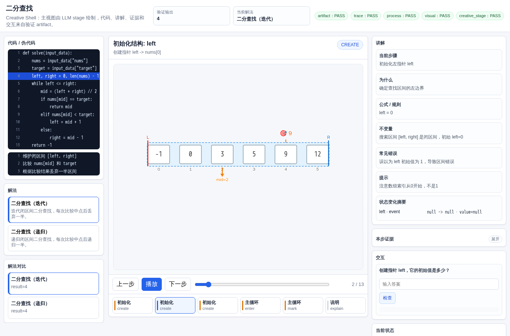
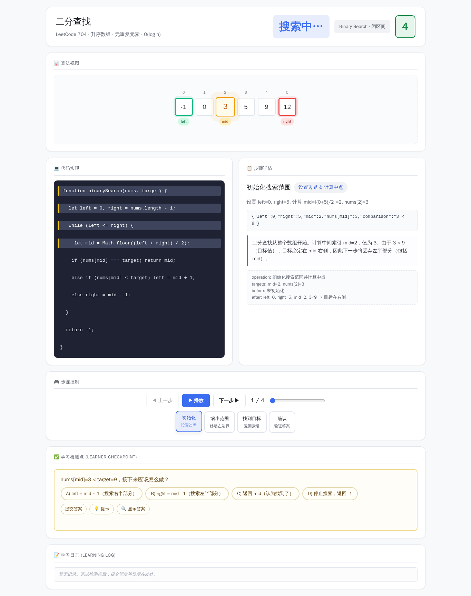
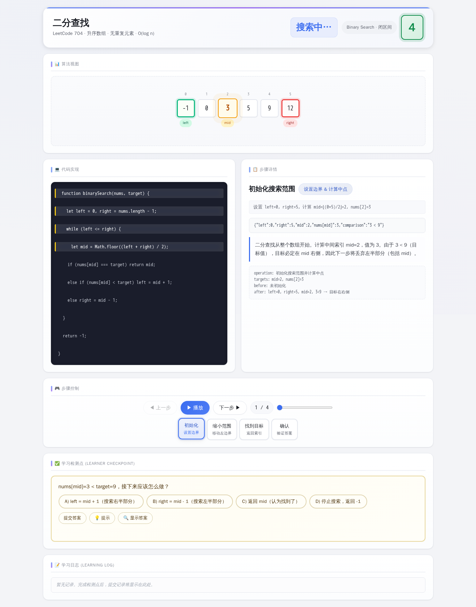
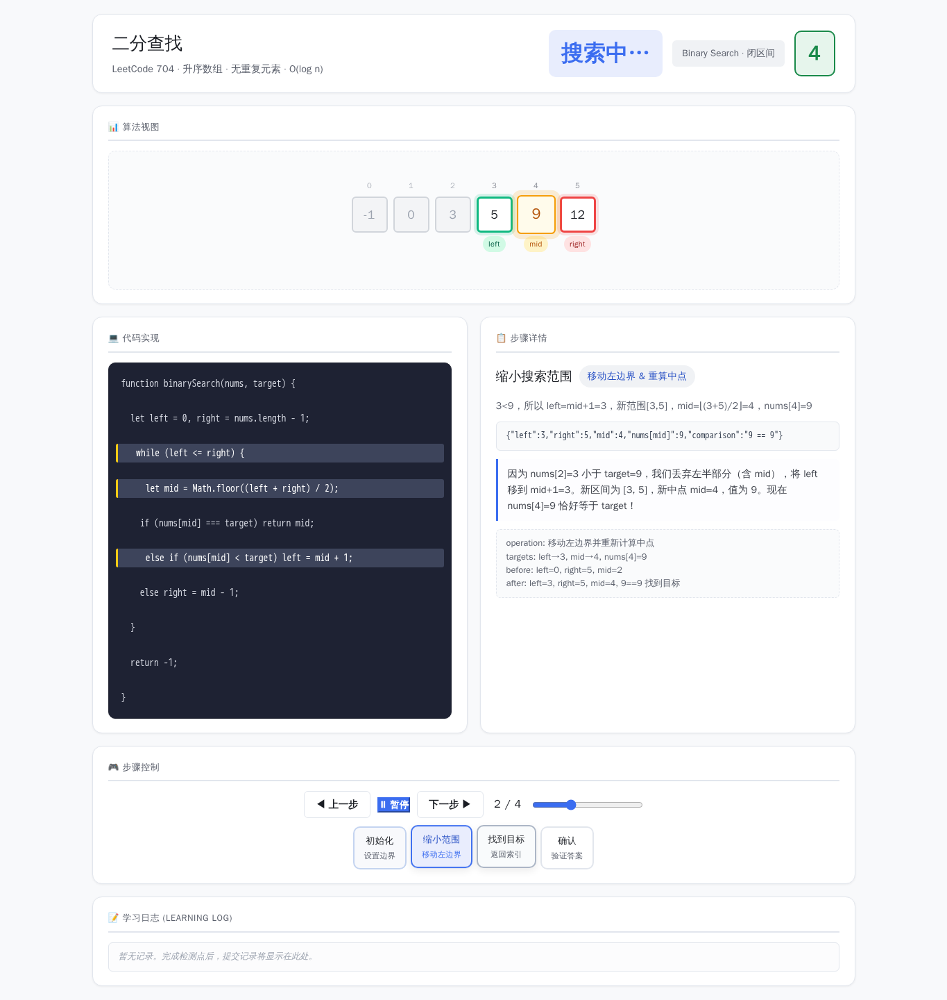

# 二分查找

- 案例 ID：`binary_search`
- 算法家族：二分
- 难度：medium
- 时间复杂度：`O(log n)`
- 空间复杂度：`O(1)`

你在图书馆工作，书架上有序排列着无重复索书号的书籍。给定书架数组 nums（每个位置 i 存放索书号 nums[i]），以及读者需要的目标索书号 target。请返回 target 所在的下标，如果不存在则返回 -1。

## 抽样输入

```json
{
  "expected": 4,
  "index": 0,
  "input_data": {
    "nums": [
      -1,
      0,
      3,
      5,
      9,
      12
    ],
    "target": 9
  }
}
```

## 九项机器判定

| 方法 | Load | Answer | Interaction | Correct FB | Wrong FB | Hint | Show | Log | Mutation-free | Machine OK |
| --- | --- | --- | --- | --- | --- | --- | --- | --- | --- | --- |
| AlgoTutorGen / Stage2 | PASS | PASS | PASS | PASS | PASS | PASS | PASS | PASS | PASS | PASS |
| Direct HTML | PASS | PASS | PASS | PASS | PASS | PASS | PASS | PASS | PASS | PASS |
| WebGen-Agent | PASS | PASS | PASS | FAIL | FAIL | PASS | PASS | FAIL | PASS | FAIL |
| Direct + HTMLCure (strict) | FAIL | FAIL | FAIL | FAIL | FAIL | FAIL | FAIL | FAIL | FAIL | FAIL |
| Direct-BrowserRepair (1-call) | PASS | PASS | PASS | PASS | PASS | PASS | PASS | PASS | PASS | PASS |

## 五种方法的真实产物

### AlgoTutorGen / Stage2

[打开 AlgoTutorGen / Stage2 HTML](algotutorgen_stage2/page.html) · [审计摘要](algotutorgen_stage2/audit.json)

- Machine OK：**PASS**
- 教学总分：5.0
- 视觉总分：4.75



### Direct HTML

[打开 Direct HTML HTML](direct_html/page.html) · [审计摘要](direct_html/audit.json)

- Machine OK：**PASS**
- 教学总分：4.571
- 视觉总分：4.75



### WebGen-Agent

[WebGen-Agent 源码入口](webgen_agent/source/index.html) · [package.json](webgen_agent/source/package.json) · [审计摘要](webgen_agent/audit.json)

- Machine OK：**FAIL**
- 教学总分：3.571
- 视觉总分：5.0


### Direct + HTMLCure (strict)

[打开 Direct + HTMLCure (strict) HTML](htmlcure_strict/page.html) · [审计摘要](htmlcure_strict/audit.json)

- Machine OK：**FAIL**
- 教学总分：2.429
- 视觉总分：3.75



### Direct-BrowserRepair (1-call)

[打开 Direct-BrowserRepair (1-call) HTML](browser_repair_1call/page.html) · [审计摘要](browser_repair_1call/audit.json)

- Machine OK：**PASS**
- 教学总分：5.0
- 视觉总分：4.75


