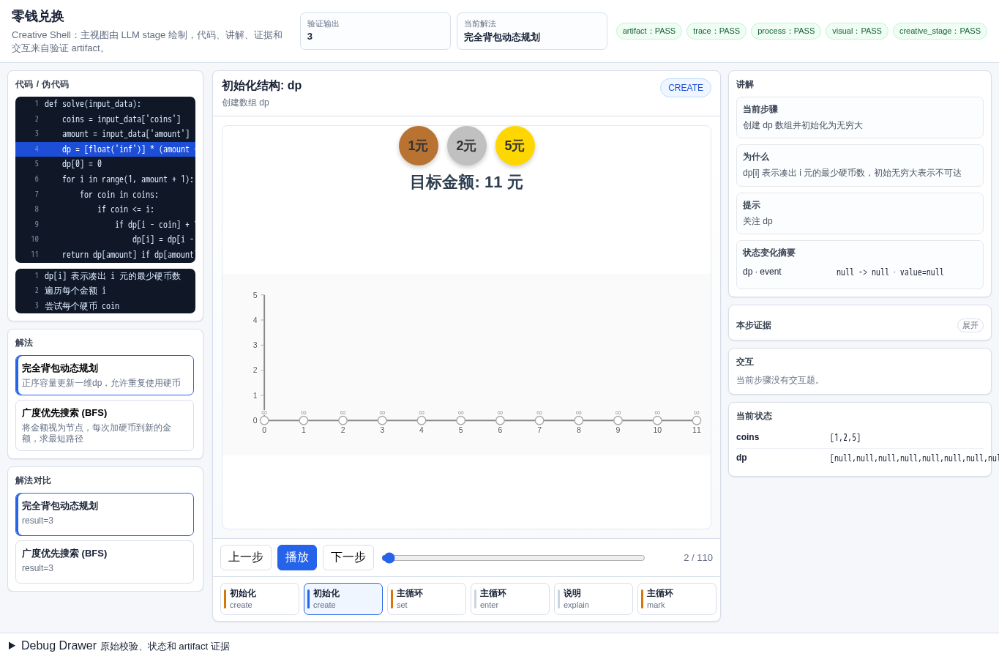
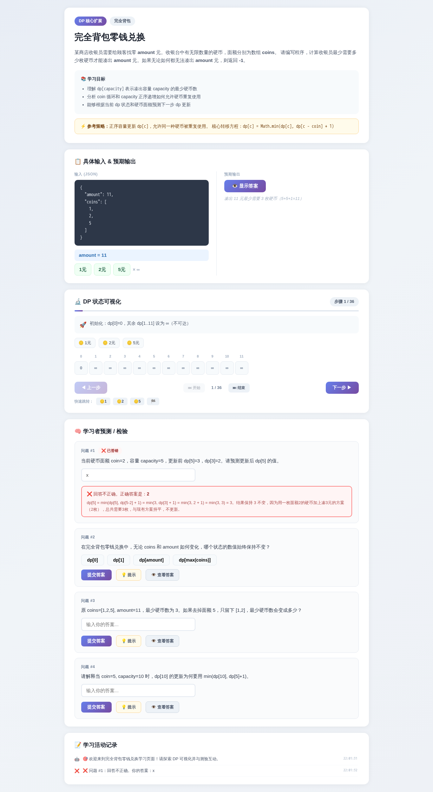
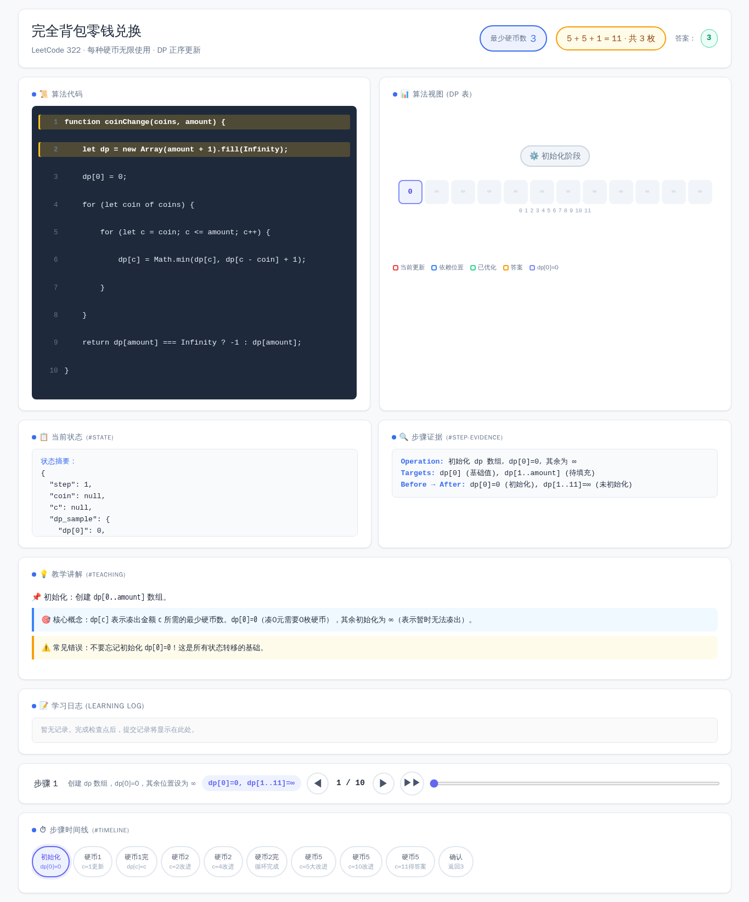
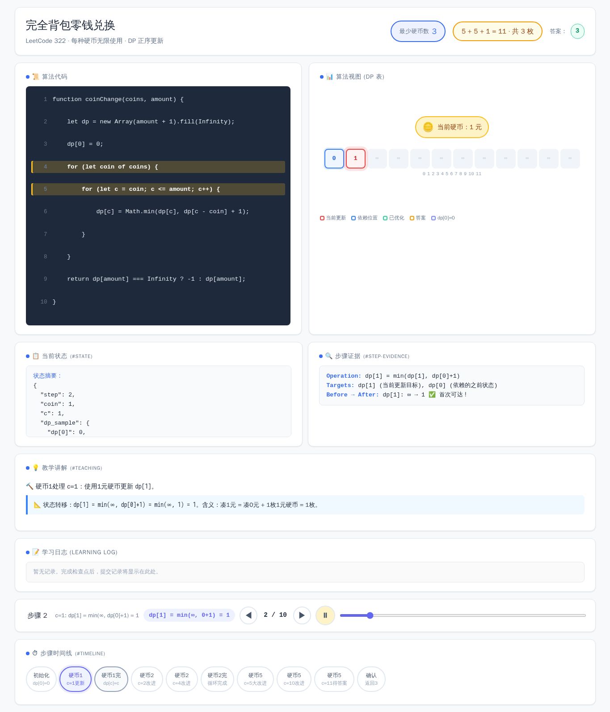

# 完全背包零钱兑换

- 案例 ID：`complete_knapsack_coin_change`
- 算法家族：DP 核心扩展
- 难度：medium
- 时间复杂度：`O(len(coins) * amount)`
- 空间复杂度：`O(amount)`

某商店收银员需要给顾客找零 amount 元。收银台中有无限数量的硬币，面额分别为数组 coins。请编写程序，计算收银员最少需要多少枚硬币才能凑出 amount 元。如果无论如何都无法凑出 amount 元，则返回 -1。

## 抽样输入

```json
{
  "expected": 3,
  "index": 0,
  "input_data": {
    "amount": 11,
    "coins": [
      1,
      2,
      5
    ]
  }
}
```

## 九项机器判定

| 方法 | Load | Answer | Interaction | Correct FB | Wrong FB | Hint | Show | Log | Mutation-free | Machine OK |
| --- | --- | --- | --- | --- | --- | --- | --- | --- | --- | --- |
| AlgoTutorGen / Stage2 | PASS | PASS | PASS | PASS | PASS | PASS | PASS | PASS | PASS | PASS |
| Direct HTML | PASS | PASS | PASS | PASS | PASS | PASS | PASS | PASS | PASS | PASS |
| WebGen-Agent | PASS | PASS | PASS | FAIL | PASS | PASS | PASS | FAIL | PASS | FAIL |
| Direct + HTMLCure (strict) | PASS | PASS | PASS | PASS | PASS | PASS | PASS | PASS | PASS | PASS |
| Direct-BrowserRepair (1-call) | PASS | PASS | PASS | PASS | PASS | PASS | PASS | PASS | PASS | PASS |

## 五种方法的真实产物

### AlgoTutorGen / Stage2

[打开 AlgoTutorGen / Stage2 HTML](algotutorgen_stage2/page.html) · [审计摘要](algotutorgen_stage2/audit.json)

- Machine OK：**PASS**
- 教学总分：4.857
- 视觉总分：4.5



### Direct HTML

[打开 Direct HTML HTML](direct_html/page.html) · [审计摘要](direct_html/audit.json)

- Machine OK：**PASS**
- 教学总分：5.0
- 视觉总分：5.0


### WebGen-Agent

[WebGen-Agent 源码入口](webgen_agent/source/index.html) · [package.json](webgen_agent/source/package.json) · [审计摘要](webgen_agent/audit.json)

- Machine OK：**FAIL**
- 教学总分：4.571
- 视觉总分：5.0



### Direct + HTMLCure (strict)

[打开 Direct + HTMLCure (strict) HTML](htmlcure_strict/page.html) · [审计摘要](htmlcure_strict/audit.json)

- Machine OK：**PASS**
- 教学总分：4.714
- 视觉总分：4.5



### Direct-BrowserRepair (1-call)

[打开 Direct-BrowserRepair (1-call) HTML](browser_repair_1call/page.html) · [审计摘要](browser_repair_1call/audit.json)

- Machine OK：**PASS**
- 教学总分：4.857
- 视觉总分：5.0


