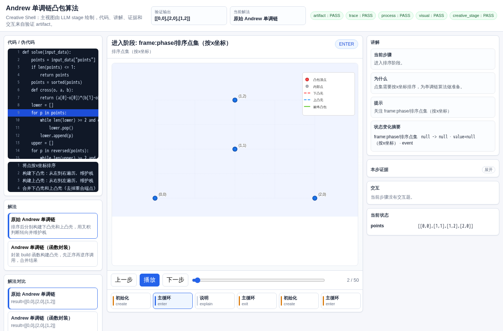
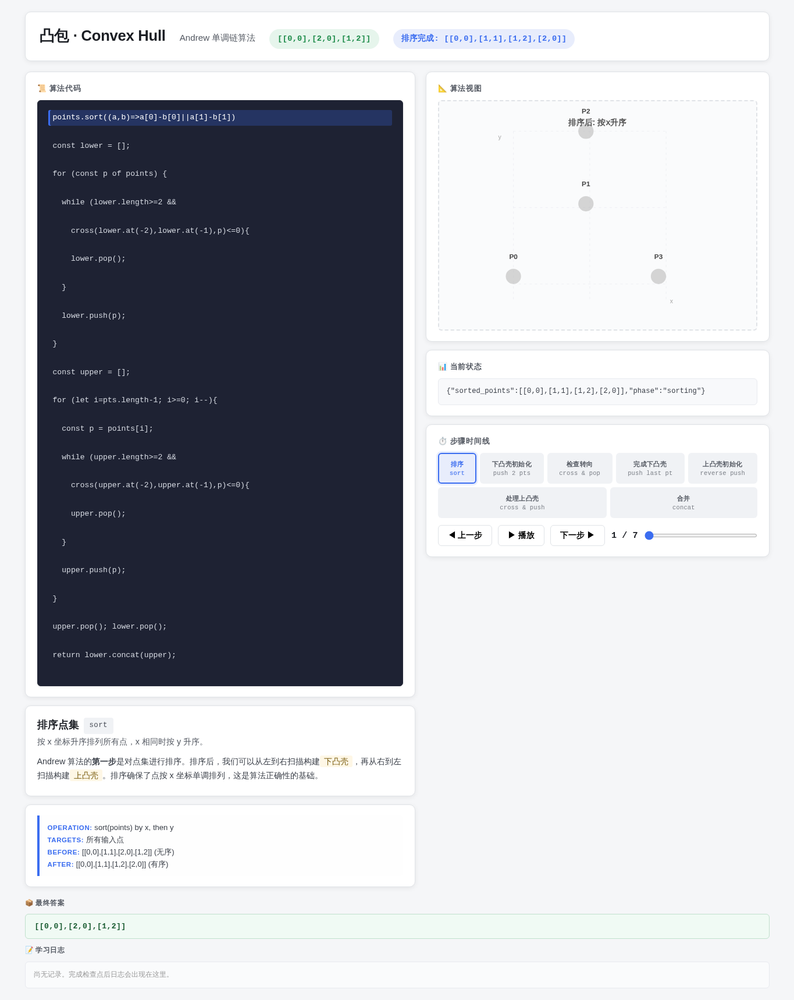
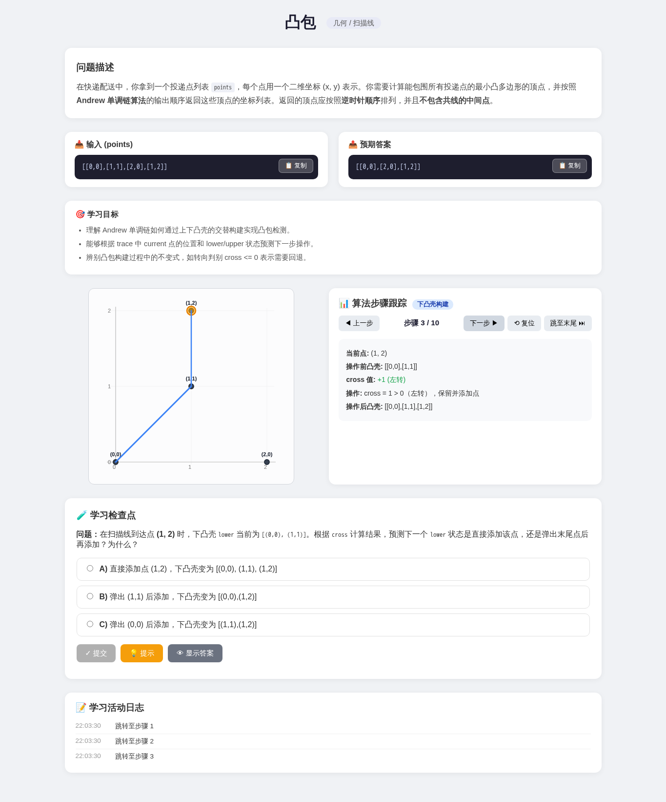
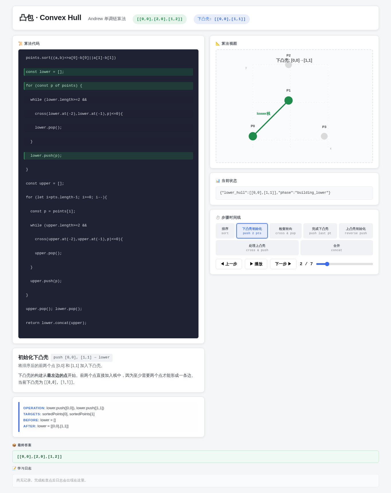

# 凸包

- 案例 ID：`convex_hull`
- 算法家族：几何 / 扫描线
- 难度：medium
- 时间复杂度：`O(n log n)`
- 空间复杂度：`O(n)`

在快递配送中，你拿到一个投递点列表 points，每个点用一个二维坐标 (x, y) 表示。你需要计算能包围所有投递点的最小凸多边形的顶点，并按照 Andrew 单调链算法的输出顺序返回这些顶点的坐标列表。返回的顶点应按照逆时针顺序排列，并且不包含共线的中间点。

## 抽样输入

```json
{
  "expected": [
    [
      0,
      0
    ],
    [
      2,
      0
    ],
    [
      1,
      2
    ]
  ],
  "index": 0,
  "input_data": {
    "points": [
      [
        0,
        0
      ],
      [
        1,
        1
      ],
      [
        2,
        0
      ],
      [
        1,
        2
      ]
    ]
  }
}
```

## 九项机器判定

| 方法 | Load | Answer | Interaction | Correct FB | Wrong FB | Hint | Show | Log | Mutation-free | Machine OK |
| --- | --- | --- | --- | --- | --- | --- | --- | --- | --- | --- |
| AlgoTutorGen / Stage2 | PASS | PASS | PASS | PASS | PASS | PASS | PASS | PASS | PASS | PASS |
| Direct HTML | PASS | PASS | PASS | PASS | PASS | PASS | PASS | PASS | PASS | PASS |
| WebGen-Agent | PASS | PASS | PASS | FAIL | FAIL | FAIL | PASS | PASS | PASS | FAIL |
| Direct + HTMLCure (strict) | PASS | PASS | PASS | PASS | PASS | PASS | PASS | PASS | PASS | PASS |
| Direct-BrowserRepair (1-call) | PASS | PASS | PASS | PASS | PASS | PASS | PASS | PASS | PASS | PASS |

## 五种方法的真实产物

### AlgoTutorGen / Stage2

[打开 AlgoTutorGen / Stage2 HTML](algotutorgen_stage2/page.html) · [审计摘要](algotutorgen_stage2/audit.json)

- Machine OK：**PASS**
- 教学总分：4.714
- 视觉总分：4.75



### Direct HTML

[打开 Direct HTML HTML](direct_html/page.html) · [审计摘要](direct_html/audit.json)

- Machine OK：**PASS**
- 教学总分：4.857
- 视觉总分：4.75



### WebGen-Agent

[WebGen-Agent 源码入口](webgen_agent/source/index.html) · [package.json](webgen_agent/source/package.json) · [审计摘要](webgen_agent/audit.json)

- Machine OK：**FAIL**
- 教学总分：3.857
- 视觉总分：5.0



### Direct + HTMLCure (strict)

[打开 Direct + HTMLCure (strict) HTML](htmlcure_strict/page.html) · [审计摘要](htmlcure_strict/audit.json)

- Machine OK：**PASS**
- 教学总分：4.857
- 视觉总分：4.75


### Direct-BrowserRepair (1-call)

[打开 Direct-BrowserRepair (1-call) HTML](browser_repair_1call/page.html) · [审计摘要](browser_repair_1call/audit.json)

- Machine OK：**PASS**
- 教学总分：4.857
- 视觉总分：4.75


