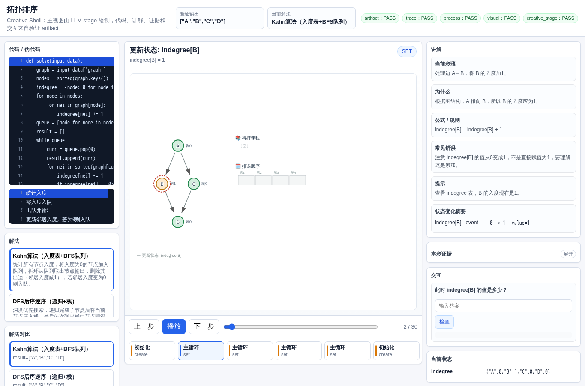
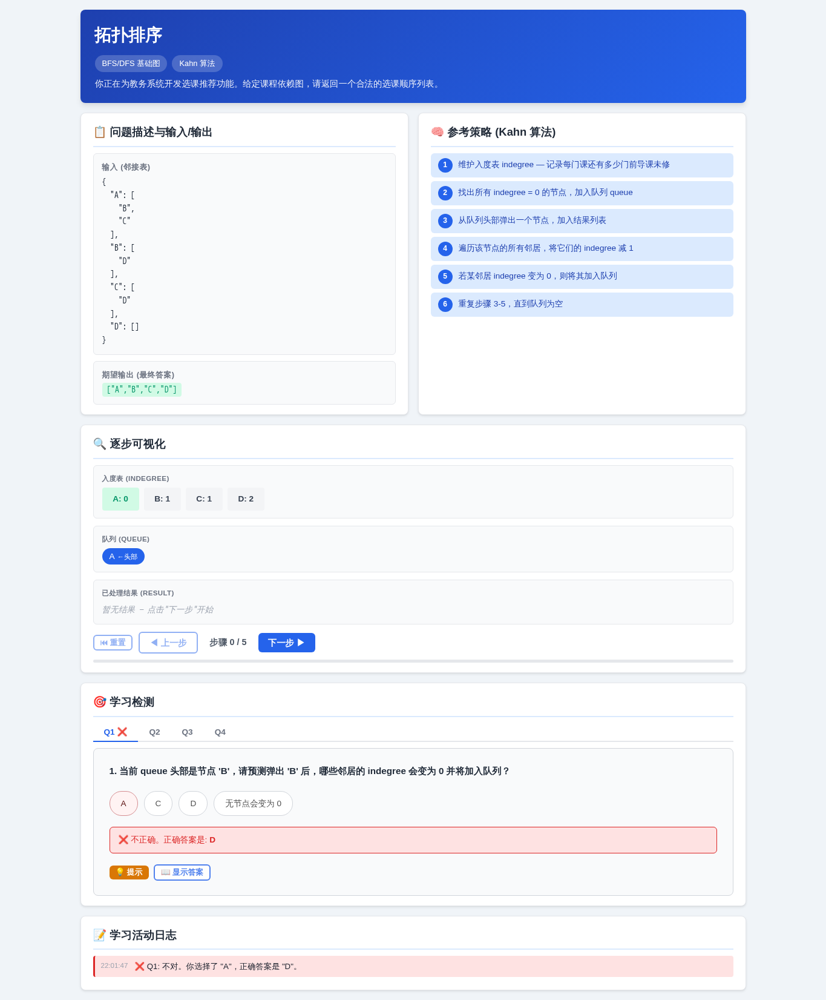
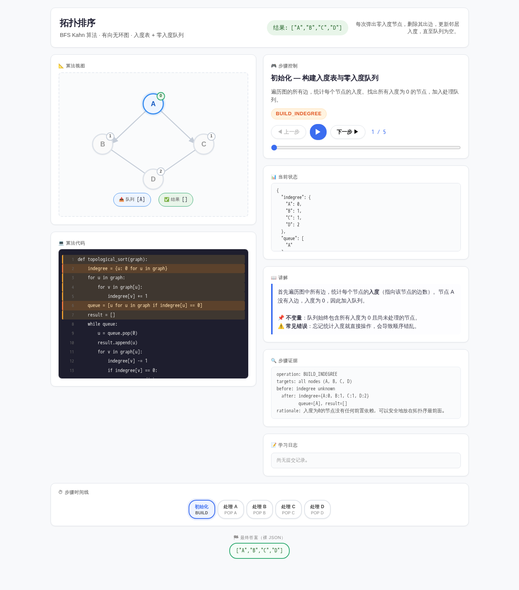
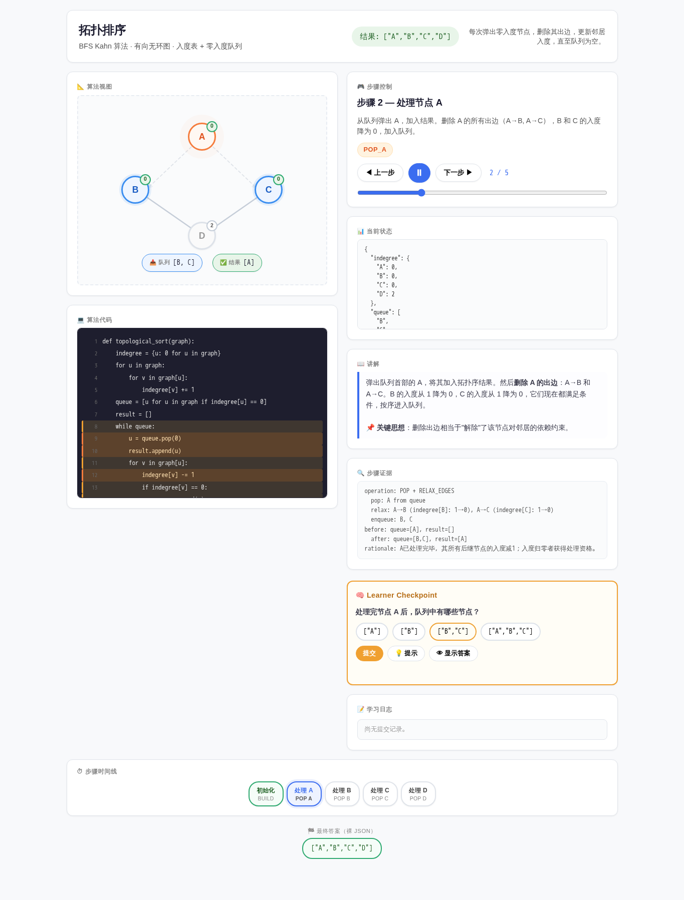

# 拓扑排序

- 案例 ID：`graph_topological_sort`
- 算法家族：BFS/DFS 基础图
- 难度：medium
- 时间复杂度：`O(V+E)`
- 空间复杂度：`O(V)`

你正在为教务系统开发选课推荐功能。给定课程依赖图 graph（邻接表），每门课用字符串表示。请返回一个合法的选课顺序列表，使得每门课的所有前导课程都出现在它之前。

## 抽样输入

```json
{
  "expected": [
    "A",
    "B",
    "C",
    "D"
  ],
  "index": 0,
  "input_data": {
    "graph": {
      "A": [
        "B",
        "C"
      ],
      "B": [
        "D"
      ],
      "C": [
        "D"
      ],
      "D": []
    }
  }
}
```

## 九项机器判定

| 方法 | Load | Answer | Interaction | Correct FB | Wrong FB | Hint | Show | Log | Mutation-free | Machine OK |
| --- | --- | --- | --- | --- | --- | --- | --- | --- | --- | --- |
| AlgoTutorGen / Stage2 | PASS | PASS | PASS | PASS | PASS | PASS | PASS | PASS | PASS | PASS |
| Direct HTML | PASS | PASS | PASS | PASS | PASS | PASS | PASS | PASS | PASS | PASS |
| WebGen-Agent | PASS | PASS | PASS | PASS | PASS | PASS | PASS | PASS | PASS | PASS |
| Direct + HTMLCure (strict) | PASS | PASS | PASS | PASS | PASS | PASS | PASS | PASS | PASS | PASS |
| Direct-BrowserRepair (1-call) | PASS | PASS | PASS | PASS | PASS | PASS | PASS | PASS | PASS | PASS |

## 五种方法的真实产物

### AlgoTutorGen / Stage2

[打开 AlgoTutorGen / Stage2 HTML](algotutorgen_stage2/page.html) · [审计摘要](algotutorgen_stage2/audit.json)

- Machine OK：**PASS**
- 教学总分：4.857
- 视觉总分：5.0



### Direct HTML

[打开 Direct HTML HTML](direct_html/page.html) · [审计摘要](direct_html/audit.json)

- Machine OK：**PASS**
- 教学总分：5.0
- 视觉总分：5.0


### WebGen-Agent

[WebGen-Agent 源码入口](webgen_agent/source/index.html) · [package.json](webgen_agent/source/package.json) · [审计摘要](webgen_agent/audit.json)

- Machine OK：**PASS**
- 教学总分：4.857
- 视觉总分：4.25



### Direct + HTMLCure (strict)

[打开 Direct + HTMLCure (strict) HTML](htmlcure_strict/page.html) · [审计摘要](htmlcure_strict/audit.json)

- Machine OK：**PASS**
- 教学总分：5.0
- 视觉总分：4.75



### Direct-BrowserRepair (1-call)

[打开 Direct-BrowserRepair (1-call) HTML](browser_repair_1call/page.html) · [审计摘要](browser_repair_1call/audit.json)

- Machine OK：**PASS**
- 教学总分：5.0
- 视觉总分：5.0


