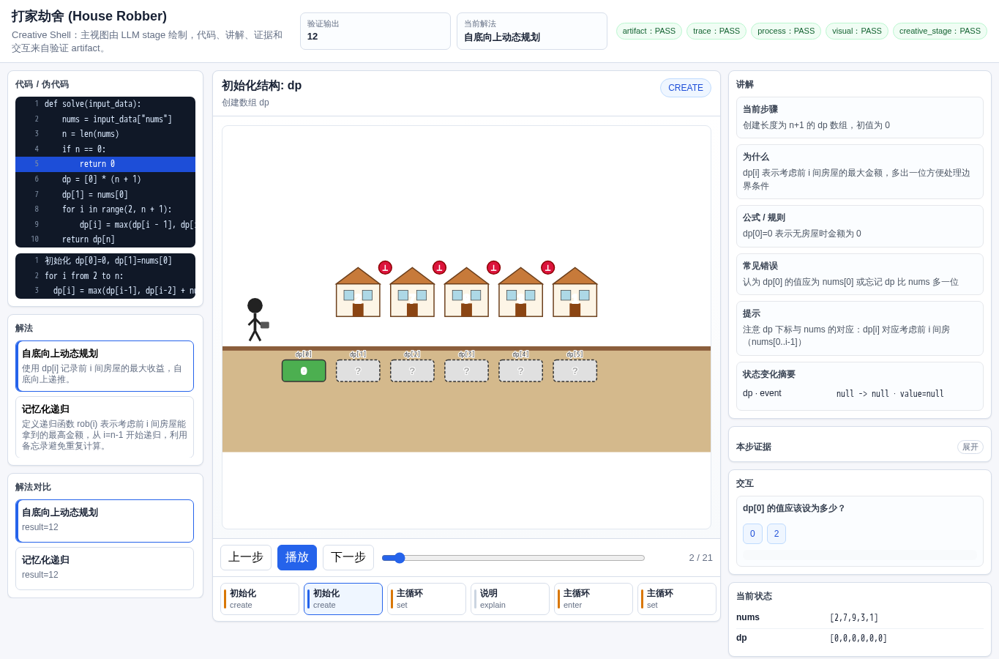
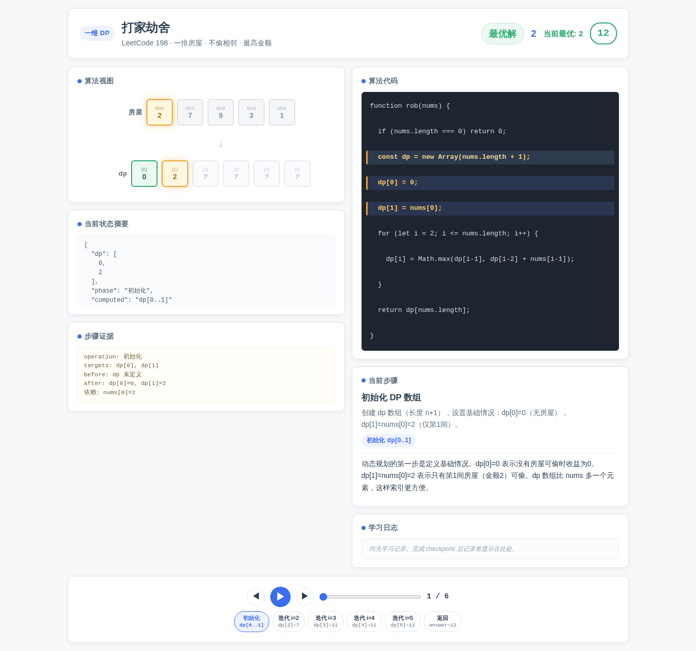
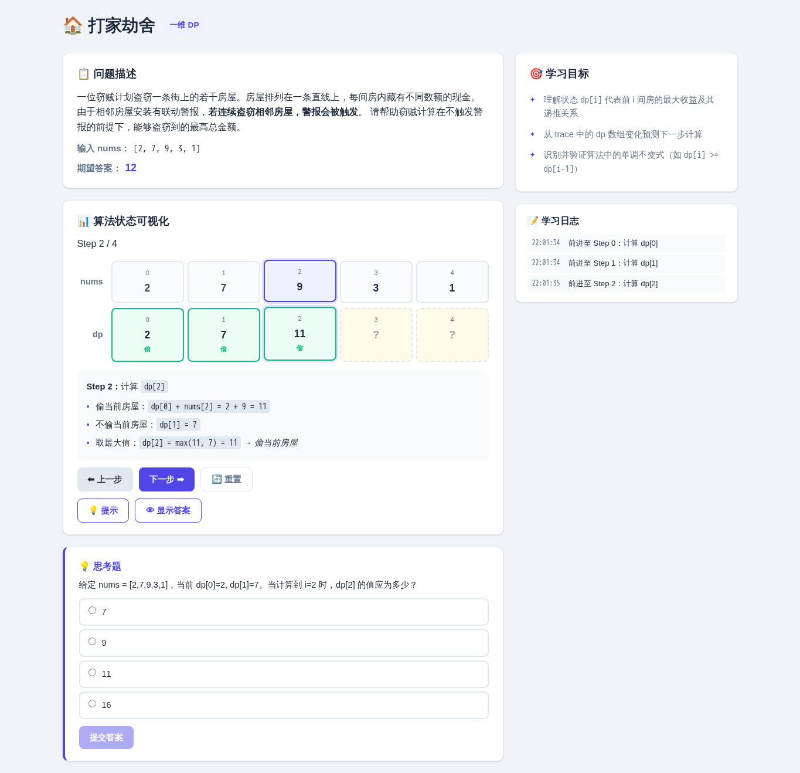
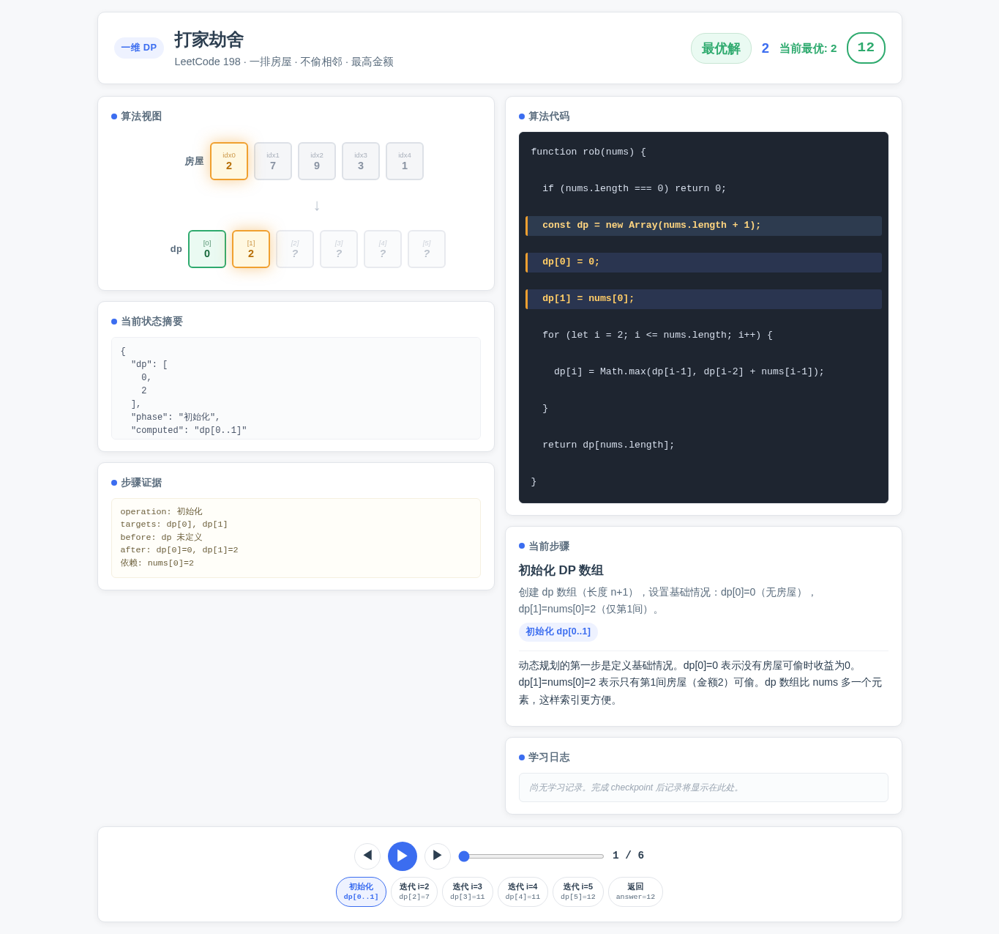
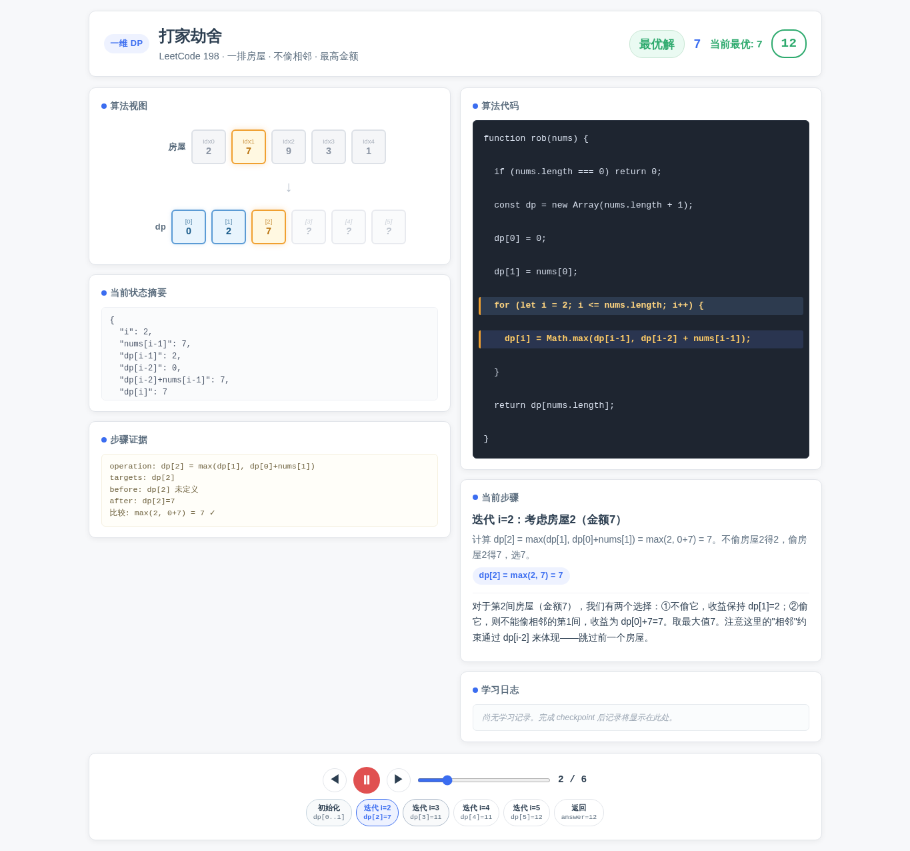

# 打家劫舍

- 案例 ID：`house_robber`
- 算法家族：一维 DP
- 难度：medium
- 时间复杂度：`O(n)`
- 空间复杂度：`O(n)`

一位窃贼计划盗窃一条街上的若干房屋。房屋排列在一条直线上，每间房内藏有不同数额的现金，用一个整数数组 nums 表示，其中 nums[i] 为第 i 间房的现金额（0‑based 索引）。由于相邻房屋安装有联动警报，若连续盗窃相邻房屋，警报会被触发。请帮助窃贼计算在不触发警报的前提下，能够盗窃到的最高总金额。

## 抽样输入

```json
{
  "expected": 12,
  "index": 0,
  "input_data": {
    "nums": [
      2,
      7,
      9,
      3,
      1
    ]
  }
}
```

## 九项机器判定

| 方法 | Load | Answer | Interaction | Correct FB | Wrong FB | Hint | Show | Log | Mutation-free | Machine OK |
| --- | --- | --- | --- | --- | --- | --- | --- | --- | --- | --- |
| AlgoTutorGen / Stage2 | PASS | PASS | PASS | PASS | PASS | PASS | PASS | PASS | PASS | PASS |
| Direct HTML | PASS | PASS | PASS | PASS | PASS | PASS | PASS | PASS | PASS | PASS |
| WebGen-Agent | PASS | PASS | PASS | FAIL | FAIL | PASS | PASS | FAIL | PASS | FAIL |
| Direct + HTMLCure (strict) | PASS | PASS | PASS | PASS | PASS | PASS | PASS | PASS | PASS | PASS |
| Direct-BrowserRepair (1-call) | PASS | PASS | PASS | PASS | PASS | PASS | PASS | PASS | PASS | PASS |

## 五种方法的真实产物

### AlgoTutorGen / Stage2

[打开 AlgoTutorGen / Stage2 HTML](algotutorgen_stage2/page.html) · [审计摘要](algotutorgen_stage2/audit.json)

- Machine OK：**PASS**
- 教学总分：5.0
- 视觉总分：5.0



### Direct HTML

[打开 Direct HTML HTML](direct_html/page.html) · [审计摘要](direct_html/audit.json)

- Machine OK：**PASS**
- 教学总分：4.857
- 视觉总分：4.75



### WebGen-Agent

[WebGen-Agent 源码入口](webgen_agent/source/index.html) · [package.json](webgen_agent/source/package.json) · [审计摘要](webgen_agent/audit.json)

- Machine OK：**FAIL**
- 教学总分：4.143
- 视觉总分：4.75



### Direct + HTMLCure (strict)

[打开 Direct + HTMLCure (strict) HTML](htmlcure_strict/page.html) · [审计摘要](htmlcure_strict/audit.json)

- Machine OK：**PASS**
- 教学总分：5.0
- 视觉总分：5.0



### Direct-BrowserRepair (1-call)

[打开 Direct-BrowserRepair (1-call) HTML](browser_repair_1call/page.html) · [审计摘要](browser_repair_1call/audit.json)

- Machine OK：**PASS**
- 教学总分：5.0
- 视觉总分：5.0


