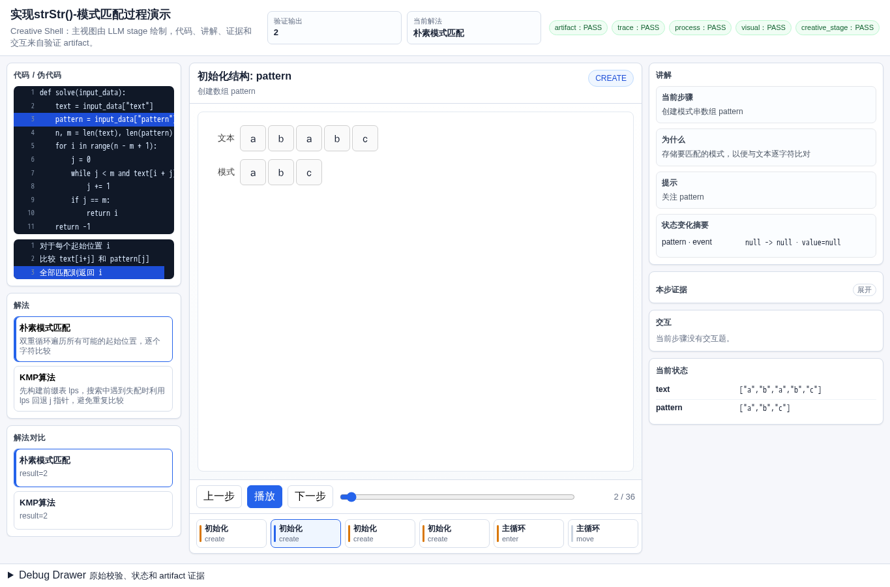
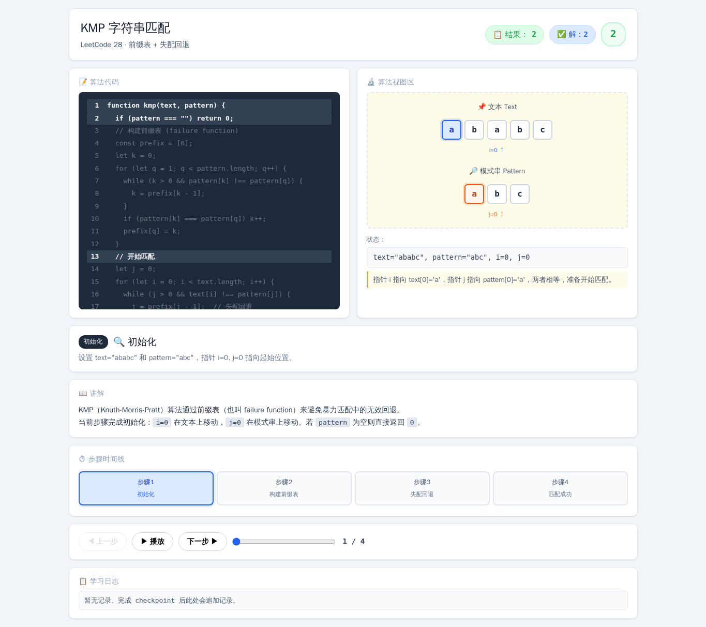
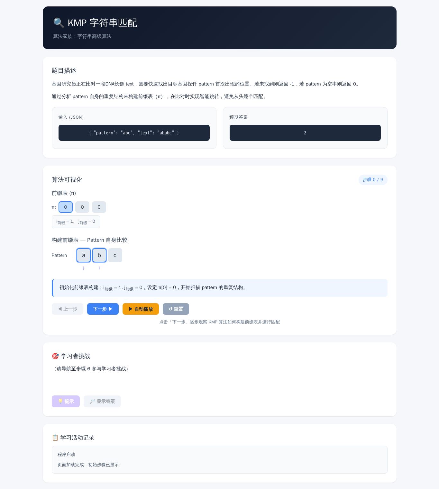
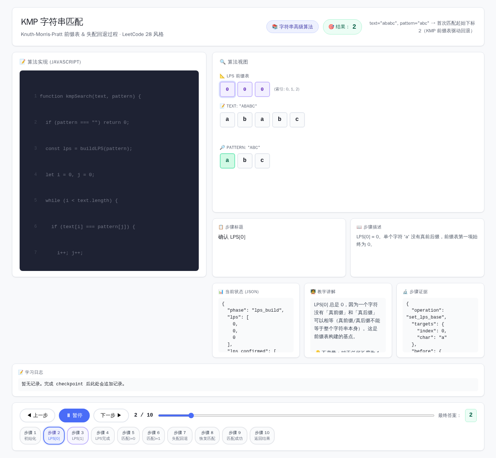

# KMP 字符串匹配

- 案例 ID：`kmp`
- 算法家族：字符串高级算法
- 难度：medium
- 时间复杂度：`O(n+m)`
- 空间复杂度：`O(m)`

基因研究员正在比对一段DNA长链 text，需要快速找出目标基因探针 pattern 首次出现的位置。若未找到则返回 -1，若 pattern 为空串则返回 0。你可以通过分析 pattern 自身的重复结构来构建前缀表，在比对时实现智能跳转，避免从头逐个匹配。

## 抽样输入

```json
{
  "expected": 2,
  "index": 0,
  "input_data": {
    "pattern": "abc",
    "text": "ababc"
  }
}
```

## 九项机器判定

| 方法 | Load | Answer | Interaction | Correct FB | Wrong FB | Hint | Show | Log | Mutation-free | Machine OK |
| --- | --- | --- | --- | --- | --- | --- | --- | --- | --- | --- |
| AlgoTutorGen / Stage2 | PASS | PASS | PASS | PASS | PASS | PASS | PASS | PASS | PASS | PASS |
| Direct HTML | PASS | PASS | PASS | FAIL | PASS | FAIL | FAIL | PASS | PASS | FAIL |
| WebGen-Agent | PASS | PASS | PASS | FAIL | FAIL | FAIL | FAIL | FAIL | PASS | FAIL |
| Direct + HTMLCure (strict) | PASS | PASS | PASS | FAIL | PASS | FAIL | FAIL | PASS | PASS | FAIL |
| Direct-BrowserRepair (1-call) | PASS | PASS | PASS | FAIL | PASS | FAIL | FAIL | PASS | PASS | FAIL |

## 五种方法的真实产物

### AlgoTutorGen / Stage2

[打开 AlgoTutorGen / Stage2 HTML](algotutorgen_stage2/page.html) · [审计摘要](algotutorgen_stage2/audit.json)

- Machine OK：**PASS**
- 教学总分：4.857
- 视觉总分：4.5



### Direct HTML

[打开 Direct HTML HTML](direct_html/page.html) · [审计摘要](direct_html/audit.json)

- Machine OK：**FAIL**
- 教学总分：3.857
- 视觉总分：4.5



### WebGen-Agent

[WebGen-Agent 源码入口](webgen_agent/source/index.html) · [package.json](webgen_agent/source/package.json) · [审计摘要](webgen_agent/audit.json)

- Machine OK：**FAIL**
- 教学总分：3.429
- 视觉总分：4.0



### Direct + HTMLCure (strict)

[打开 Direct + HTMLCure (strict) HTML](htmlcure_strict/page.html) · [审计摘要](htmlcure_strict/audit.json)

- Machine OK：**FAIL**
- 教学总分：4.143
- 视觉总分：4.5


### Direct-BrowserRepair (1-call)

[打开 Direct-BrowserRepair (1-call) HTML](browser_repair_1call/page.html) · [审计摘要](browser_repair_1call/audit.json)

- Machine OK：**FAIL**
- 教学总分：4.429
- 视觉总分：5.0


