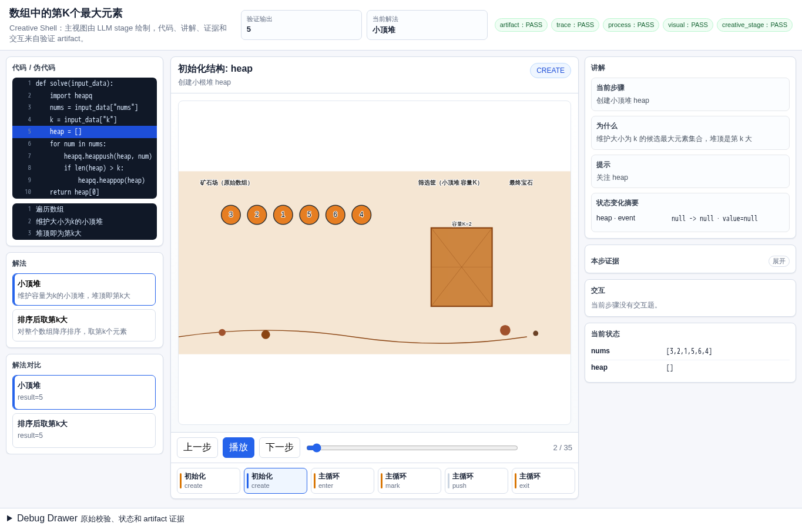
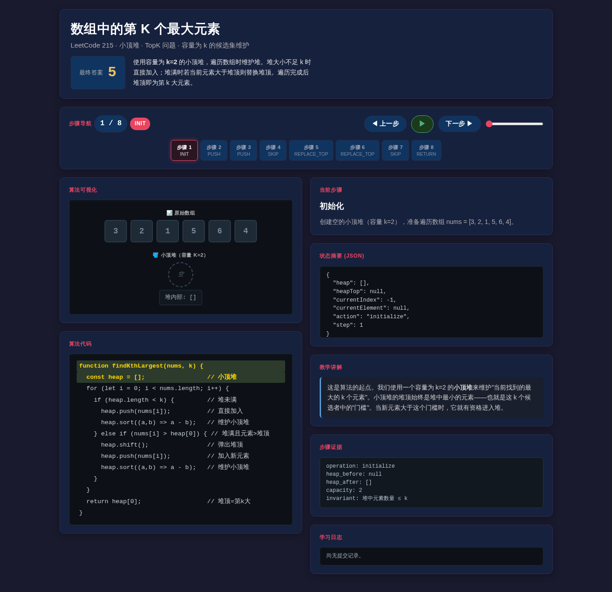
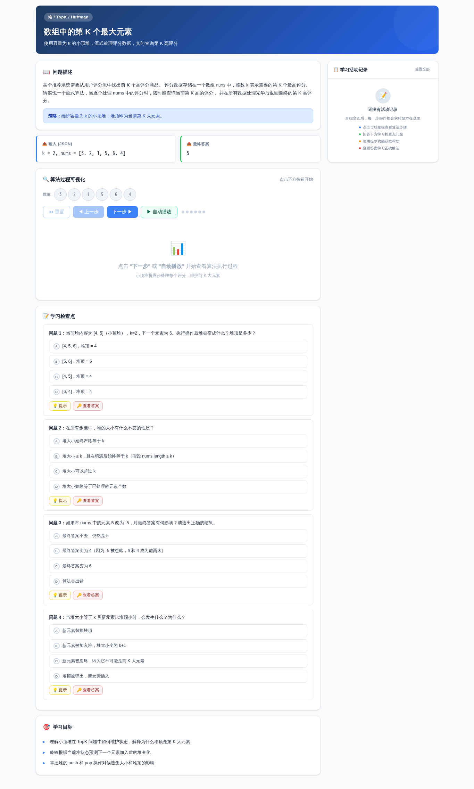
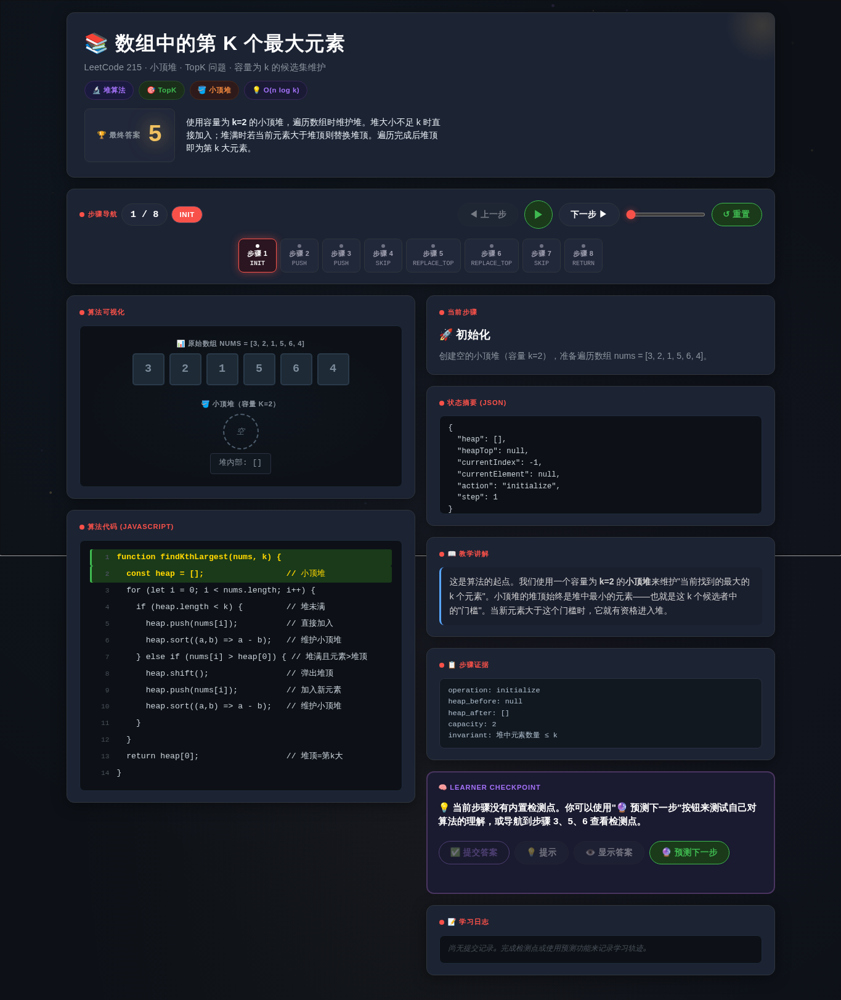
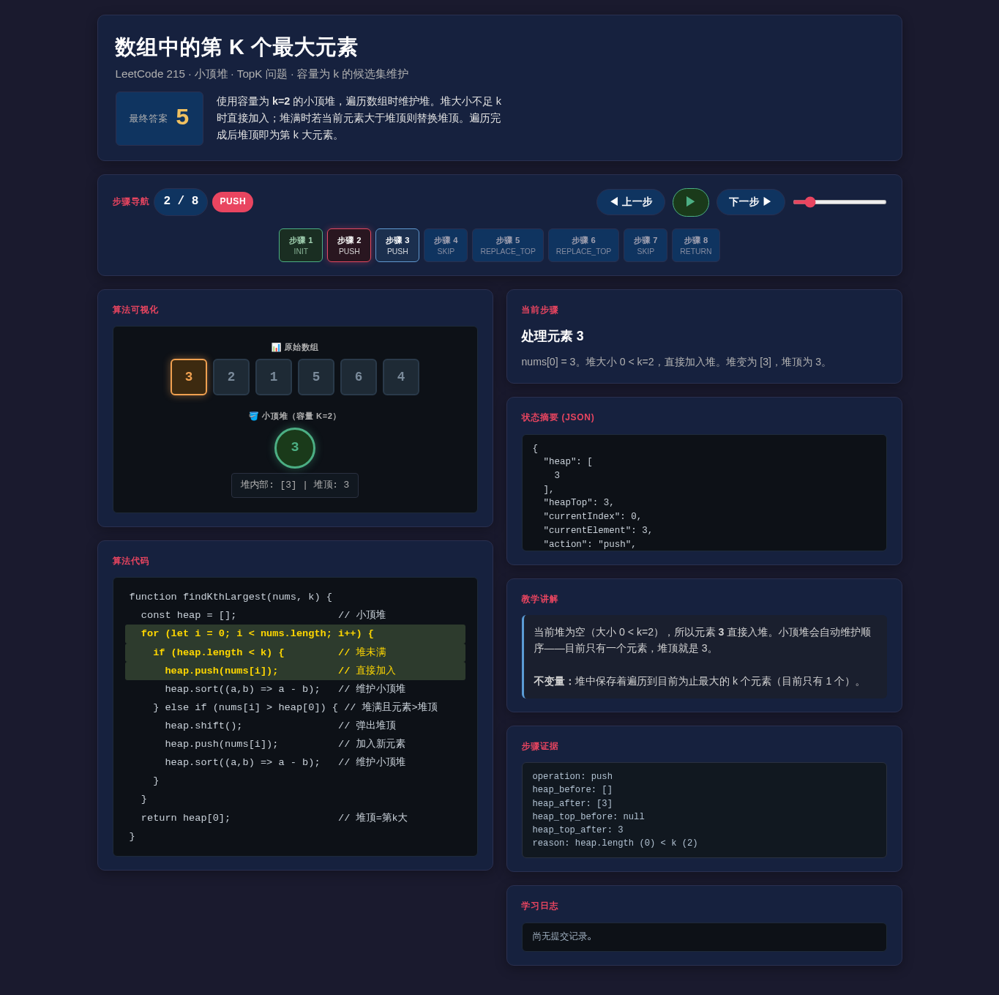

# 数组中的第 K 个最大元素

- 案例 ID：`kth_largest`
- 算法家族：堆 / TopK / Huffman
- 难度：medium
- 时间复杂度：`O(n log k)`
- 空间复杂度：`O(k)`

某个推荐系统需要从用户评分流中找出前 K 个高评分商品。评分数据存储在一个数组 nums 中，整数 k 表示需要的第 K 个最高评分。请实现一个流式算法，当逐个处理 nums 中的评分时，随时能查询当前第 K 高的评分，并在所有数据处理完毕后返回最终的第 K 高评分。

## 抽样输入

```json
{
  "expected": 5,
  "index": 0,
  "input_data": {
    "k": 2,
    "nums": [
      3,
      2,
      1,
      5,
      6,
      4
    ]
  }
}
```

## 九项机器判定

| 方法 | Load | Answer | Interaction | Correct FB | Wrong FB | Hint | Show | Log | Mutation-free | Machine OK |
| --- | --- | --- | --- | --- | --- | --- | --- | --- | --- | --- |
| AlgoTutorGen / Stage2 | PASS | PASS | PASS | PASS | PASS | PASS | PASS | PASS | PASS | PASS |
| Direct HTML | PASS | PASS | PASS | FAIL | PASS | PASS | PASS | PASS | PASS | FAIL |
| WebGen-Agent | PASS | PASS | PASS | FAIL | FAIL | PASS | PASS | FAIL | PASS | FAIL |
| Direct + HTMLCure (strict) | FAIL | FAIL | FAIL | FAIL | FAIL | FAIL | FAIL | FAIL | FAIL | FAIL |
| Direct-BrowserRepair (1-call) | PASS | PASS | PASS | FAIL | PASS | PASS | PASS | PASS | PASS | FAIL |

## 五种方法的真实产物

### AlgoTutorGen / Stage2

[打开 AlgoTutorGen / Stage2 HTML](algotutorgen_stage2/page.html) · [审计摘要](algotutorgen_stage2/audit.json)

- Machine OK：**PASS**
- 教学总分：4.857
- 视觉总分：4.75



### Direct HTML

[打开 Direct HTML HTML](direct_html/page.html) · [审计摘要](direct_html/audit.json)

- Machine OK：**FAIL**
- 教学总分：4.143
- 视觉总分：4.75



### WebGen-Agent

[WebGen-Agent 源码入口](webgen_agent/source/index.html) · [package.json](webgen_agent/source/package.json) · [审计摘要](webgen_agent/audit.json)

- Machine OK：**FAIL**
- 教学总分：4.143
- 视觉总分：4.25



### Direct + HTMLCure (strict)

[打开 Direct + HTMLCure (strict) HTML](htmlcure_strict/page.html) · [审计摘要](htmlcure_strict/audit.json)

- Machine OK：**FAIL**
- 教学总分：2.429
- 视觉总分：4.5



### Direct-BrowserRepair (1-call)

[打开 Direct-BrowserRepair (1-call) HTML](browser_repair_1call/page.html) · [审计摘要](browser_repair_1call/audit.json)

- Machine OK：**FAIL**
- 教学总分：4.143
- 视觉总分：5.0


