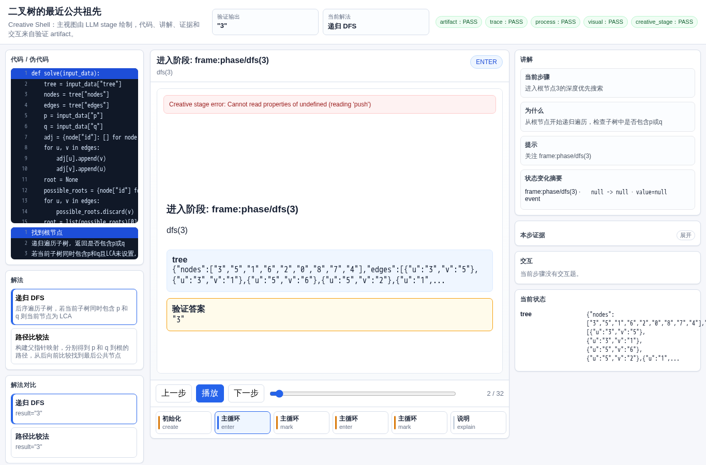
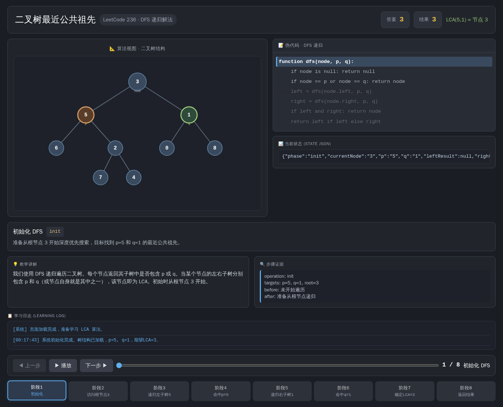
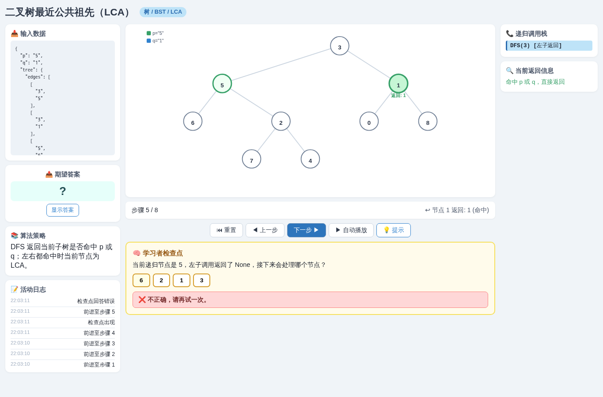
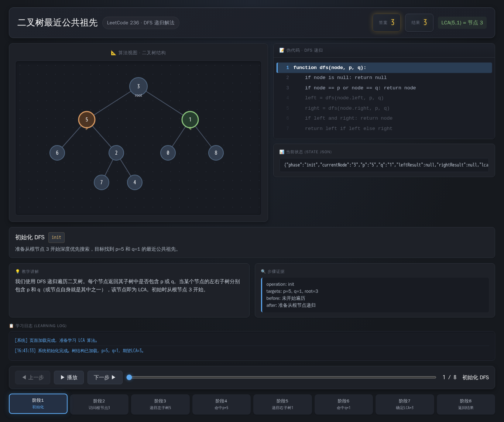
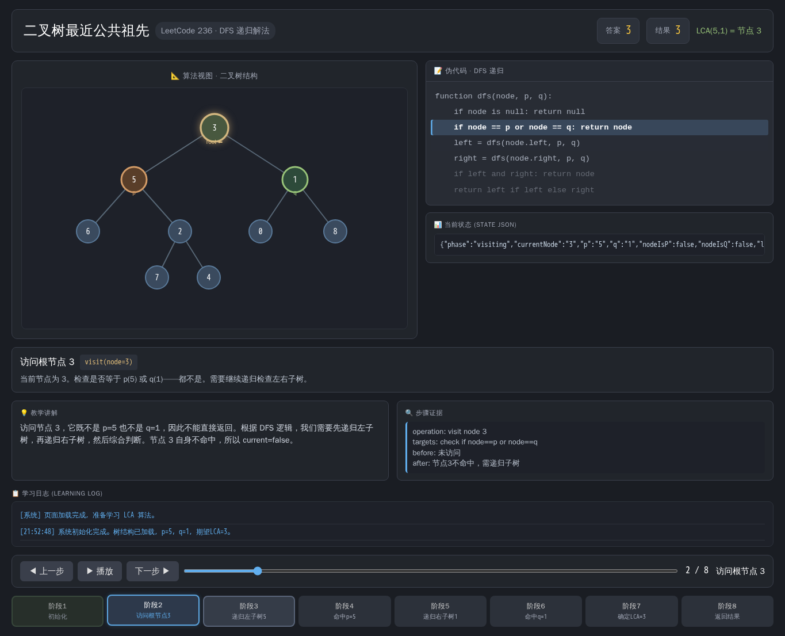

# 二叉树最近公共祖先

- 案例 ID：`lca`
- 算法家族：树 / BST / LCA
- 难度：medium
- 时间复杂度：`O(n)`
- 空间复杂度：`O(h)`

在家族谱系追踪系统中，用户经常需要了解两位成员的血缘关系。你的任务是：根据完整的家族树 tree（含节点 id 和亲子边），对于任意指定的成员 p 和 q，计算二者深度最大的共同祖先节点，并以字符串形式返回该节点的 id。

## 抽样输入

```json
{
  "expected": "3",
  "index": 0,
  "input_data": {
    "p": "5",
    "q": "1",
    "tree": {
      "edges": [
        [
          "3",
          "5"
        ],
        [
          "3",
          "1"
        ],
        [
          "5",
          "6"
        ],
        [
          "5",
          "2"
        ],
        [
          "1",
          "0"
        ],
        [
          "1",
          "8"
        ],
        [
          "2",
          "7"
        ],
        [
          "2",
          "4"
        ]
      ],
      "nodes": [
        {
          "id": "3"
        },
        {
          "id": "5"
        },
        {
          "id": "1"
        },
        {
          "id": "6"
        },
        {
          "id": "2"
        },
        {
          "id": "0"
        },
        {
          "id": "8"
        },
        {
          "id": "7"
        },
        {
          "id": "4"
        }
      ]
    }
  }
}
```

## 九项机器判定

| 方法 | Load | Answer | Interaction | Correct FB | Wrong FB | Hint | Show | Log | Mutation-free | Machine OK |
| --- | --- | --- | --- | --- | --- | --- | --- | --- | --- | --- |
| AlgoTutorGen / Stage2 | PASS | PASS | PASS | PASS | PASS | PASS | PASS | PASS | PASS | PASS |
| Direct HTML | PASS | PASS | FAIL | FAIL | FAIL | FAIL | FAIL | FAIL | FAIL | FAIL |
| WebGen-Agent | PASS | PASS | PASS | PASS | PASS | PASS | PASS | PASS | PASS | PASS |
| Direct + HTMLCure (strict) | FAIL | FAIL | FAIL | FAIL | FAIL | FAIL | FAIL | FAIL | FAIL | FAIL |
| Direct-BrowserRepair (1-call) | PASS | PASS | FAIL | FAIL | FAIL | FAIL | FAIL | FAIL | FAIL | FAIL |

## 五种方法的真实产物

### AlgoTutorGen / Stage2

[打开 AlgoTutorGen / Stage2 HTML](algotutorgen_stage2/page.html) · [审计摘要](algotutorgen_stage2/audit.json)

- Machine OK：**PASS**
- 教学总分：3.0
- 视觉总分：2.75



### Direct HTML

[打开 Direct HTML HTML](direct_html/page.html) · [审计摘要](direct_html/audit.json)

- Machine OK：**FAIL**
- 教学总分：3.143
- 视觉总分：4.5



### WebGen-Agent

[WebGen-Agent 源码入口](webgen_agent/source/index.html) · [package.json](webgen_agent/source/package.json) · [审计摘要](webgen_agent/audit.json)

- Machine OK：**PASS**
- 教学总分：4.857
- 视觉总分：4.75



### Direct + HTMLCure (strict)

[打开 Direct + HTMLCure (strict) HTML](htmlcure_strict/page.html) · [审计摘要](htmlcure_strict/audit.json)

- Machine OK：**FAIL**
- 教学总分：2.0
- 视觉总分：3.25



### Direct-BrowserRepair (1-call)

[打开 Direct-BrowserRepair (1-call) HTML](browser_repair_1call/page.html) · [审计摘要](browser_repair_1call/audit.json)

- Machine OK：**FAIL**
- 教学总分：3.143
- 视觉总分：4.5


