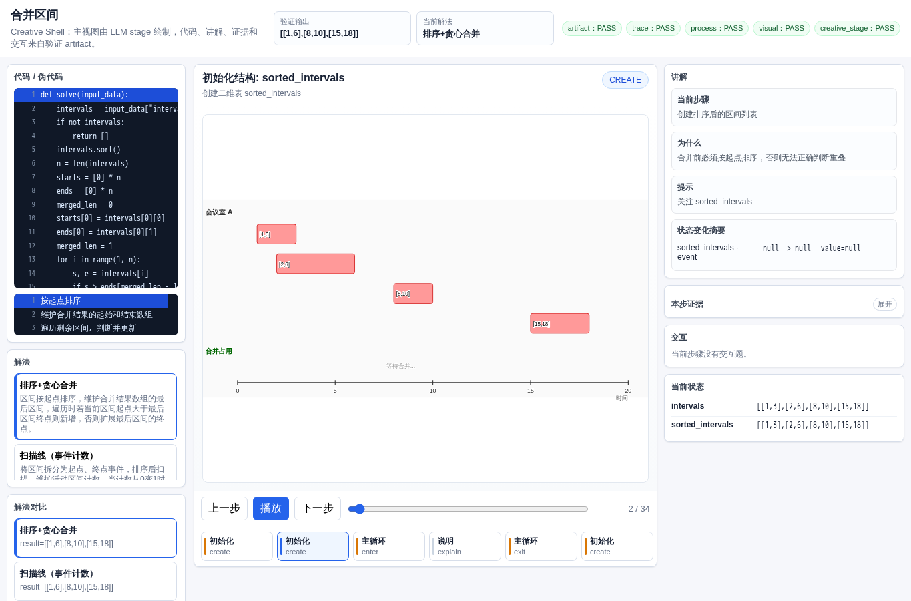
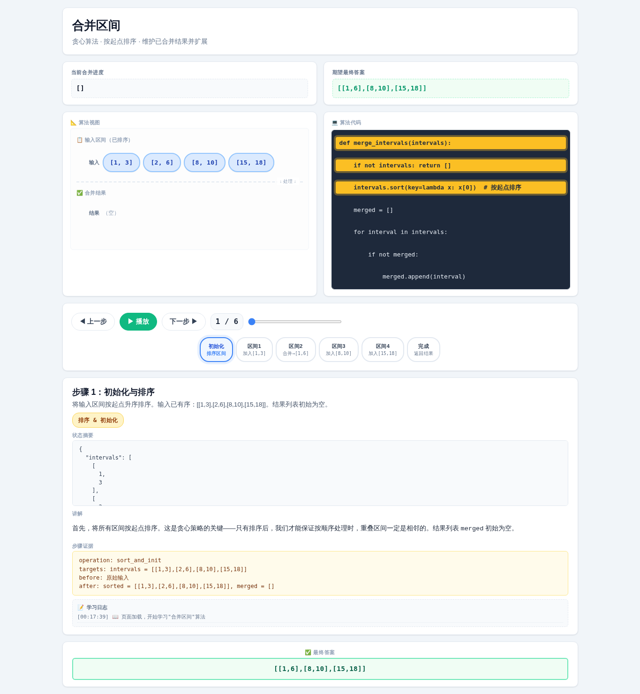
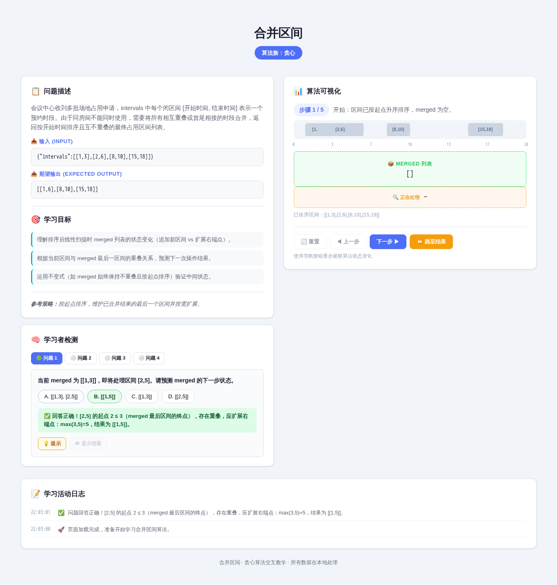
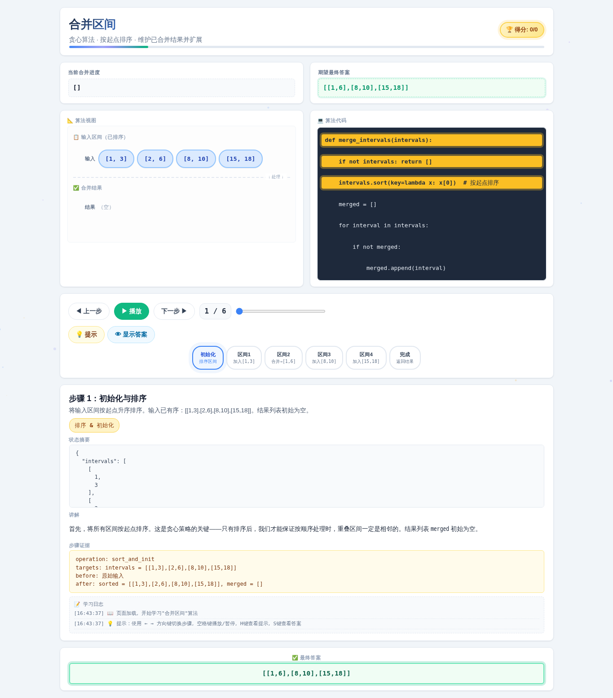
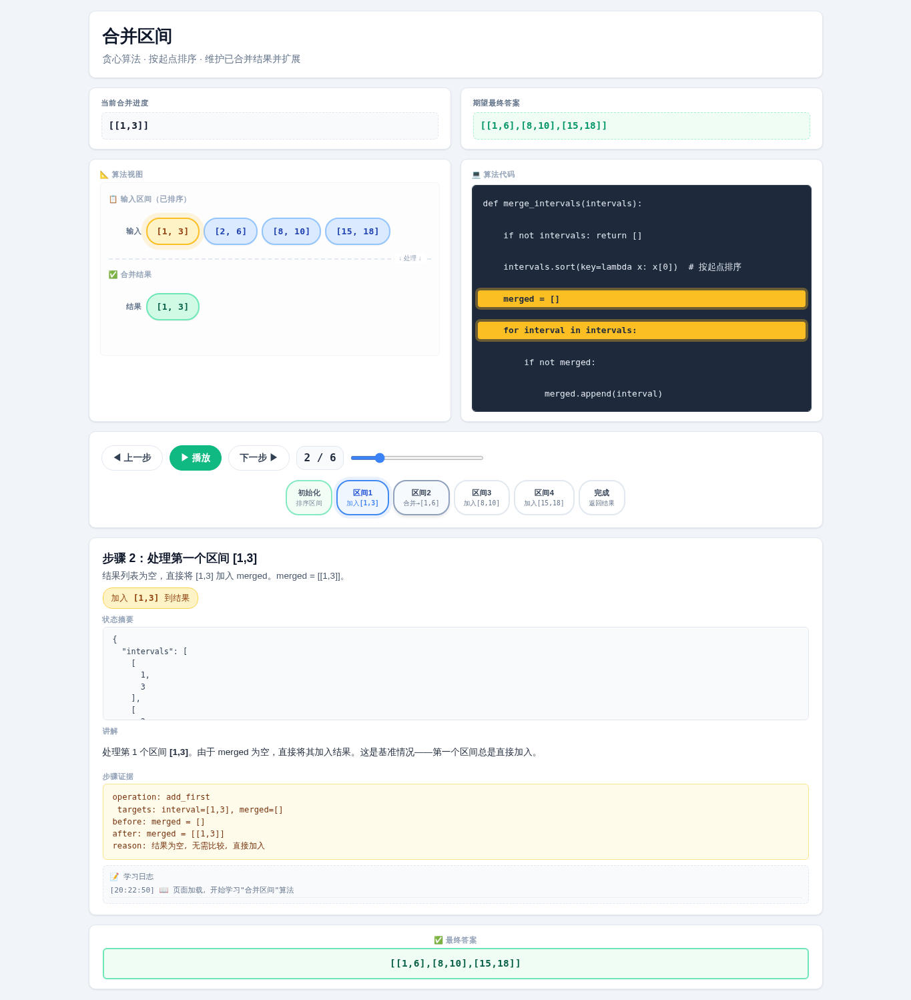

# 合并区间

- 案例 ID：`merge_intervals`
- 算法家族：贪心
- 难度：medium
- 时间复杂度：`O(n log n)`
- 空间复杂度：`O(n)`

会议中心收到多批场地占用申请，intervals 中每个闭区间 [开始时间, 结束时间] 表示一个预约时段。由于同房间不能同时使用，需要将所有相互重叠或首尾相接的时段合并，返回按开始时间排序且互不重叠的最终占用区间列表。

## 抽样输入

```json
{
  "expected": [
    [
      1,
      6
    ],
    [
      8,
      10
    ],
    [
      15,
      18
    ]
  ],
  "index": 0,
  "input_data": {
    "intervals": [
      [
        1,
        3
      ],
      [
        2,
        6
      ],
      [
        8,
        10
      ],
      [
        15,
        18
      ]
    ]
  }
}
```

## 九项机器判定

| 方法 | Load | Answer | Interaction | Correct FB | Wrong FB | Hint | Show | Log | Mutation-free | Machine OK |
| --- | --- | --- | --- | --- | --- | --- | --- | --- | --- | --- |
| AlgoTutorGen / Stage2 | PASS | PASS | PASS | PASS | PASS | PASS | PASS | PASS | PASS | PASS |
| Direct HTML | PASS | PASS | FAIL | FAIL | FAIL | FAIL | FAIL | FAIL | FAIL | FAIL |
| WebGen-Agent | PASS | PASS | PASS | PASS | PASS | PASS | PASS | PASS | PASS | PASS |
| Direct + HTMLCure (strict) | FAIL | FAIL | FAIL | FAIL | FAIL | FAIL | FAIL | FAIL | FAIL | FAIL |
| Direct-BrowserRepair (1-call) | PASS | PASS | FAIL | FAIL | FAIL | FAIL | FAIL | FAIL | FAIL | FAIL |

## 五种方法的真实产物

### AlgoTutorGen / Stage2

[打开 AlgoTutorGen / Stage2 HTML](algotutorgen_stage2/page.html) · [审计摘要](algotutorgen_stage2/audit.json)

- Machine OK：**PASS**
- 教学总分：4.857
- 视觉总分：4.75



### Direct HTML

[打开 Direct HTML HTML](direct_html/page.html) · [审计摘要](direct_html/audit.json)

- Machine OK：**FAIL**
- 教学总分：3.143
- 视觉总分：4.5



### WebGen-Agent

[WebGen-Agent 源码入口](webgen_agent/source/index.html) · [package.json](webgen_agent/source/package.json) · [审计摘要](webgen_agent/audit.json)

- Machine OK：**PASS**
- 教学总分：5.0
- 视觉总分：4.75



### Direct + HTMLCure (strict)

[打开 Direct + HTMLCure (strict) HTML](htmlcure_strict/page.html) · [审计摘要](htmlcure_strict/audit.json)

- Machine OK：**FAIL**
- 教学总分：2.571
- 视觉总分：4.0



### Direct-BrowserRepair (1-call)

[打开 Direct-BrowserRepair (1-call) HTML](browser_repair_1call/page.html) · [审计摘要](browser_repair_1call/audit.json)

- Machine OK：**FAIL**
- 教学总分：3.286
- 视觉总分：5.0


