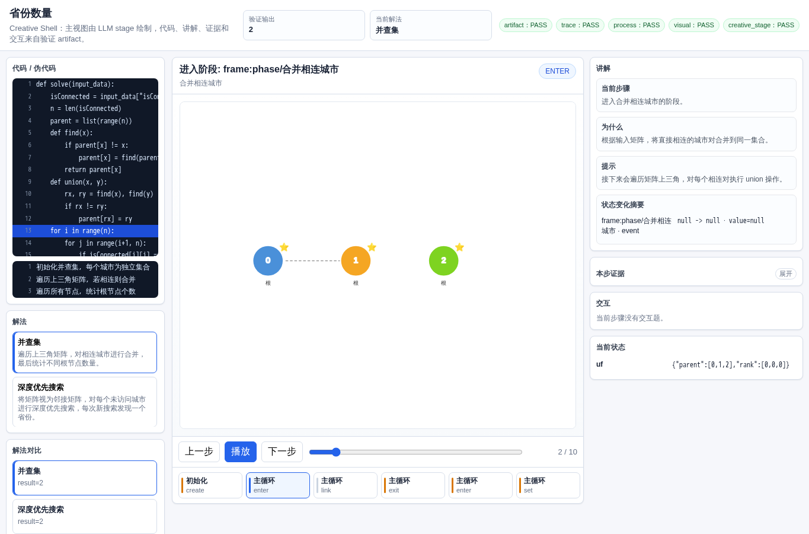
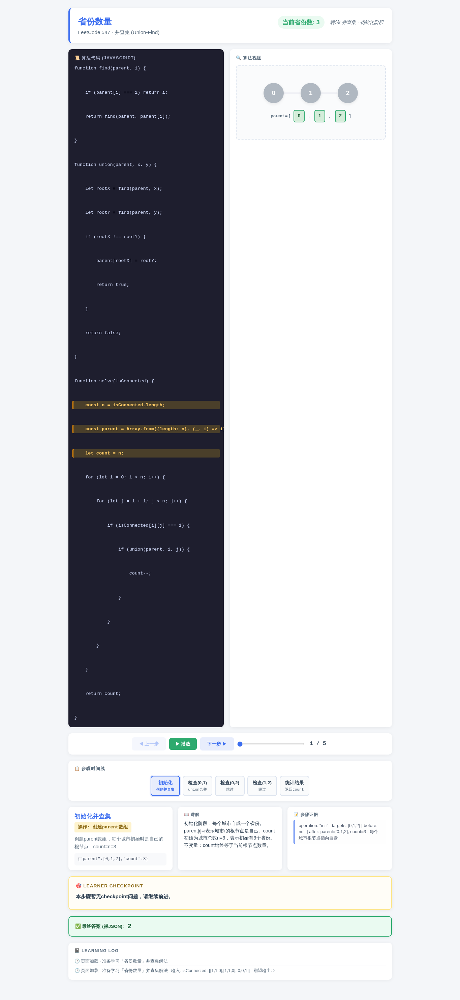
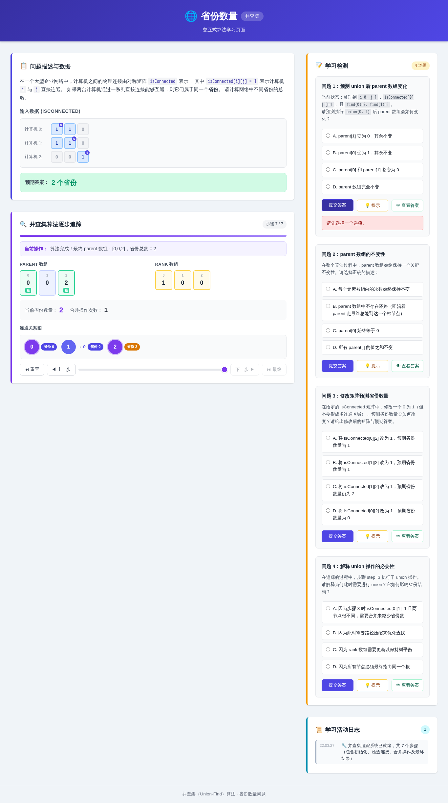
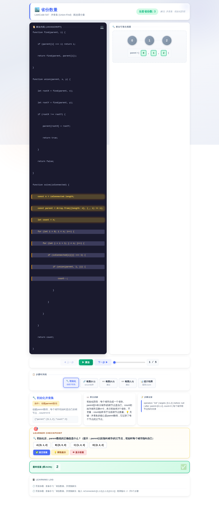
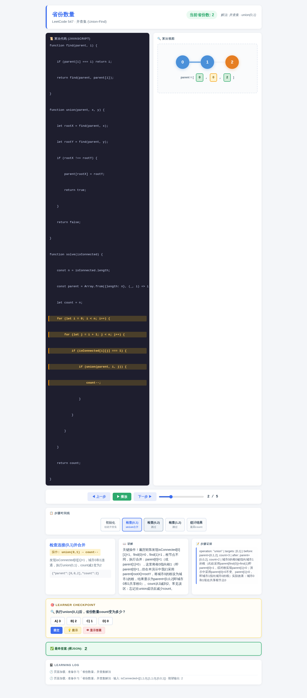

# 省份数量

- 案例 ID：`provinces`
- 算法家族：并查集
- 难度：medium
- 时间复杂度：`O(n^2 α(n))`
- 空间复杂度：`O(n)`

在一个大型企业网络中，计算机之间的物理连接由对称矩阵 isConnected 表示，其中 isConnected[i][j] = 1 表示计算机 i 与 j 直接连通，0 表示不直连；对角线元素均为 1（每台计算机与自身连通）。如果两台计算机通过一系列直接连接能够互通，则它们属于同一个网络区域（称为“省份”）。请计算整个网络中不同省份的总数。

## 抽样输入

```json
{
  "expected": 2,
  "index": 0,
  "input_data": {
    "isConnected": [
      [
        1,
        1,
        0
      ],
      [
        1,
        1,
        0
      ],
      [
        0,
        0,
        1
      ]
    ]
  }
}
```

## 九项机器判定

| 方法 | Load | Answer | Interaction | Correct FB | Wrong FB | Hint | Show | Log | Mutation-free | Machine OK |
| --- | --- | --- | --- | --- | --- | --- | --- | --- | --- | --- |
| AlgoTutorGen / Stage2 | PASS | PASS | PASS | PASS | PASS | PASS | PASS | PASS | PASS | PASS |
| Direct HTML | PASS | PASS | PASS | PASS | PASS | PASS | PASS | PASS | PASS | PASS |
| WebGen-Agent | PASS | PASS | PASS | PASS | FAIL | PASS | PASS | PASS | PASS | FAIL |
| Direct + HTMLCure (strict) | FAIL | FAIL | FAIL | FAIL | FAIL | FAIL | FAIL | FAIL | FAIL | FAIL |
| Direct-BrowserRepair (1-call) | PASS | PASS | PASS | PASS | PASS | PASS | PASS | PASS | PASS | PASS |

## 五种方法的真实产物

### AlgoTutorGen / Stage2

[打开 AlgoTutorGen / Stage2 HTML](algotutorgen_stage2/page.html) · [审计摘要](algotutorgen_stage2/audit.json)

- Machine OK：**PASS**
- 教学总分：4.857
- 视觉总分：4.5



### Direct HTML

[打开 Direct HTML HTML](direct_html/page.html) · [审计摘要](direct_html/audit.json)

- Machine OK：**PASS**
- 教学总分：4.857
- 视觉总分：4.75



### WebGen-Agent

[WebGen-Agent 源码入口](webgen_agent/source/index.html) · [package.json](webgen_agent/source/package.json) · [审计摘要](webgen_agent/audit.json)

- Machine OK：**FAIL**
- 教学总分：4.571
- 视觉总分：5.0



### Direct + HTMLCure (strict)

[打开 Direct + HTMLCure (strict) HTML](htmlcure_strict/page.html) · [审计摘要](htmlcure_strict/audit.json)

- Machine OK：**FAIL**
- 教学总分：2.0
- 视觉总分：4.0



### Direct-BrowserRepair (1-call)

[打开 Direct-BrowserRepair (1-call) HTML](browser_repair_1call/page.html) · [审计摘要](browser_repair_1call/audit.json)

- Machine OK：**PASS**
- 教学总分：4.429
- 视觉总分：5.0


