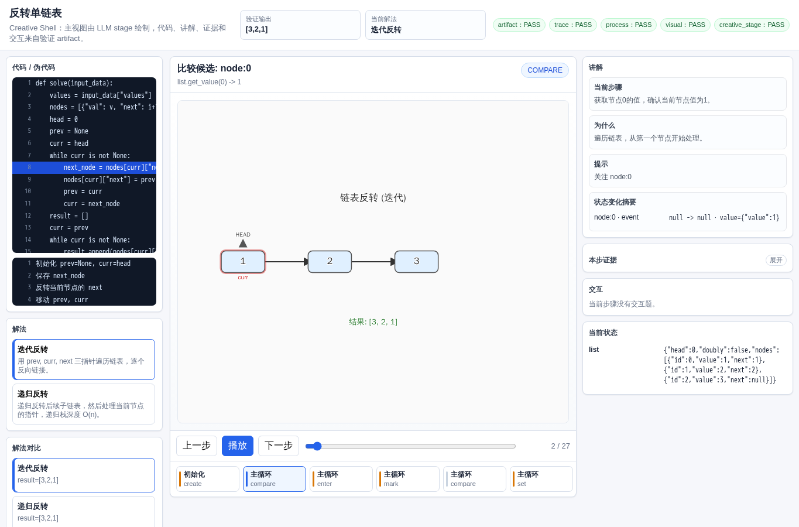
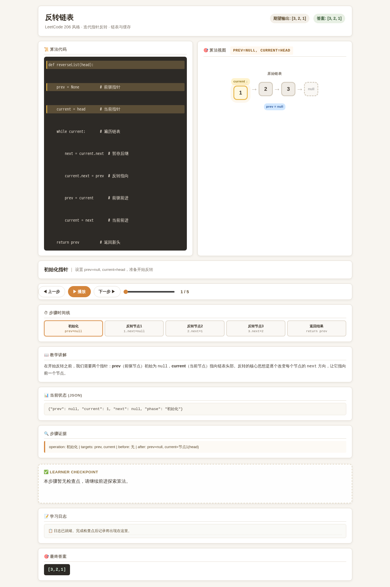
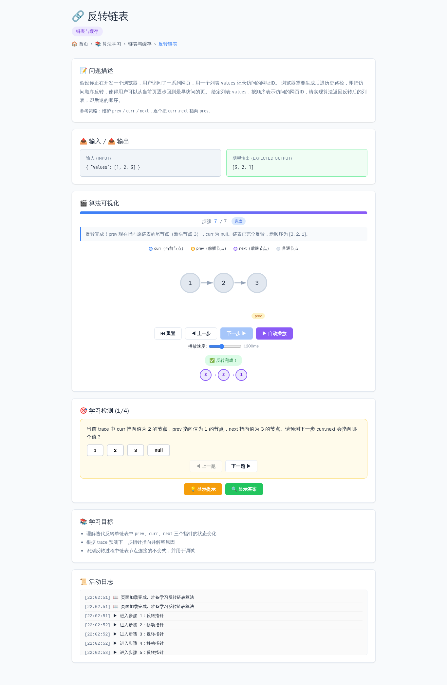
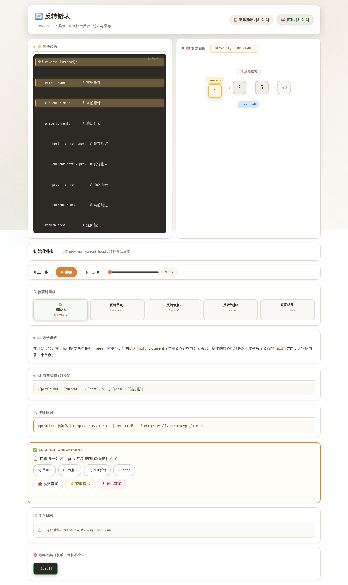
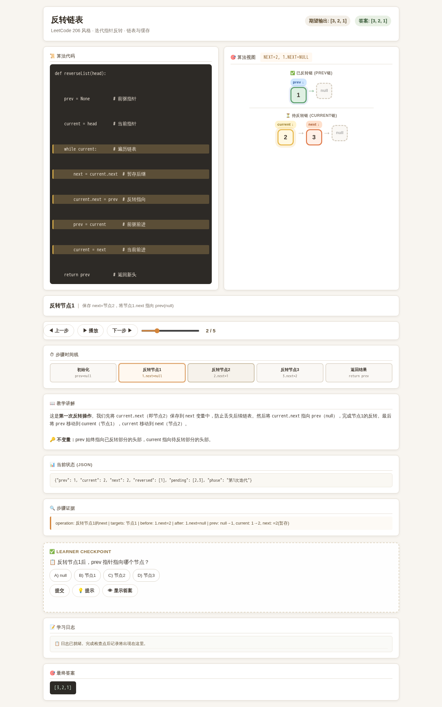

# 反转链表

- 案例 ID：`reverse_linked_list`
- 算法家族：链表与缓存
- 难度：medium
- 时间复杂度：`O(n)`
- 空间复杂度：`O(1)`

假设你正在开发一个浏览器，用户访问了一系列网页，用一个列表 values 记录访问的网址ID。浏览器需要生成后退历史路径，即把访问顺序反转，使得用户可以从当前页逐步回到最早访问的页。给定列表 values，按顺序表示访问的网页ID，请实现算法返回反转后的列表，即后退的顺序。

## 抽样输入

```json
{
  "expected": [
    3,
    2,
    1
  ],
  "index": 0,
  "input_data": {
    "values": [
      1,
      2,
      3
    ]
  }
}
```

## 九项机器判定

| 方法 | Load | Answer | Interaction | Correct FB | Wrong FB | Hint | Show | Log | Mutation-free | Machine OK |
| --- | --- | --- | --- | --- | --- | --- | --- | --- | --- | --- |
| AlgoTutorGen / Stage2 | PASS | PASS | PASS | PASS | PASS | PASS | PASS | PASS | PASS | PASS |
| Direct HTML | PASS | PASS | FAIL | FAIL | FAIL | FAIL | FAIL | FAIL | FAIL | FAIL |
| WebGen-Agent | PASS | PASS | FAIL | FAIL | FAIL | FAIL | FAIL | FAIL | FAIL | FAIL |
| Direct + HTMLCure (strict) | FAIL | FAIL | FAIL | FAIL | FAIL | FAIL | FAIL | FAIL | FAIL | FAIL |
| Direct-BrowserRepair (1-call) | PASS | PASS | FAIL | FAIL | FAIL | FAIL | FAIL | FAIL | FAIL | FAIL |

## 五种方法的真实产物

### AlgoTutorGen / Stage2

[打开 AlgoTutorGen / Stage2 HTML](algotutorgen_stage2/page.html) · [审计摘要](algotutorgen_stage2/audit.json)

- Machine OK：**PASS**
- 教学总分：4.857
- 视觉总分：4.75



### Direct HTML

[打开 Direct HTML HTML](direct_html/page.html) · [审计摘要](direct_html/audit.json)

- Machine OK：**FAIL**
- 教学总分：3.143
- 视觉总分：4.5



### WebGen-Agent

[WebGen-Agent 源码入口](webgen_agent/source/index.html) · [package.json](webgen_agent/source/package.json) · [审计摘要](webgen_agent/audit.json)

- Machine OK：**FAIL**
- 教学总分：2.714
- 视觉总分：4.5



### Direct + HTMLCure (strict)

[打开 Direct + HTMLCure (strict) HTML](htmlcure_strict/page.html) · [审计摘要](htmlcure_strict/audit.json)

- Machine OK：**FAIL**
- 教学总分：2.429
- 视觉总分：4.25



### Direct-BrowserRepair (1-call)

[打开 Direct-BrowserRepair (1-call) HTML](browser_repair_1call/page.html) · [审计摘要](browser_repair_1call/audit.json)

- Machine OK：**FAIL**
- 教学总分：3.143
- 视觉总分：5.0


