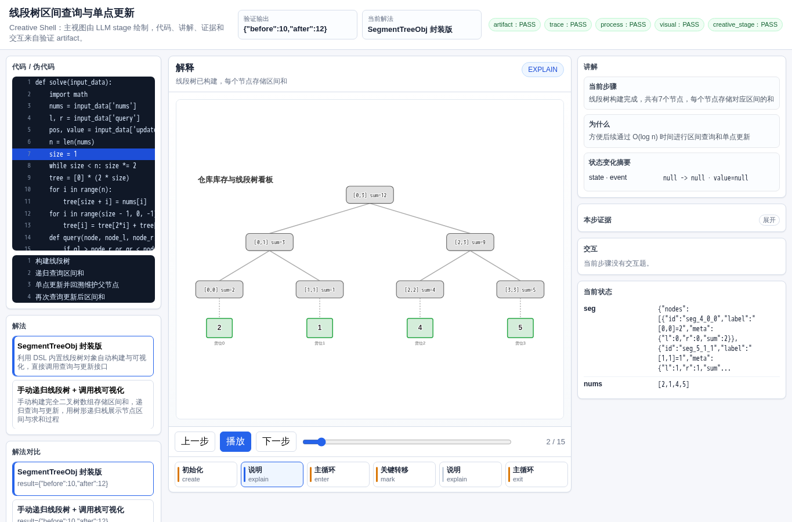
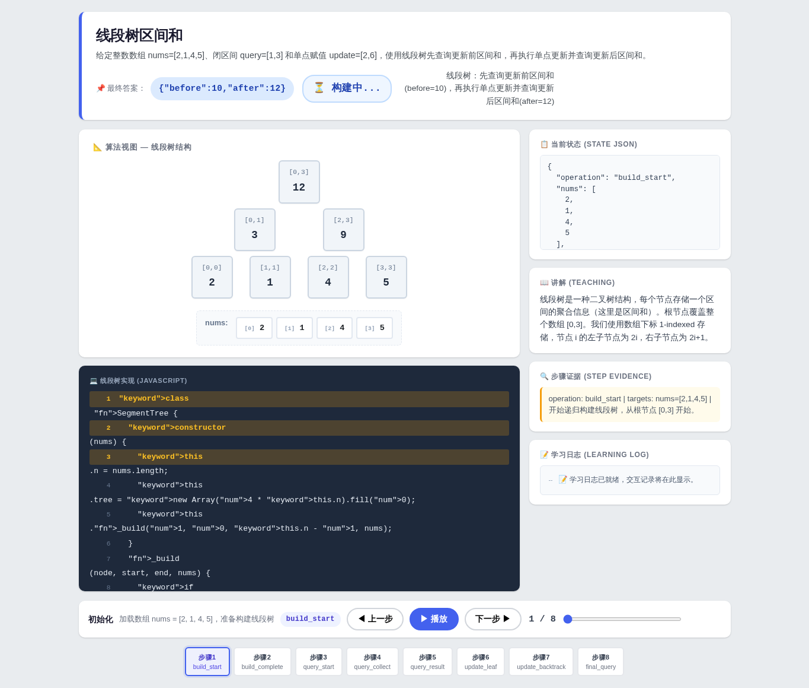
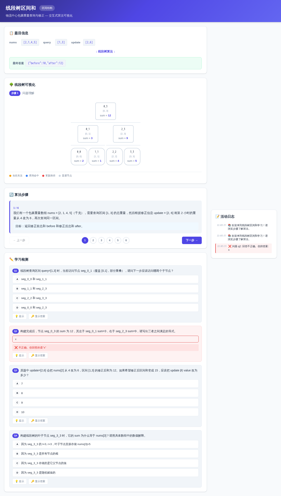
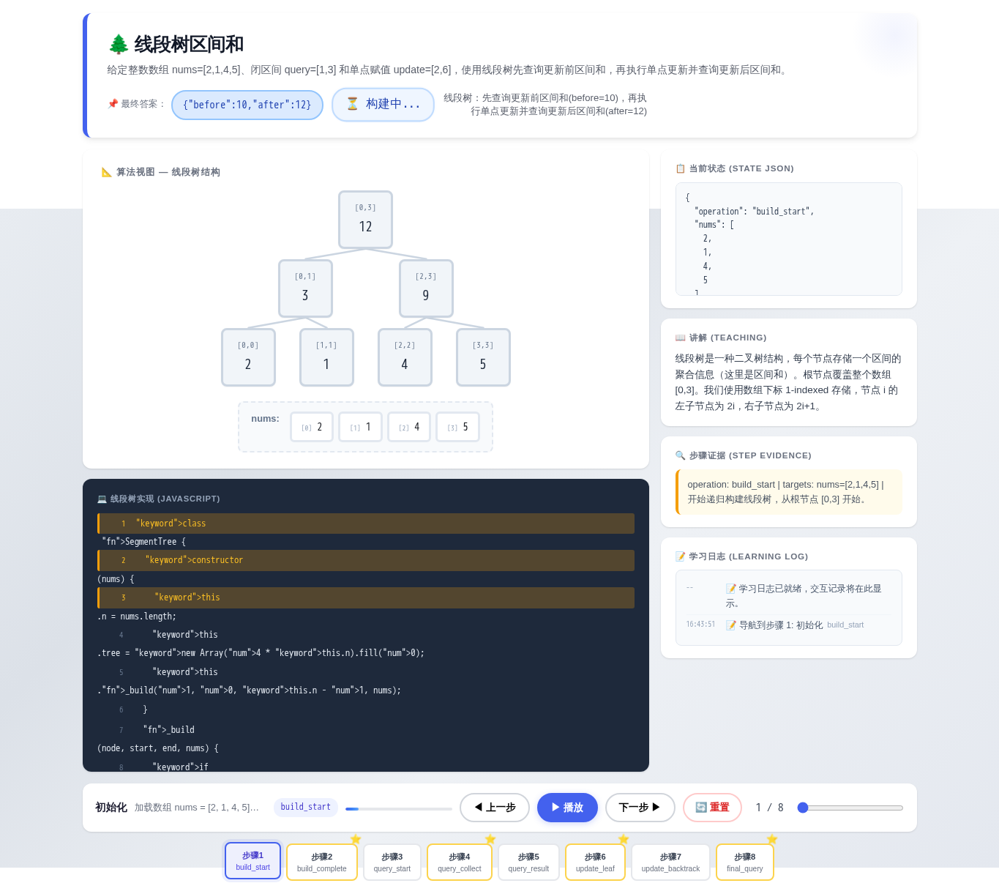
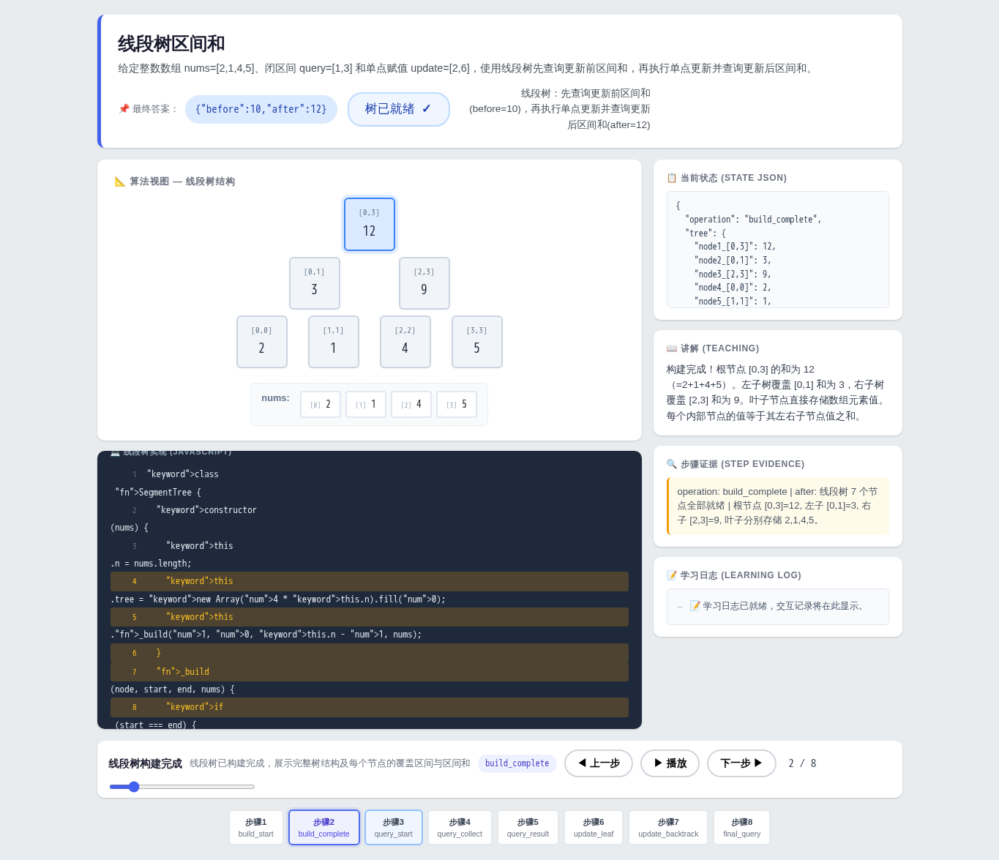

# 线段树区间和

- 案例 ID：`segment_tree_range_sum`
- 算法家族：区间结构
- 难度：medium
- 时间复杂度：`O(log n)`
- 空间复杂度：`O(n)`

物流中心每小时记录一次包裹重量（单位：千克），存储在数组 nums 中。运营人员需要查询从时间点 query[0] 到 query[1] 之间的包裹总重量（闭区间），然后根据收到的修正信息 update=[pos,value] 将第 pos 小时的重量修改为 value，再重新查询同一区间的总重量。请使用线段树计算并返回修正前的区间总重量 before 和修正后的区间总重量 after。输入包含 nums 数组、query 区间和 update 操作，输出为包含 before 和 after 的对象。

## 抽样输入

```json
{
  "expected": {
    "after": 12,
    "before": 10
  },
  "index": 0,
  "input_data": {
    "nums": [
      2,
      1,
      4,
      5
    ],
    "query": [
      1,
      3
    ],
    "update": [
      2,
      6
    ]
  }
}
```

## 九项机器判定

| 方法 | Load | Answer | Interaction | Correct FB | Wrong FB | Hint | Show | Log | Mutation-free | Machine OK |
| --- | --- | --- | --- | --- | --- | --- | --- | --- | --- | --- |
| AlgoTutorGen / Stage2 | PASS | PASS | PASS | PASS | PASS | PASS | PASS | PASS | PASS | PASS |
| Direct HTML | PASS | PASS | FAIL | FAIL | FAIL | FAIL | FAIL | FAIL | FAIL | FAIL |
| WebGen-Agent | PASS | FAIL | PASS | FAIL | PASS | PASS | PASS | PASS | PASS | FAIL |
| Direct + HTMLCure (strict) | FAIL | FAIL | FAIL | FAIL | FAIL | FAIL | FAIL | FAIL | FAIL | FAIL |
| Direct-BrowserRepair (1-call) | PASS | PASS | FAIL | FAIL | FAIL | FAIL | FAIL | FAIL | FAIL | FAIL |

## 五种方法的真实产物

### AlgoTutorGen / Stage2

[打开 AlgoTutorGen / Stage2 HTML](algotutorgen_stage2/page.html) · [审计摘要](algotutorgen_stage2/audit.json)

- Machine OK：**PASS**
- 教学总分：4.857
- 视觉总分：4.75



### Direct HTML

[打开 Direct HTML HTML](direct_html/page.html) · [审计摘要](direct_html/audit.json)

- Machine OK：**FAIL**
- 教学总分：2.857
- 视觉总分：4.5



### WebGen-Agent

[WebGen-Agent 源码入口](webgen_agent/source/index.html) · [package.json](webgen_agent/source/package.json) · [审计摘要](webgen_agent/audit.json)

- Machine OK：**FAIL**
- 教学总分：4.286
- 视觉总分：4.75



### Direct + HTMLCure (strict)

[打开 Direct + HTMLCure (strict) HTML](htmlcure_strict/page.html) · [审计摘要](htmlcure_strict/audit.json)

- Machine OK：**FAIL**
- 教学总分：2.143
- 视觉总分：4.5



### Direct-BrowserRepair (1-call)

[打开 Direct-BrowserRepair (1-call) HTML](browser_repair_1call/page.html) · [审计摘要](browser_repair_1call/audit.json)

- Machine OK：**FAIL**
- 教学总分：3.0
- 视觉总分：4.5


