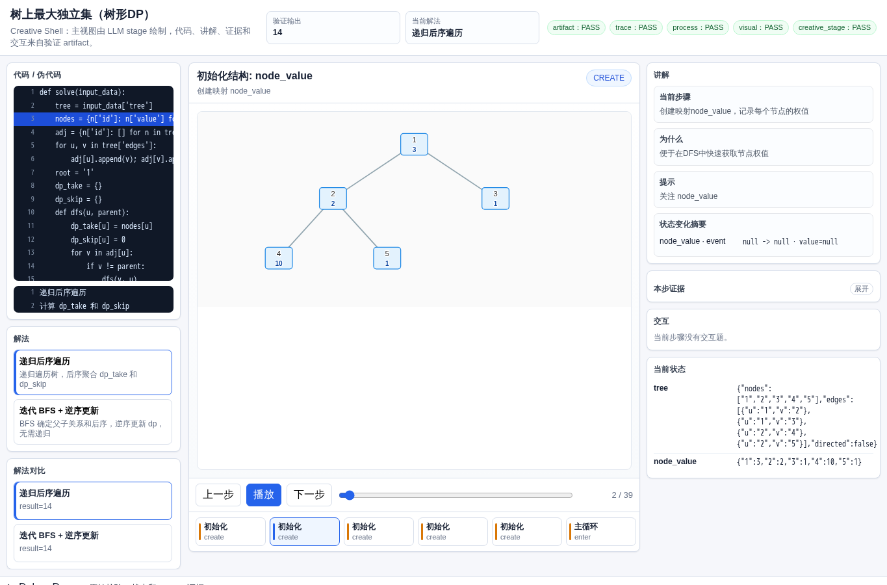
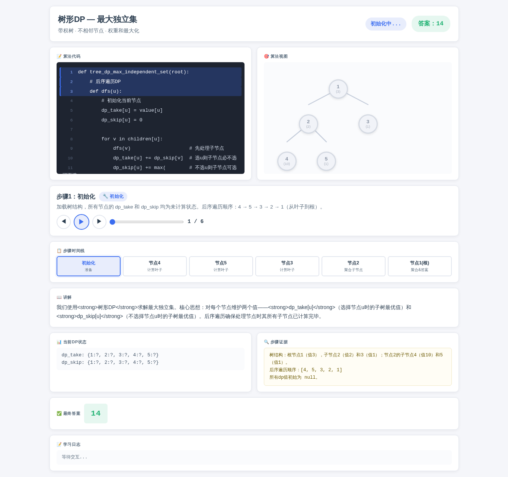
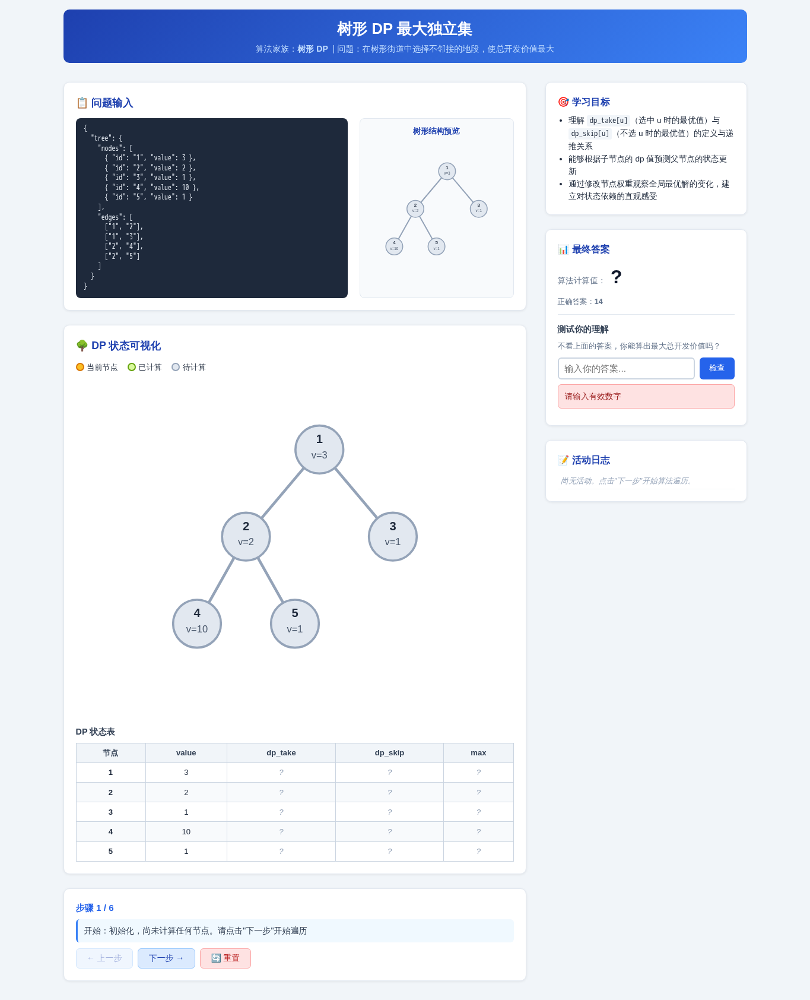
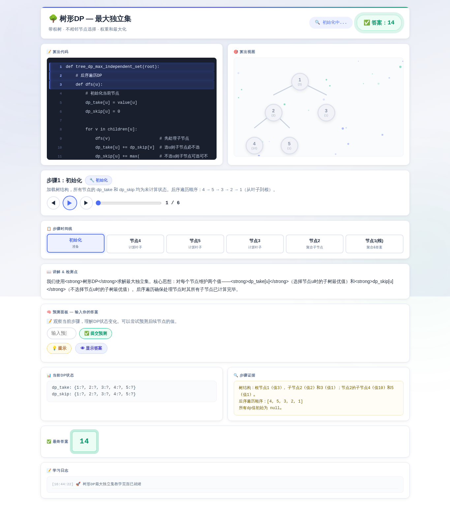
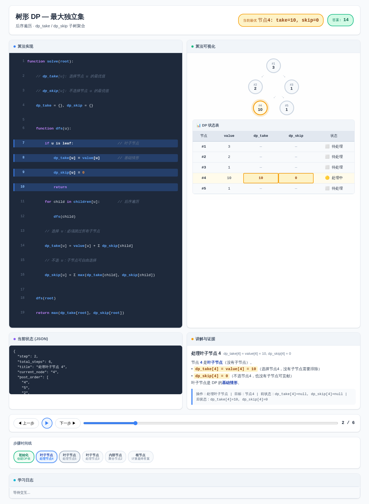

# 树形 DP 最大独立集

- 案例 ID：`tree_max_independent_set`
- 算法家族：树形 DP
- 难度：medium
- 时间复杂度：`O(n)`
- 空间复杂度：`O(n)`

在城市新区规划中，有一片树形街道，每个地段（节点）具有开发价值。相邻地段不能同时开发，以免交通拥堵。给定一棵树 tree，节点表示地段，value 表示开发价值，边表示相邻关系。请计算能获得的最大总开发价值，只需返回最大数值。输入中 tree 对象包含 nodes （id, value）和 edges （无向边）。

## 抽样输入

```json
{
  "expected": 14,
  "index": 0,
  "input_data": {
    "tree": {
      "edges": [
        [
          "1",
          "2"
        ],
        [
          "1",
          "3"
        ],
        [
          "2",
          "4"
        ],
        [
          "2",
          "5"
        ]
      ],
      "nodes": [
        {
          "id": "1",
          "value": 3
        },
        {
          "id": "2",
          "value": 2
        },
        {
          "id": "3",
          "value": 1
        },
        {
          "id": "4",
          "value": 10
        },
        {
          "id": "5",
          "value": 1
        }
      ]
    }
  }
}
```

## 九项机器判定

| 方法 | Load | Answer | Interaction | Correct FB | Wrong FB | Hint | Show | Log | Mutation-free | Machine OK |
| --- | --- | --- | --- | --- | --- | --- | --- | --- | --- | --- |
| AlgoTutorGen / Stage2 | PASS | PASS | PASS | PASS | PASS | PASS | PASS | PASS | PASS | PASS |
| Direct HTML | PASS | PASS | PASS | FAIL | FAIL | PASS | PASS | FAIL | PASS | FAIL |
| WebGen-Agent | PASS | PASS | PASS | FAIL | FAIL | FAIL | FAIL | FAIL | PASS | FAIL |
| Direct + HTMLCure (strict) | FAIL | FAIL | FAIL | FAIL | FAIL | FAIL | FAIL | FAIL | FAIL | FAIL |
| Direct-BrowserRepair (1-call) | PASS | PASS | PASS | PASS | PASS | PASS | PASS | PASS | PASS | PASS |

## 五种方法的真实产物

### AlgoTutorGen / Stage2

[打开 AlgoTutorGen / Stage2 HTML](algotutorgen_stage2/page.html) · [审计摘要](algotutorgen_stage2/audit.json)

- Machine OK：**PASS**
- 教学总分：4.857
- 视觉总分：4.75



### Direct HTML

[打开 Direct HTML HTML](direct_html/page.html) · [审计摘要](direct_html/audit.json)

- Machine OK：**FAIL**
- 教学总分：4.0
- 视觉总分：4.5



### WebGen-Agent

[WebGen-Agent 源码入口](webgen_agent/source/index.html) · [package.json](webgen_agent/source/package.json) · [审计摘要](webgen_agent/audit.json)

- Machine OK：**FAIL**
- 教学总分：3.143
- 视觉总分：4.5



### Direct + HTMLCure (strict)

[打开 Direct + HTMLCure (strict) HTML](htmlcure_strict/page.html) · [审计摘要](htmlcure_strict/audit.json)

- Machine OK：**FAIL**
- 教学总分：2.286
- 视觉总分：4.75



### Direct-BrowserRepair (1-call)

[打开 Direct-BrowserRepair (1-call) HTML](browser_repair_1call/page.html) · [审计摘要](browser_repair_1call/audit.json)

- Machine OK：**PASS**
- 教学总分：5.0
- 视觉总分：5.0


