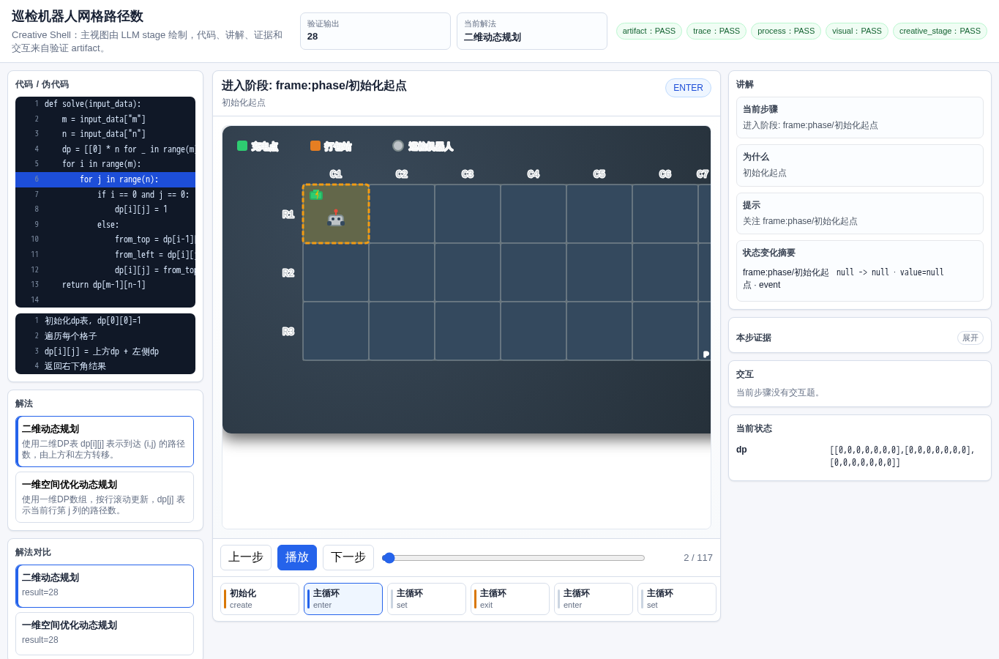
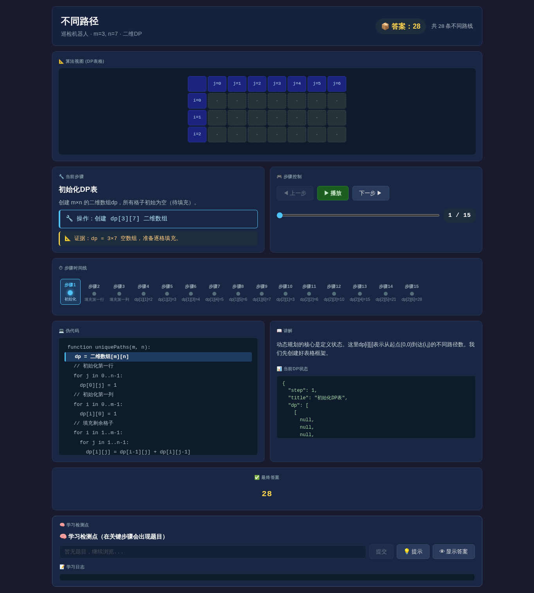
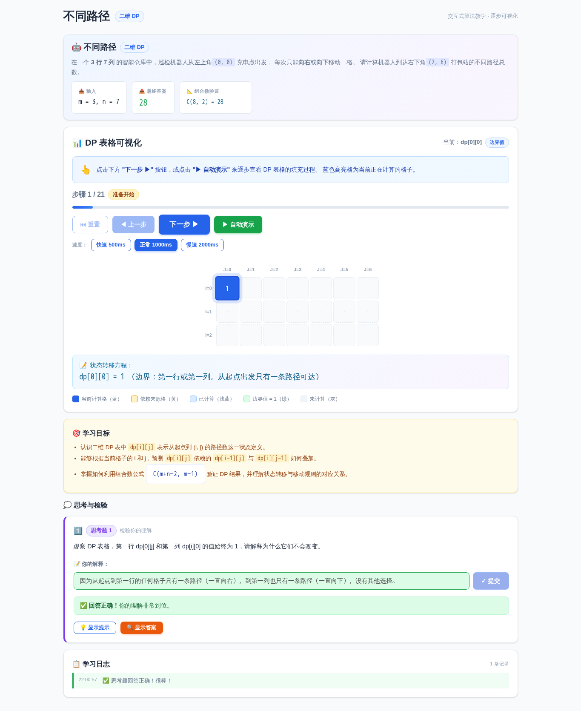
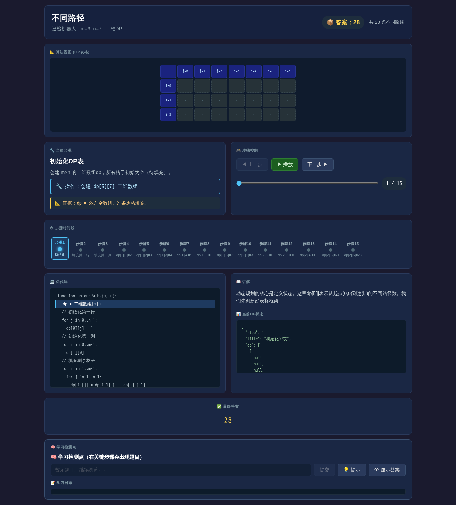
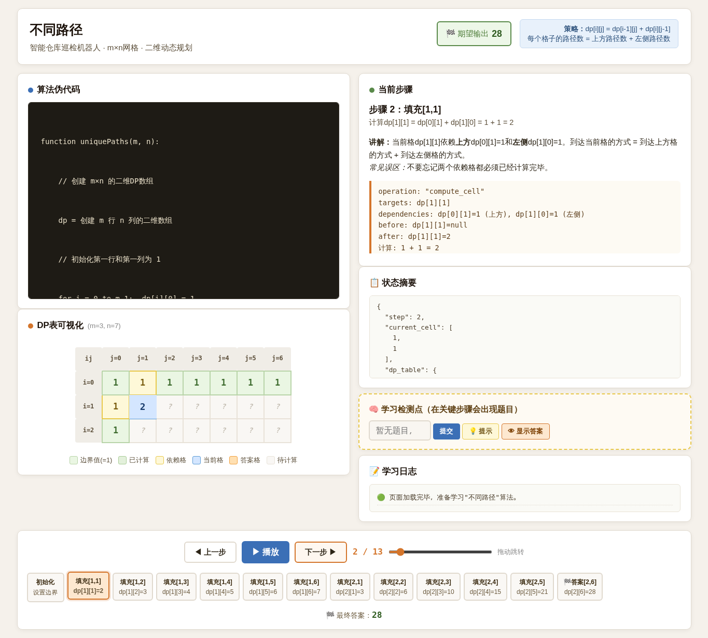

# 不同路径

- 案例 ID：`unique_paths`
- 算法家族：二维 DP
- 难度：medium
- 时间复杂度：`O(mn)`
- 空间复杂度：`O(mn)`

在一个 m 行 n 列的智能仓库中，巡检机器人从左上角 (0,0) 充电点出发，每次只能向右或向下移动一格。给定网格行数 m 和列数 n，请计算机器人到达右下角 (m-1, n-1) 打包站的不同路径总数。输入变量 m 和 n 分别表示网格的行数和列数，输出一个整数表示路径总数。

## 抽样输入

```json
{
  "expected": 28,
  "index": 0,
  "input_data": {
    "m": 3,
    "n": 7
  }
}
```

## 九项机器判定

| 方法 | Load | Answer | Interaction | Correct FB | Wrong FB | Hint | Show | Log | Mutation-free | Machine OK |
| --- | --- | --- | --- | --- | --- | --- | --- | --- | --- | --- |
| AlgoTutorGen / Stage2 | PASS | PASS | PASS | PASS | PASS | PASS | PASS | PASS | PASS | PASS |
| Direct HTML | PASS | PASS | PASS | FAIL | FAIL | FAIL | FAIL | FAIL | PASS | FAIL |
| WebGen-Agent | PASS | PASS | PASS | PASS | PASS | PASS | PASS | PASS | PASS | PASS |
| Direct + HTMLCure (strict) | PASS | PASS | PASS | FAIL | FAIL | FAIL | FAIL | FAIL | PASS | FAIL |
| Direct-BrowserRepair (1-call) | PASS | PASS | PASS | FAIL | FAIL | FAIL | FAIL | FAIL | PASS | FAIL |

## 五种方法的真实产物

### AlgoTutorGen / Stage2

[打开 AlgoTutorGen / Stage2 HTML](algotutorgen_stage2/page.html) · [审计摘要](algotutorgen_stage2/audit.json)

- Machine OK：**PASS**
- 教学总分：4.714
- 视觉总分：4.5



### Direct HTML

[打开 Direct HTML HTML](direct_html/page.html) · [审计摘要](direct_html/audit.json)

- Machine OK：**FAIL**
- 教学总分：3.571
- 视觉总分：4.5



### WebGen-Agent

[WebGen-Agent 源码入口](webgen_agent/source/index.html) · [package.json](webgen_agent/source/package.json) · [审计摘要](webgen_agent/audit.json)

- Machine OK：**PASS**
- 教学总分：5.0
- 视觉总分：5.0



### Direct + HTMLCure (strict)

[打开 Direct + HTMLCure (strict) HTML](htmlcure_strict/page.html) · [审计摘要](htmlcure_strict/audit.json)

- Machine OK：**FAIL**
- 教学总分：3.143
- 视觉总分：4.5



### Direct-BrowserRepair (1-call)

[打开 Direct-BrowserRepair (1-call) HTML](browser_repair_1call/page.html) · [审计摘要](browser_repair_1call/audit.json)

- Machine OK：**FAIL**
- 教学总分：3.571
- 视觉总分：5.0


