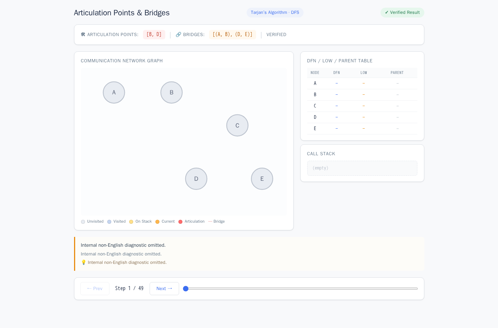
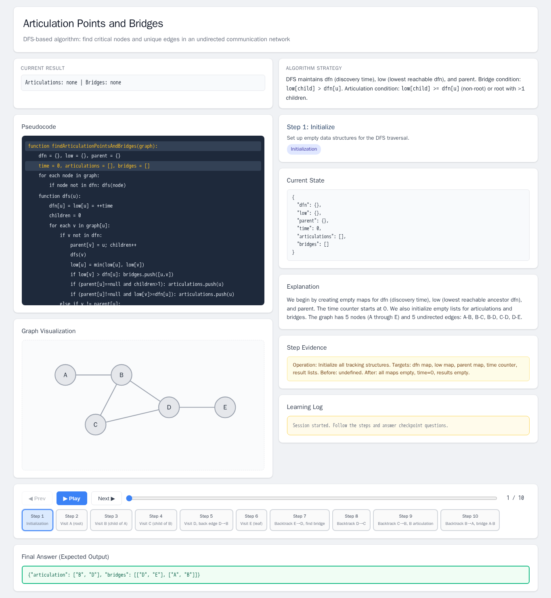
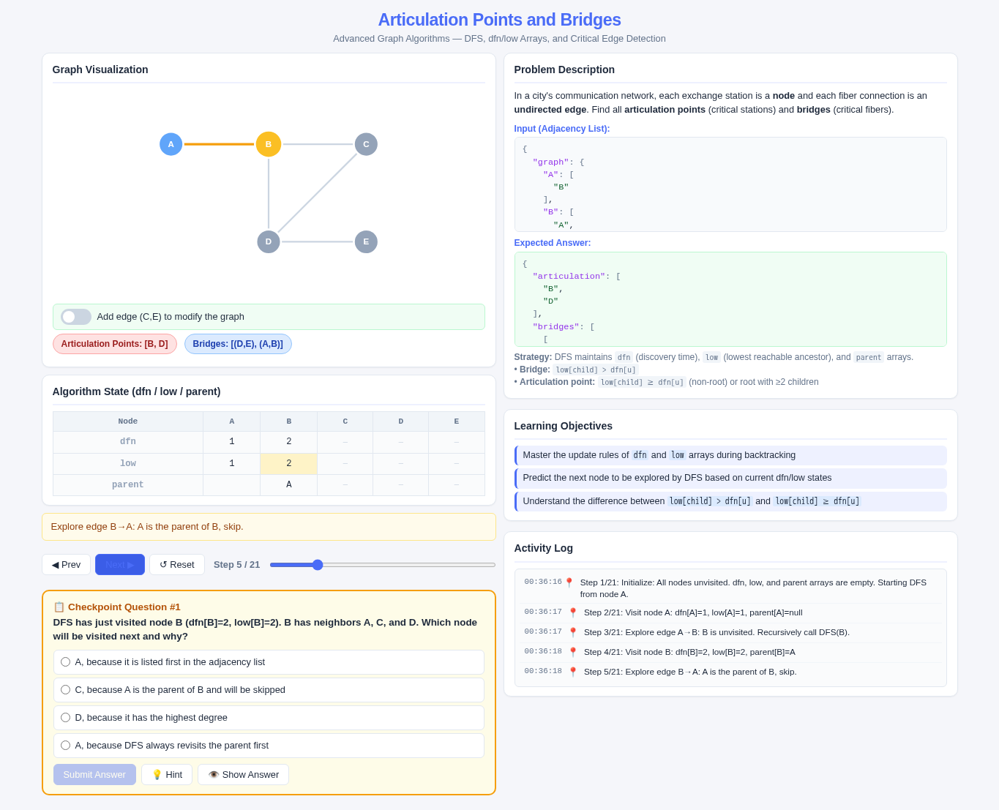
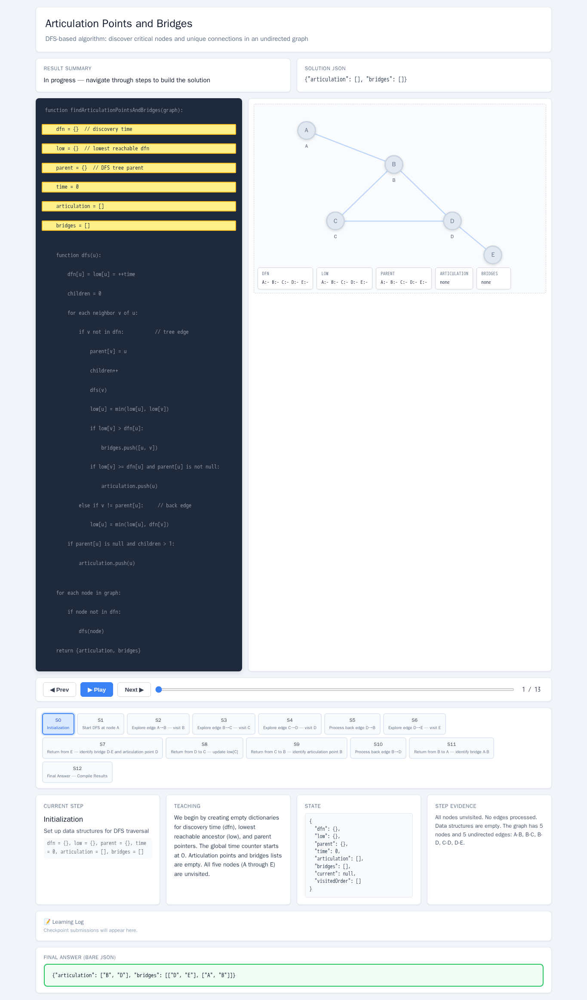

# Articulation Points and Bridges

- Case ID: `articulation_bridges`
- Algorithm family: Advanced Graph
- Difficulty: medium
- Time complexity: `O(V+E)`
- Space complexity: `O(V)`

In a city's communication network, each exchange station corresponds to a node, and each fiber connection corresponds to an undirected edge. Given a graph represented by an adjacency list, you need to find all articulation points (critical exchange stations) and bridges (unique fibers), and output an object containing articulation (list of articulation points) and bridges (list of edges as bridges).

## Fixed input and expected answer

```json
{
  "expected": {
    "articulation": [
      "B",
      "D"
    ],
    "bridges": [
      [
        "D",
        "E"
      ],
      [
        "A",
        "B"
      ]
    ]
  },
  "index": 0,
  "input_data": {
    "graph": {
      "A": [
        "B"
      ],
      "B": [
        "A",
        "C",
        "D"
      ],
      "C": [
        "B",
        "D"
      ],
      "D": [
        "B",
        "C",
        "E"
      ],
      "E": [
        "D"
      ]
    }
  }
}
```

## Nine machine checks

Machine OK means that all nine browser checks pass for the same page.

| Method | Load | Answer | Interaction | Correct feedback | Wrong feedback | Hint | Show answer | Learning log | Mutation-free | Machine OK |
| --- | --- | --- | --- | --- | --- | --- | --- | --- | --- | --- |
| AlgoTutorGen / Stage2 | PASS | PASS | PASS | PASS | PASS | PASS | PASS | PASS | PASS | PASS |
| Direct HTML | PASS | PASS | PASS | FAIL | PASS | PASS | PASS | PASS | PASS | FAIL |
| WebGen-Agent | PASS | PASS | PASS | FAIL | FAIL | FAIL | PASS | PASS | PASS | FAIL |
| Direct + HTMLCure (strict) | PASS | PASS | PASS | FAIL | PASS | PASS | PASS | PASS | PASS | FAIL |
| Direct-BrowserRepair (1 call) | PASS | PASS | PASS | FAIL | PASS | PASS | FAIL | PASS | PASS | FAIL |

## Generated artifacts

### AlgoTutorGen / Stage2

[Open AlgoTutorGen / Stage2 page](algotutorgen_stage2/page.html) · [Machine audit](algotutorgen_stage2/audit.json)



### Direct HTML

[Open Direct HTML page](direct_html/page.html) · [Machine audit](direct_html/audit.json)



### WebGen-Agent

[WebGen-Agent source entry](webgen_agent/source/index.html) · [Machine audit](webgen_agent/audit.json)



### Direct + HTMLCure (strict)

[Open Direct + HTMLCure (strict) page](htmlcure_strict/page.html) · [Machine audit](htmlcure_strict/audit.json)


### Direct-BrowserRepair (1 call)

[Open Direct-BrowserRepair (1 call) page](browser_repair_1call/page.html) · [Machine audit](browser_repair_1call/audit.json)


