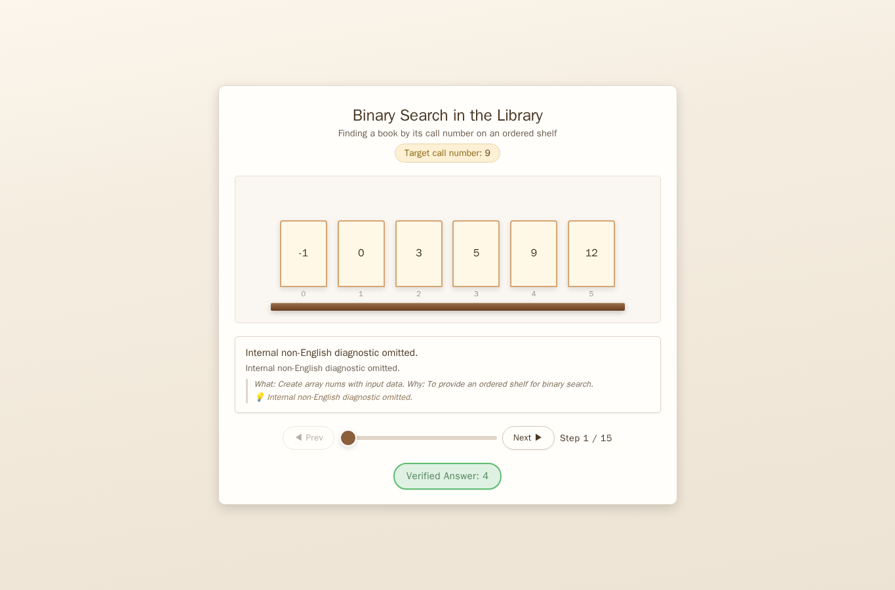
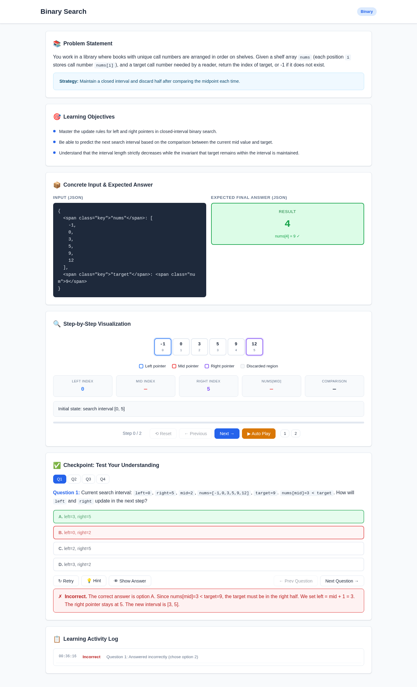
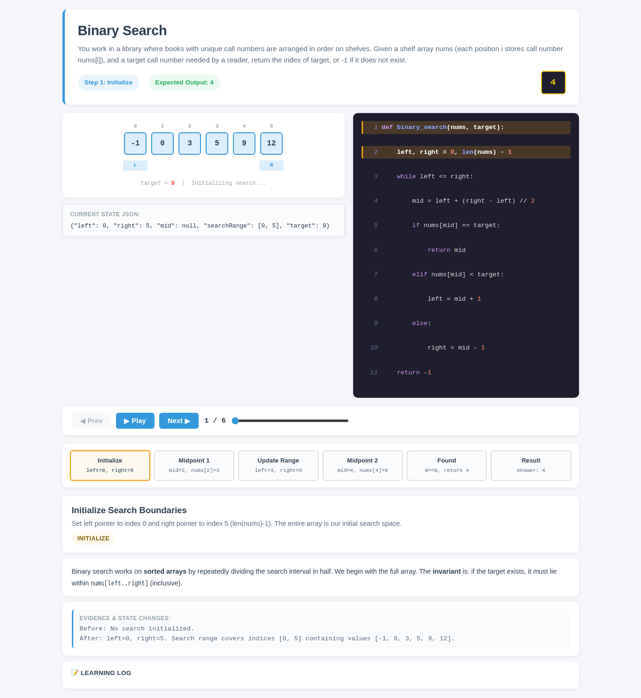
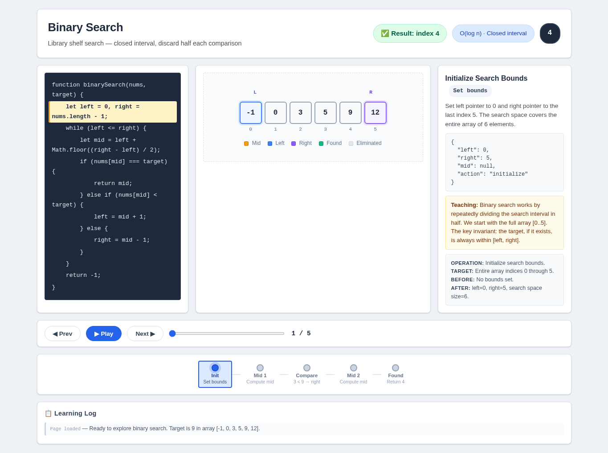

# Binary Search

- Case ID: `binary_search`
- Algorithm family: Binary
- Difficulty: medium
- Time complexity: `O(log n)`
- Space complexity: `O(1)`

You work in a library where books with unique call numbers are arranged in order on shelves. Given a shelf array nums (each position i stores call number nums[i]), and a target call number needed by a reader, return the index of target, or -1 if it does not exist.

## Fixed input and expected answer

```json
{
  "expected": 4,
  "index": 0,
  "input_data": {
    "nums": [
      -1,
      0,
      3,
      5,
      9,
      12
    ],
    "target": 9
  }
}
```

## Nine machine checks

Machine OK means that all nine browser checks pass for the same page.

| Method | Load | Answer | Interaction | Correct feedback | Wrong feedback | Hint | Show answer | Learning log | Mutation-free | Machine OK |
| --- | --- | --- | --- | --- | --- | --- | --- | --- | --- | --- |
| AlgoTutorGen / Stage2 | PASS | PASS | PASS | PASS | PASS | PASS | PASS | PASS | PASS | PASS |
| Direct HTML | PASS | PASS | PASS | FAIL | PASS | PASS | FAIL | PASS | PASS | FAIL |
| WebGen-Agent | PASS | PASS | PASS | PASS | PASS | PASS | PASS | FAIL | PASS | FAIL |
| Direct + HTMLCure (strict) | PASS | PASS | PASS | FAIL | PASS | PASS | FAIL | PASS | PASS | FAIL |
| Direct-BrowserRepair (1 call) | PASS | PASS | PASS | PASS | PASS | PASS | FAIL | PASS | PASS | FAIL |

## Generated artifacts

### AlgoTutorGen / Stage2

[Open AlgoTutorGen / Stage2 page](algotutorgen_stage2/page.html) · [Machine audit](algotutorgen_stage2/audit.json)



### Direct HTML

[Open Direct HTML page](direct_html/page.html) · [Machine audit](direct_html/audit.json)


### WebGen-Agent

[WebGen-Agent source entry](webgen_agent/source/index.html) · [Machine audit](webgen_agent/audit.json)



### Direct + HTMLCure (strict)

[Open Direct + HTMLCure (strict) page](htmlcure_strict/page.html) · [Machine audit](htmlcure_strict/audit.json)



### Direct-BrowserRepair (1 call)

[Open Direct-BrowserRepair (1 call) page](browser_repair_1call/page.html) · [Machine audit](browser_repair_1call/audit.json)


