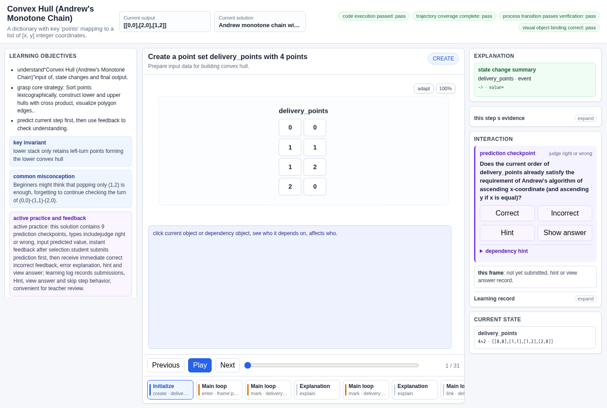
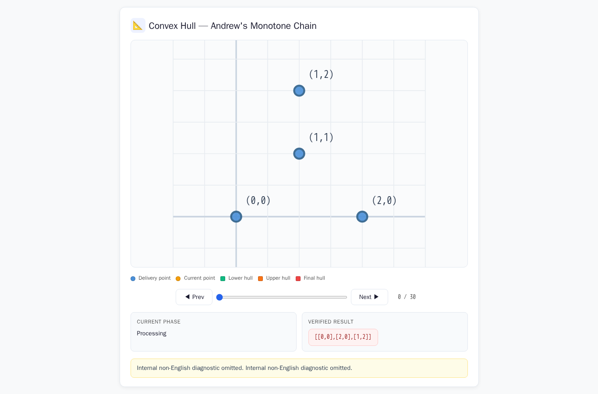
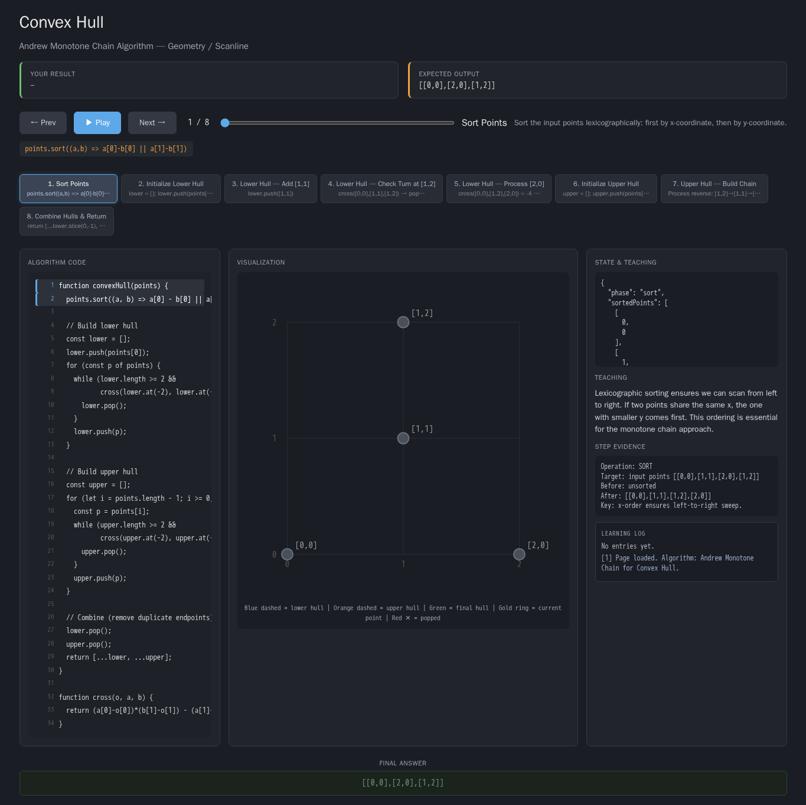
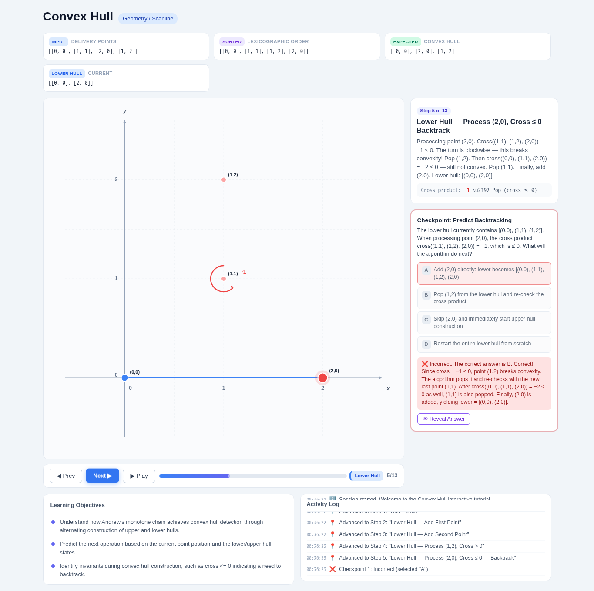
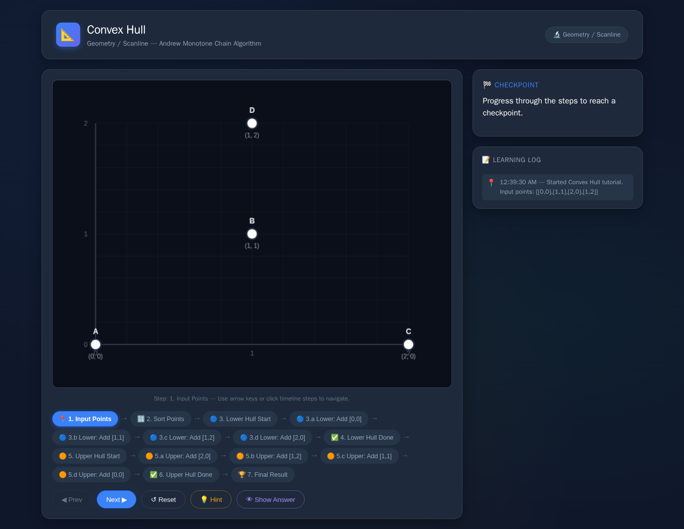
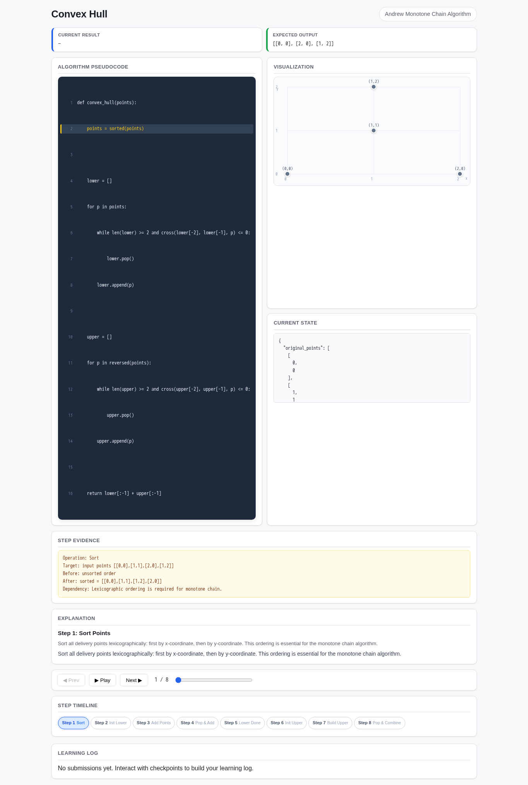

# Convex Hull

- Case ID: `convex_hull`
- Algorithm family: Geometry / Scanline
- Difficulty: medium
- Time complexity: `O(n log n)`
- Space complexity: `O(n)`

In express delivery, you are given a list of delivery points 'points', each represented by a 2D coordinate (x, y). You need to compute the vertices of the smallest convex polygon that encloses all delivery points, and return the coordinate list of these vertices in the output order of the Andrew monotone chain algorithm. The returned vertices should be arranged counterclockwise and not include collinear intermediate points.

## Fixed input and expected answer

```json
{
  "expected": [
    [
      0,
      0
    ],
    [
      2,
      0
    ],
    [
      1,
      2
    ]
  ],
  "index": 0,
  "input_data": {
    "points": [
      [
        0,
        0
      ],
      [
        1,
        1
      ],
      [
        2,
        0
      ],
      [
        1,
        2
      ]
    ]
  }
}
```

## Nine machine checks

Machine OK means that all nine browser checks pass for the evaluated interaction page.
The AlgoTutorGen / Stage2 row reuses the checks from its paired Stage1 interaction page; it is not a separate audit of the saved Stage2 visualization page.

| Method | Load | Answer | Interaction | Correct feedback | Wrong feedback | Hint | Show answer | Learning log | Mutation-free | Machine OK |
| --- | --- | --- | --- | --- | --- | --- | --- | --- | --- | --- |
| AlgoTutorGen / Stage1 | PASS | PASS | PASS | PASS | PASS | PASS | PASS | PASS | PASS | PASS |
| AlgoTutorGen / Stage2 | PASS | PASS | PASS | PASS | PASS | PASS | PASS | PASS | PASS | PASS |
| Direct HTML | PASS | PASS | PASS | FAIL | PASS | PASS | FAIL | PASS | PASS | FAIL |
| WebGen-Agent | PASS | PASS | PASS | PASS | PASS | FAIL | PASS | PASS | PASS | FAIL |
| Direct + HTMLCure (strict) | FAIL | FAIL | FAIL | FAIL | FAIL | FAIL | FAIL | FAIL | FAIL | FAIL |
| Direct-BrowserRepair (1 call) | PASS | PASS | PASS | FAIL | PASS | PASS | FAIL | PASS | PASS | FAIL |

## Generated artifacts

### AlgoTutorGen / Stage1

[Open AlgoTutorGen / Stage1 page](algotutorgen_stage1/page.html) · [Structured Stage1 JSON](algotutorgen_stage1/artifact.json) · [Machine audit](algotutorgen_stage1/audit.json)



### AlgoTutorGen / Stage2

[Open AlgoTutorGen / Stage2 page](algotutorgen_stage2/page.html) · [Machine audit](algotutorgen_stage2/audit.json)



### Direct HTML

[Open Direct HTML page](direct_html/page.html) · [Machine audit](direct_html/audit.json)



### WebGen-Agent

[WebGen-Agent source entry](webgen_agent/source/index.html) · [Machine audit](webgen_agent/audit.json)



### Direct + HTMLCure (strict)

[Open Direct + HTMLCure (strict) page](htmlcure_strict/page.html) · [Machine audit](htmlcure_strict/audit.json)



### Direct-BrowserRepair (1 call)

[Open Direct-BrowserRepair (1 call) page](browser_repair_1call/page.html) · [Machine audit](browser_repair_1call/audit.json)


