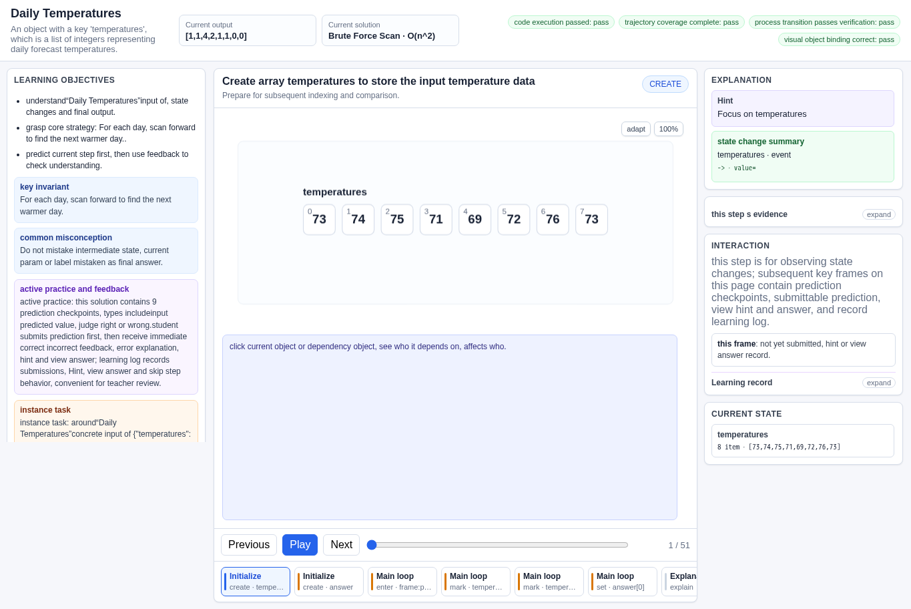
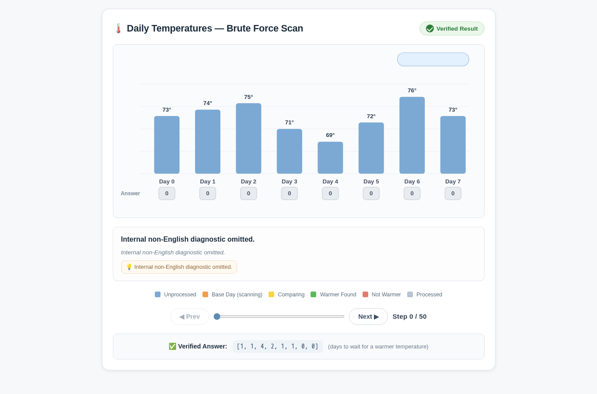
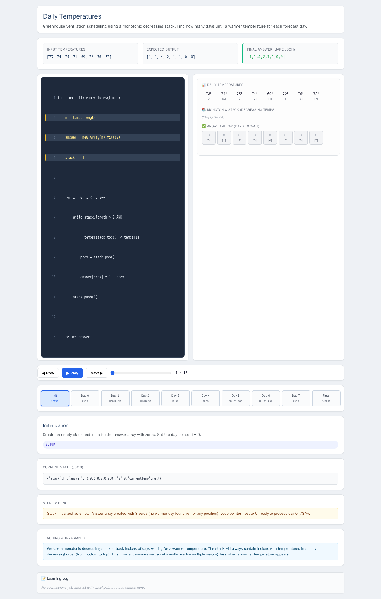
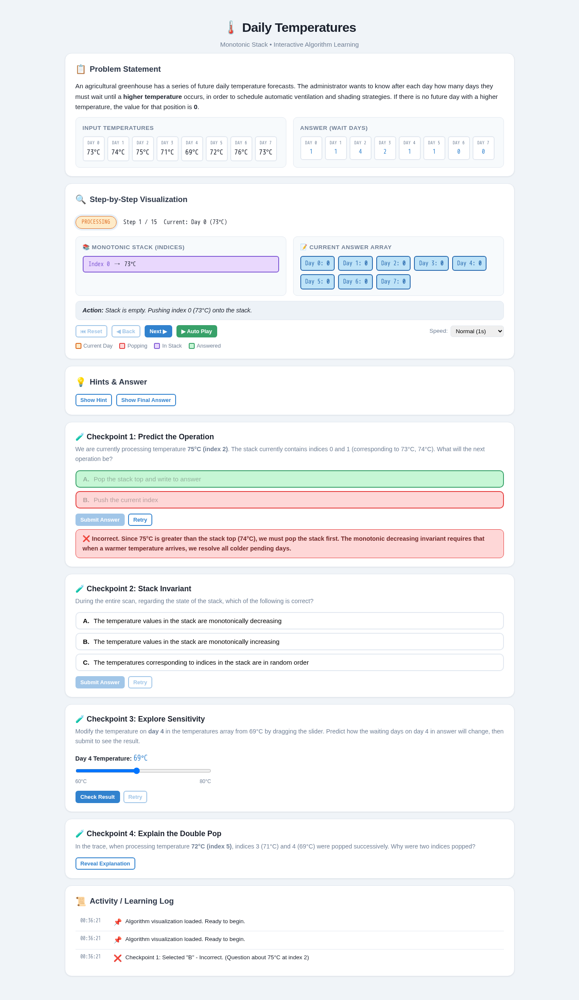
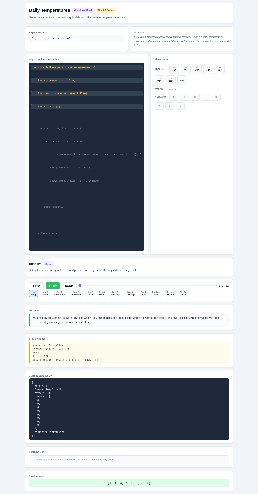

# Daily Temperatures

- Case ID: `daily_temperatures`
- Algorithm family: Stack / Queue / Monotonic Stack
- Difficulty: medium
- Time complexity: `O(n)`
- Space complexity: `O(n)`

An agricultural greenhouse has a series of future daily temperature forecasts `temperatures`. The administrator wants to know after each day how many days they must wait until a higher temperature occurs, in order to schedule automatic ventilation and shading strategies. If there is no future day with a higher temperature, the value for that position is 0.

## Fixed input and expected answer

```json
{
  "expected": [
    1,
    1,
    4,
    2,
    1,
    1,
    0,
    0
  ],
  "index": 0,
  "input_data": {
    "temperatures": [
      73,
      74,
      75,
      71,
      69,
      72,
      76,
      73
    ]
  }
}
```

## Nine machine checks

Machine OK means that all nine browser checks pass for the evaluated interaction page.
The AlgoTutorGen / Stage2 row reuses the checks from its paired Stage1 interaction page; it is not a separate audit of the saved Stage2 visualization page.

| Method | Load | Answer | Interaction | Correct feedback | Wrong feedback | Hint | Show answer | Learning log | Mutation-free | Machine OK |
| --- | --- | --- | --- | --- | --- | --- | --- | --- | --- | --- |
| AlgoTutorGen / Stage1 | PASS | PASS | PASS | PASS | PASS | PASS | PASS | PASS | PASS | PASS |
| AlgoTutorGen / Stage2 | PASS | PASS | PASS | PASS | PASS | PASS | PASS | PASS | PASS | PASS |
| Direct HTML | PASS | PASS | PASS | FAIL | PASS | PASS | FAIL | PASS | PASS | FAIL |
| WebGen-Agent | PASS | FAIL | PASS | PASS | PASS | PASS | PASS | PASS | PASS | FAIL |
| Direct + HTMLCure (strict) | PASS | PASS | PASS | FAIL | PASS | PASS | FAIL | PASS | PASS | FAIL |
| Direct-BrowserRepair (1 call) | PASS | PASS | PASS | PASS | PASS | PASS | PASS | PASS | PASS | PASS |

## Generated artifacts

### AlgoTutorGen / Stage1

[Open AlgoTutorGen / Stage1 page](algotutorgen_stage1/page.html) · [Structured Stage1 JSON](algotutorgen_stage1/artifact.json) · [Machine audit](algotutorgen_stage1/audit.json)



### AlgoTutorGen / Stage2

[Open AlgoTutorGen / Stage2 page](algotutorgen_stage2/page.html) · [Machine audit](algotutorgen_stage2/audit.json)



### Direct HTML

[Open Direct HTML page](direct_html/page.html) · [Machine audit](direct_html/audit.json)



### WebGen-Agent

[WebGen-Agent source entry](webgen_agent/source/index.html) · [Machine audit](webgen_agent/audit.json)



### Direct + HTMLCure (strict)

[Open Direct + HTMLCure (strict) page](htmlcure_strict/page.html) · [Machine audit](htmlcure_strict/audit.json)


### Direct-BrowserRepair (1 call)

[Open Direct-BrowserRepair (1 call) page](browser_repair_1call/page.html) · [Machine audit](browser_repair_1call/audit.json)


