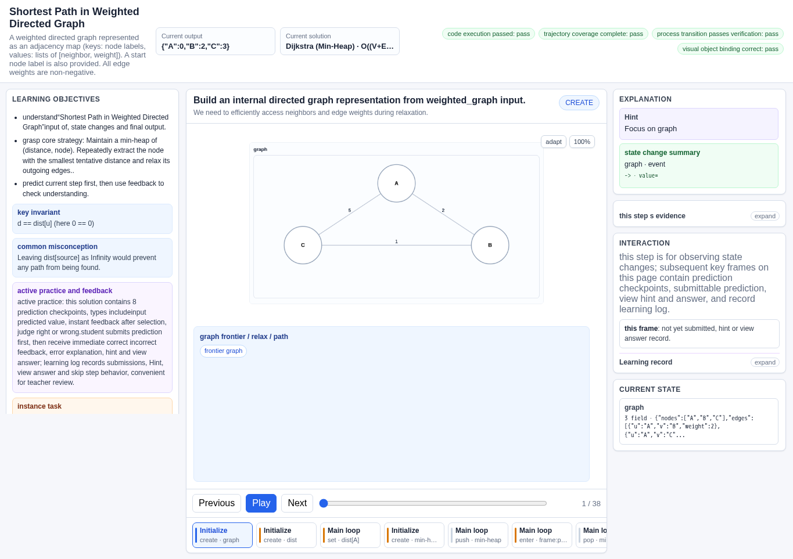
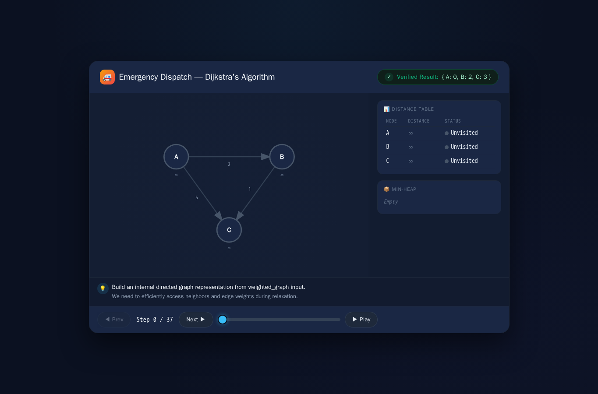
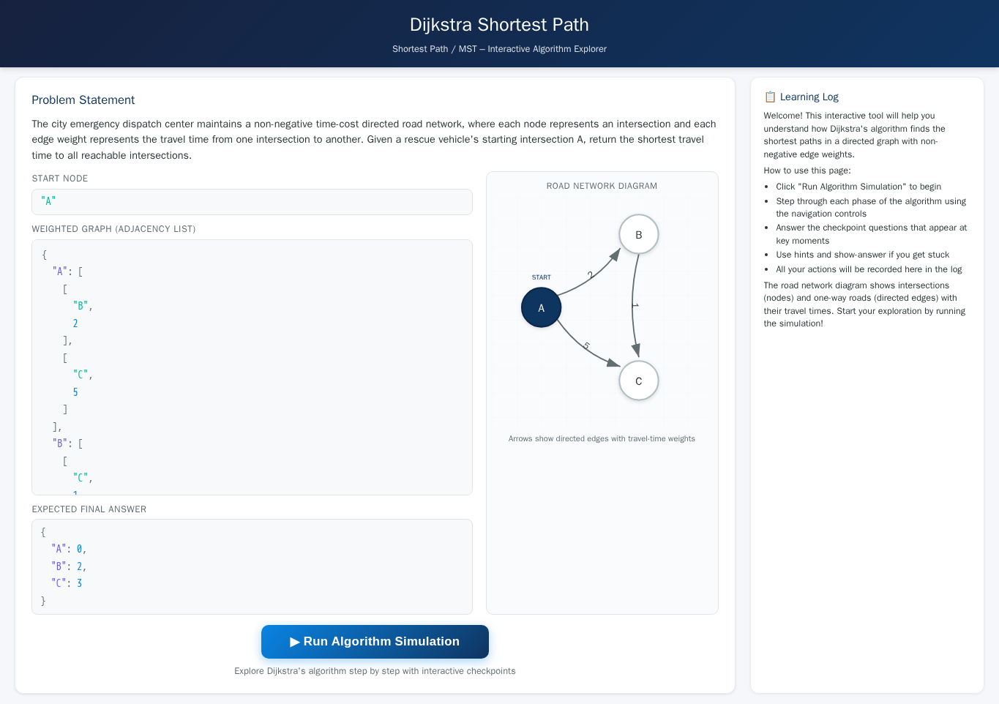
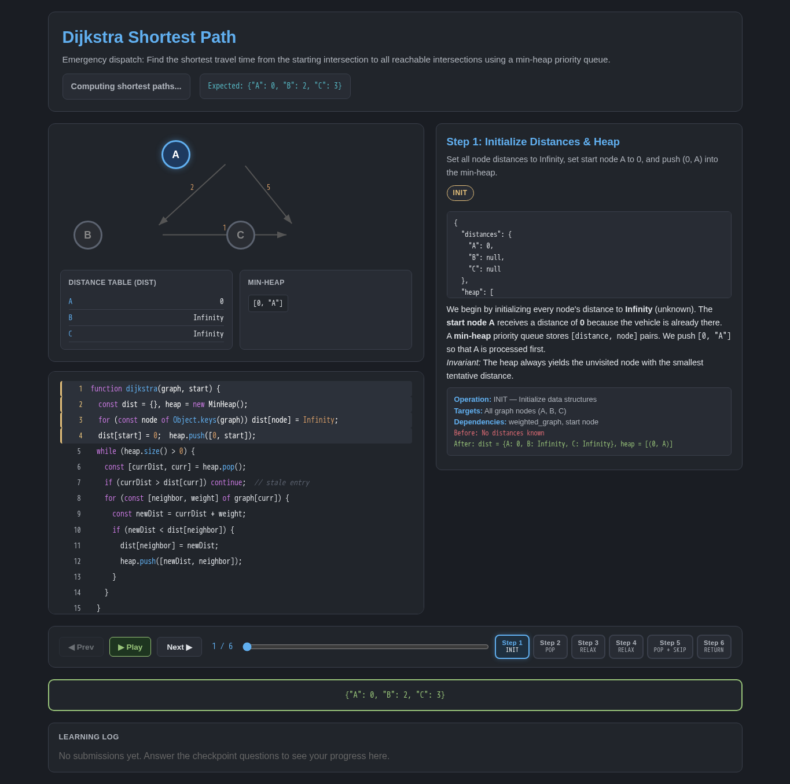
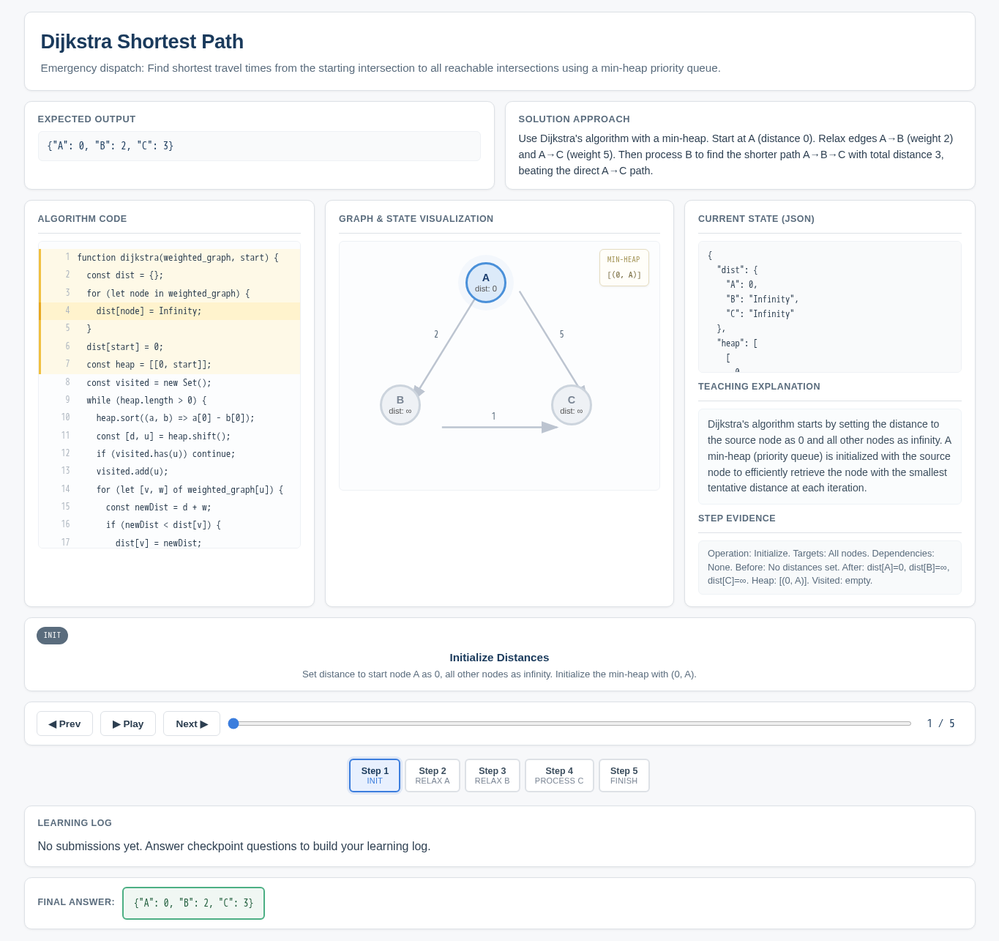

# Dijkstra Shortest Path

- Case ID: `dijkstra_shortest_path`
- Algorithm family: Shortest Path / MST
- Difficulty: medium
- Time complexity: `O((V+E) log V)`
- Space complexity: `O(V)`

The city emergency dispatch center maintains a non-negative time-cost directed road network weighted_graph, where each node represents an intersection and each edge weight represents the travel time from one intersection to another. Given a rescue vehicle's starting intersection start, return the shortest travel time to all reachable intersections.

## Fixed input and expected answer

```json
{
  "expected": {
    "A": 0,
    "B": 2,
    "C": 3
  },
  "index": 0,
  "input_data": {
    "start": "A",
    "weighted_graph": {
      "A": [
        [
          "B",
          2
        ],
        [
          "C",
          5
        ]
      ],
      "B": [
        [
          "C",
          1
        ]
      ],
      "C": []
    }
  }
}
```

## Nine machine checks

Machine OK means that all nine browser checks pass for the evaluated interaction page.
The AlgoTutorGen / Stage2 row reuses the checks from its paired Stage1 interaction page; it is not a separate audit of the saved Stage2 visualization page.

| Method | Load | Answer | Interaction | Correct feedback | Wrong feedback | Hint | Show answer | Learning log | Mutation-free | Machine OK |
| --- | --- | --- | --- | --- | --- | --- | --- | --- | --- | --- |
| AlgoTutorGen / Stage1 | PASS | PASS | PASS | PASS | PASS | PASS | PASS | PASS | PASS | PASS |
| AlgoTutorGen / Stage2 | PASS | PASS | PASS | PASS | PASS | PASS | PASS | PASS | PASS | PASS |
| Direct HTML | PASS | PASS | FAIL | FAIL | FAIL | FAIL | FAIL | FAIL | FAIL | FAIL |
| WebGen-Agent | PASS | PASS | FAIL | FAIL | FAIL | FAIL | FAIL | FAIL | FAIL | FAIL |
| Direct + HTMLCure (strict) | PASS | PASS | FAIL | FAIL | FAIL | FAIL | FAIL | FAIL | FAIL | FAIL |
| Direct-BrowserRepair (1 call) | PASS | PASS | PASS | FAIL | PASS | PASS | FAIL | PASS | PASS | FAIL |

## Generated artifacts

### AlgoTutorGen / Stage1

[Open AlgoTutorGen / Stage1 page](algotutorgen_stage1/page.html) · [Structured Stage1 JSON](algotutorgen_stage1/artifact.json) · [Machine audit](algotutorgen_stage1/audit.json)



### AlgoTutorGen / Stage2

[Open AlgoTutorGen / Stage2 page](algotutorgen_stage2/page.html) · [Machine audit](algotutorgen_stage2/audit.json)



### Direct HTML

[Open Direct HTML page](direct_html/page.html) · [Machine audit](direct_html/audit.json)


### WebGen-Agent

[WebGen-Agent source entry](webgen_agent/source/index.html) · [Machine audit](webgen_agent/audit.json)



### Direct + HTMLCure (strict)

[Open Direct + HTMLCure (strict) page](htmlcure_strict/page.html) · [Machine audit](htmlcure_strict/audit.json)



### Direct-BrowserRepair (1 call)

[Open Direct-BrowserRepair (1 call) page](browser_repair_1call/page.html) · [Machine audit](browser_repair_1call/audit.json)


