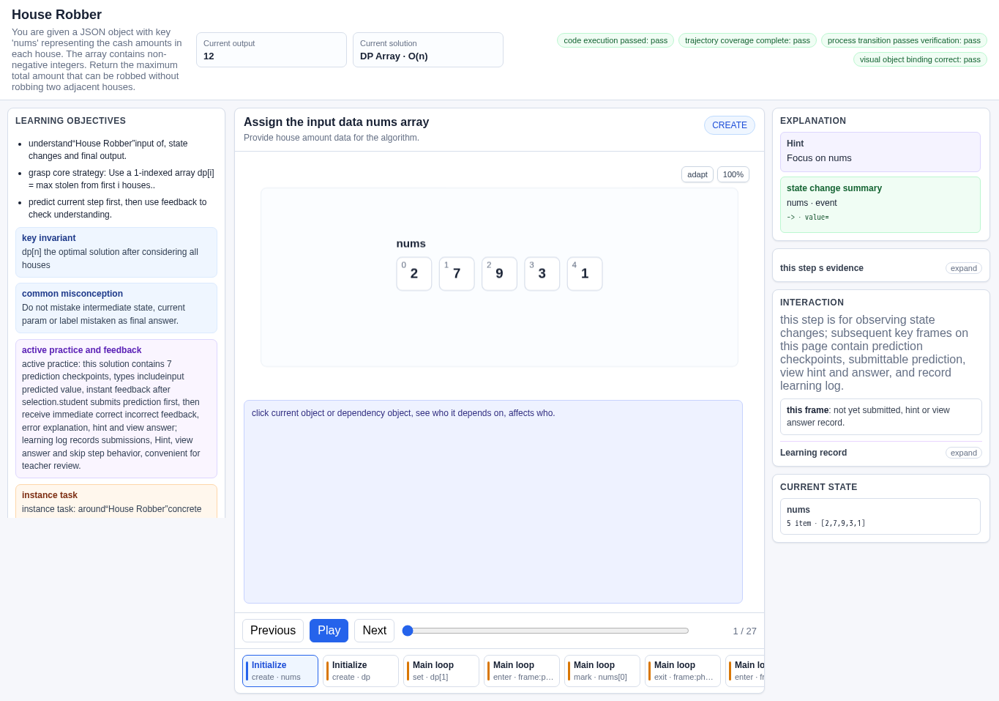
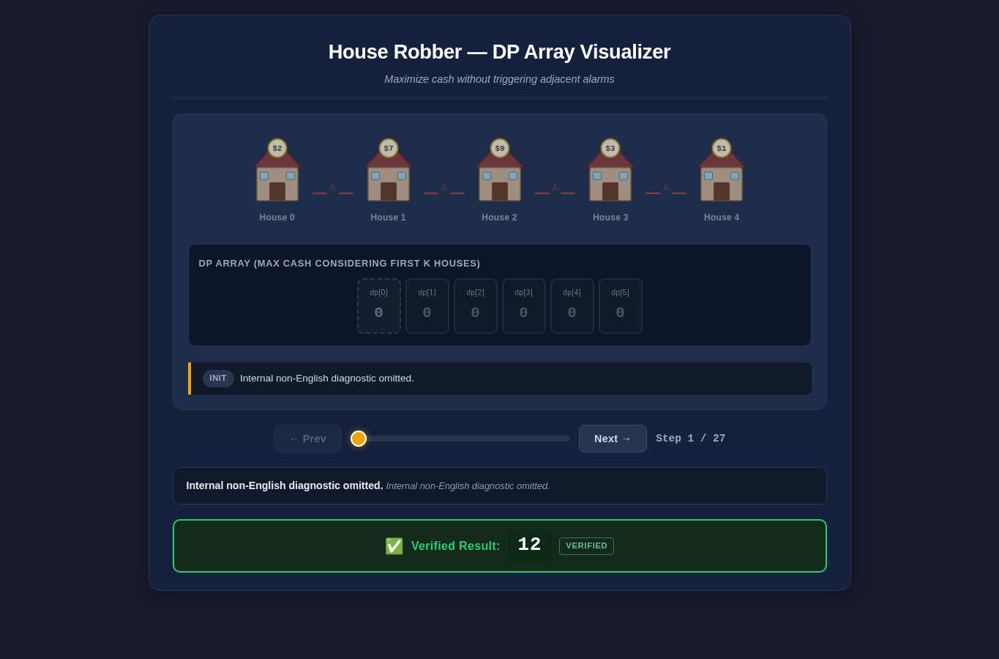
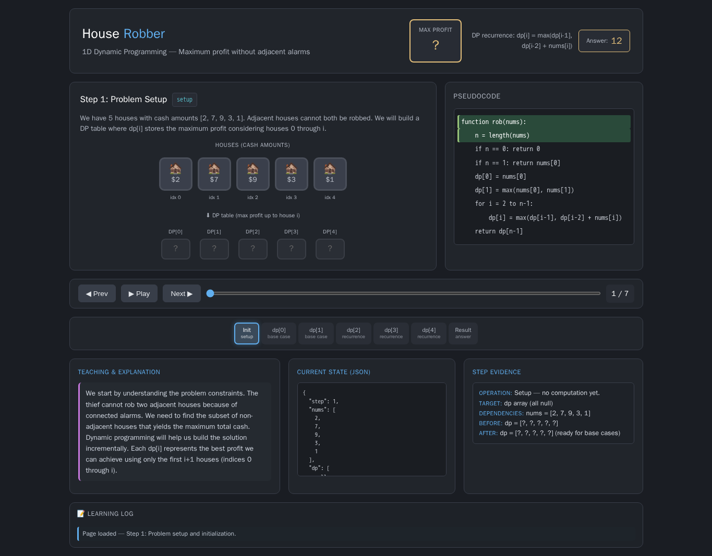
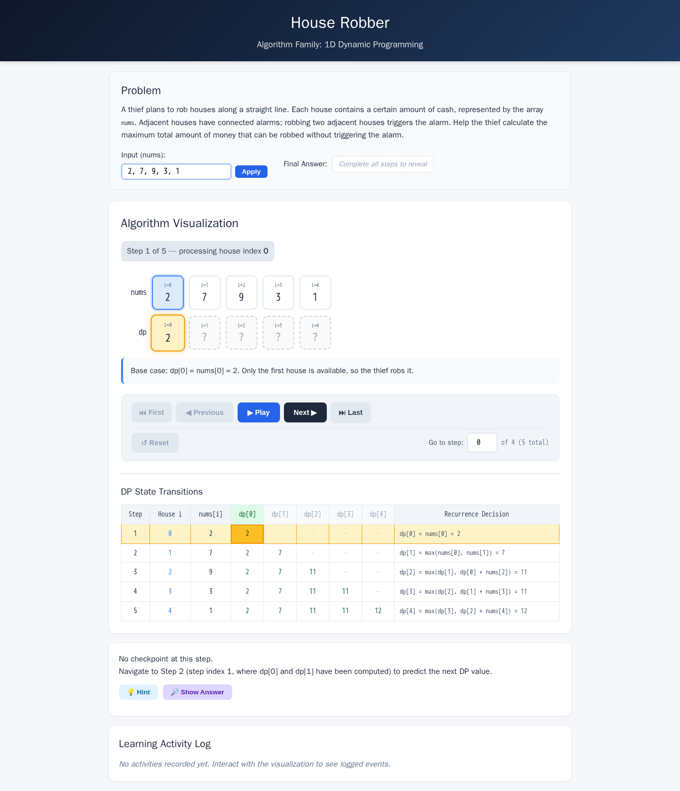
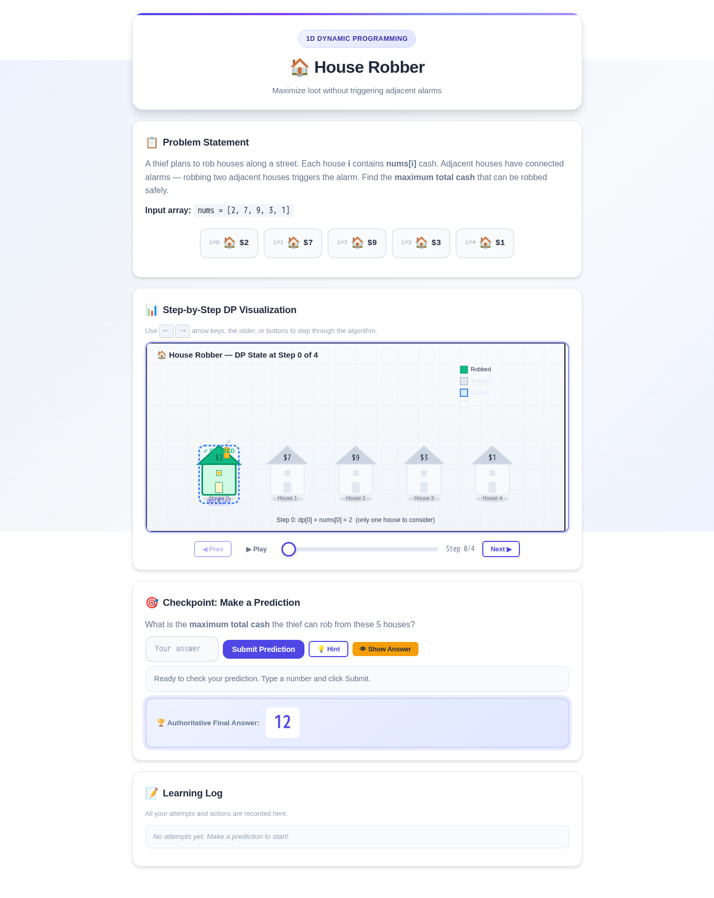
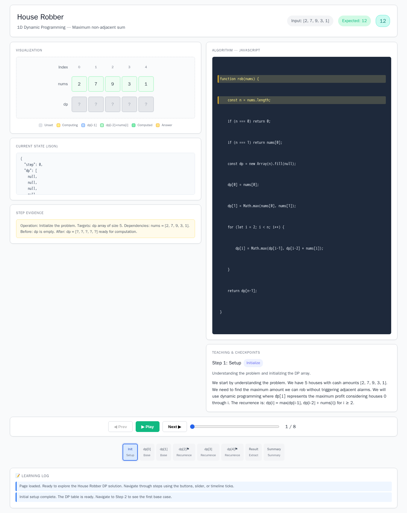

# House Robber

- Case ID: `house_robber`
- Algorithm family: 1D DP
- Difficulty: medium
- Time complexity: `O(n)`
- Space complexity: `O(n)`

A thief plans to rob a number of houses along a street. The houses are arranged in a straight line, each containing a certain amount of cash, represented by an integer array nums, where nums[i] is the cash amount in the i-th house (0-based index). Since adjacent houses are equipped with connected alarms, robbing two adjacent houses will trigger the alarm. Help the thief calculate the maximum total amount of money that can be robbed without triggering the alarm.

## Fixed input and expected answer

```json
{
  "expected": 12,
  "index": 0,
  "input_data": {
    "nums": [
      2,
      7,
      9,
      3,
      1
    ]
  }
}
```

## Nine machine checks

Machine OK means that all nine browser checks pass for the evaluated interaction page.
The AlgoTutorGen / Stage2 row reuses the checks from its paired Stage1 interaction page; it is not a separate audit of the saved Stage2 visualization page.

| Method | Load | Answer | Interaction | Correct feedback | Wrong feedback | Hint | Show answer | Learning log | Mutation-free | Machine OK |
| --- | --- | --- | --- | --- | --- | --- | --- | --- | --- | --- |
| AlgoTutorGen / Stage1 | PASS | PASS | PASS | PASS | PASS | PASS | PASS | PASS | PASS | PASS |
| AlgoTutorGen / Stage2 | PASS | PASS | PASS | PASS | PASS | PASS | PASS | PASS | PASS | PASS |
| Direct HTML | PASS | PASS | PASS | PASS | FAIL | PASS | PASS | PASS | PASS | FAIL |
| WebGen-Agent | PASS | PASS | PASS | FAIL | FAIL | FAIL | FAIL | FAIL | PASS | FAIL |
| Direct + HTMLCure (strict) | FAIL | FAIL | FAIL | FAIL | FAIL | FAIL | FAIL | FAIL | FAIL | FAIL |
| Direct-BrowserRepair (1 call) | PASS | PASS | FAIL | FAIL | FAIL | FAIL | FAIL | FAIL | FAIL | FAIL |

## Generated artifacts

### AlgoTutorGen / Stage1

[Open AlgoTutorGen / Stage1 page](algotutorgen_stage1/page.html) · [Structured Stage1 JSON](algotutorgen_stage1/artifact.json) · [Machine audit](algotutorgen_stage1/audit.json)



### AlgoTutorGen / Stage2

[Open AlgoTutorGen / Stage2 page](algotutorgen_stage2/page.html) · [Machine audit](algotutorgen_stage2/audit.json)



### Direct HTML

[Open Direct HTML page](direct_html/page.html) · [Machine audit](direct_html/audit.json)



### WebGen-Agent

[WebGen-Agent source entry](webgen_agent/source/index.html) · [Machine audit](webgen_agent/audit.json)



### Direct + HTMLCure (strict)

[Open Direct + HTMLCure (strict) page](htmlcure_strict/page.html) · [Machine audit](htmlcure_strict/audit.json)



### Direct-BrowserRepair (1 call)

[Open Direct-BrowserRepair (1 call) page](browser_repair_1call/page.html) · [Machine audit](browser_repair_1call/audit.json)


