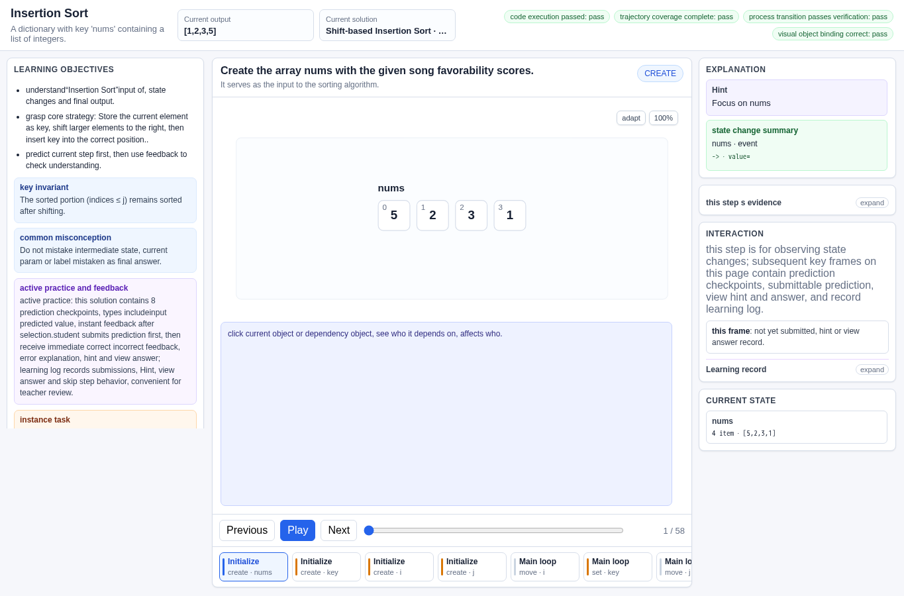
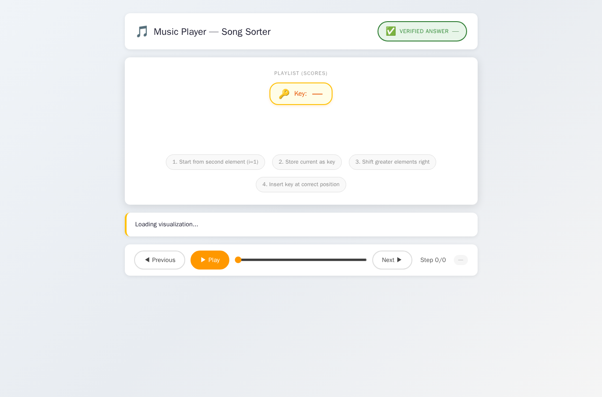
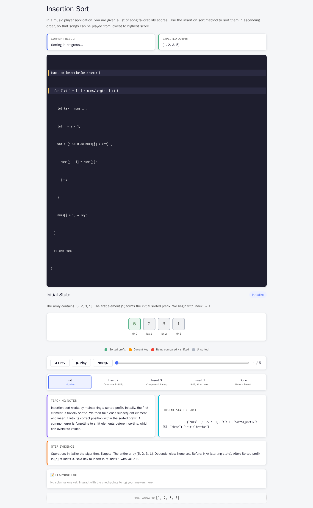
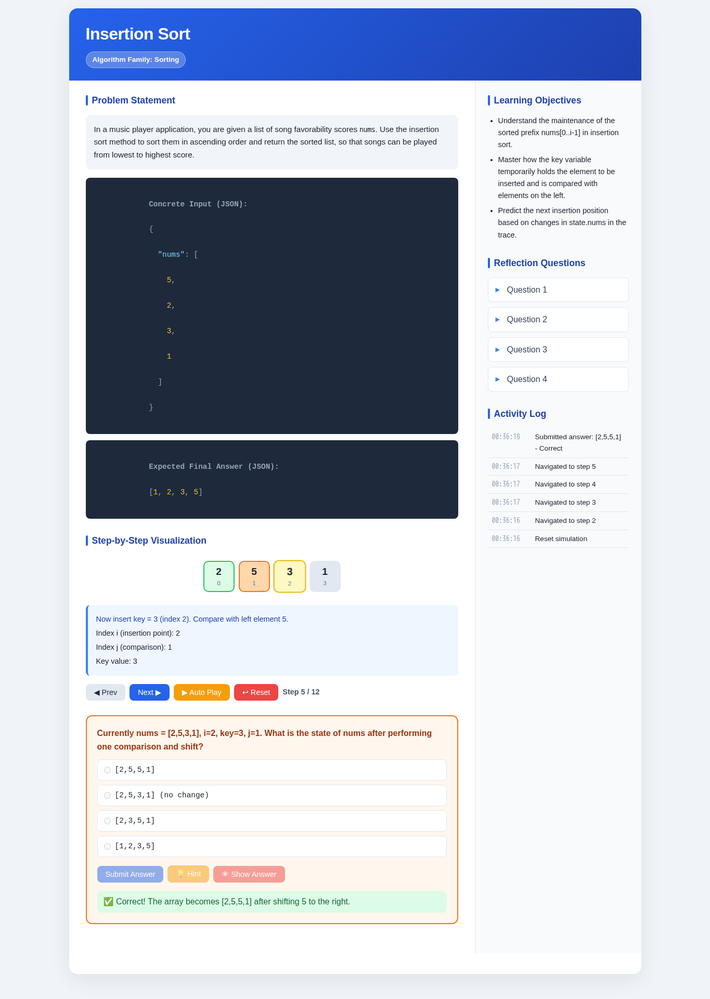
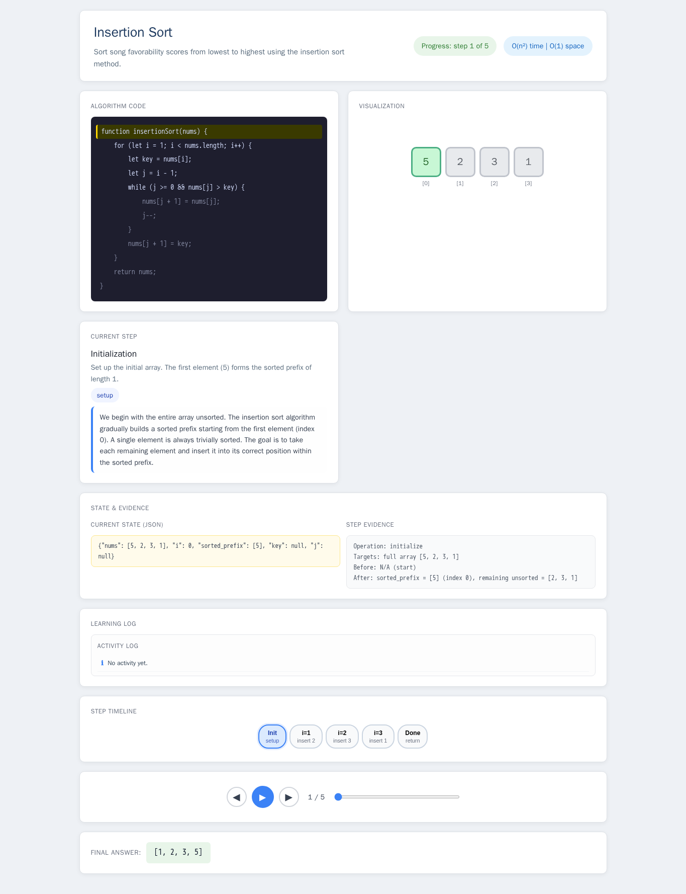

# Insertion Sort

- Case ID: `insertion_sort`
- Algorithm family: Sorting
- Difficulty: medium
- Time complexity: `O(n^2)`
- Space complexity: `O(1)`

In a music player application, you are given a list of song favorability scores nums. Use the insertion sort method to sort them in ascending order and return the sorted list, so that songs can be played from lowest to highest score.

## Fixed input and expected answer

```json
{
  "expected": [
    1,
    2,
    3,
    5
  ],
  "index": 0,
  "input_data": {
    "nums": [
      5,
      2,
      3,
      1
    ]
  }
}
```

## Nine machine checks

Machine OK means that all nine browser checks pass for the evaluated interaction page.
The AlgoTutorGen / Stage2 row reuses the checks from its paired Stage1 interaction page; it is not a separate audit of the saved Stage2 visualization page.

| Method | Load | Answer | Interaction | Correct feedback | Wrong feedback | Hint | Show answer | Learning log | Mutation-free | Machine OK |
| --- | --- | --- | --- | --- | --- | --- | --- | --- | --- | --- |
| AlgoTutorGen / Stage1 | PASS | PASS | PASS | PASS | PASS | PASS | PASS | PASS | PASS | PASS |
| AlgoTutorGen / Stage2 | PASS | PASS | PASS | PASS | PASS | PASS | PASS | PASS | PASS | PASS |
| Direct HTML | PASS | PASS | PASS | PASS | PASS | PASS | PASS | PASS | PASS | PASS |
| WebGen-Agent | PASS | PASS | PASS | PASS | FAIL | FAIL | PASS | PASS | PASS | FAIL |
| Direct + HTMLCure (strict) | FAIL | FAIL | FAIL | FAIL | FAIL | FAIL | FAIL | FAIL | FAIL | FAIL |
| Direct-BrowserRepair (1 call) | PASS | PASS | PASS | FAIL | PASS | PASS | PASS | PASS | PASS | FAIL |

## Generated artifacts

### AlgoTutorGen / Stage1

[Open AlgoTutorGen / Stage1 page](algotutorgen_stage1/page.html) · [Structured Stage1 JSON](algotutorgen_stage1/artifact.json) · [Machine audit](algotutorgen_stage1/audit.json)



### AlgoTutorGen / Stage2

[Open AlgoTutorGen / Stage2 page](algotutorgen_stage2/page.html) · [Machine audit](algotutorgen_stage2/audit.json)



### Direct HTML

[Open Direct HTML page](direct_html/page.html) · [Machine audit](direct_html/audit.json)



### WebGen-Agent

[WebGen-Agent source entry](webgen_agent/source/index.html) · [Machine audit](webgen_agent/audit.json)



### Direct + HTMLCure (strict)

[Open Direct + HTMLCure (strict) page](htmlcure_strict/page.html) · [Machine audit](htmlcure_strict/audit.json)


### Direct-BrowserRepair (1 call)

[Open Direct-BrowserRepair (1 call) page](browser_repair_1call/page.html) · [Machine audit](browser_repair_1call/audit.json)


