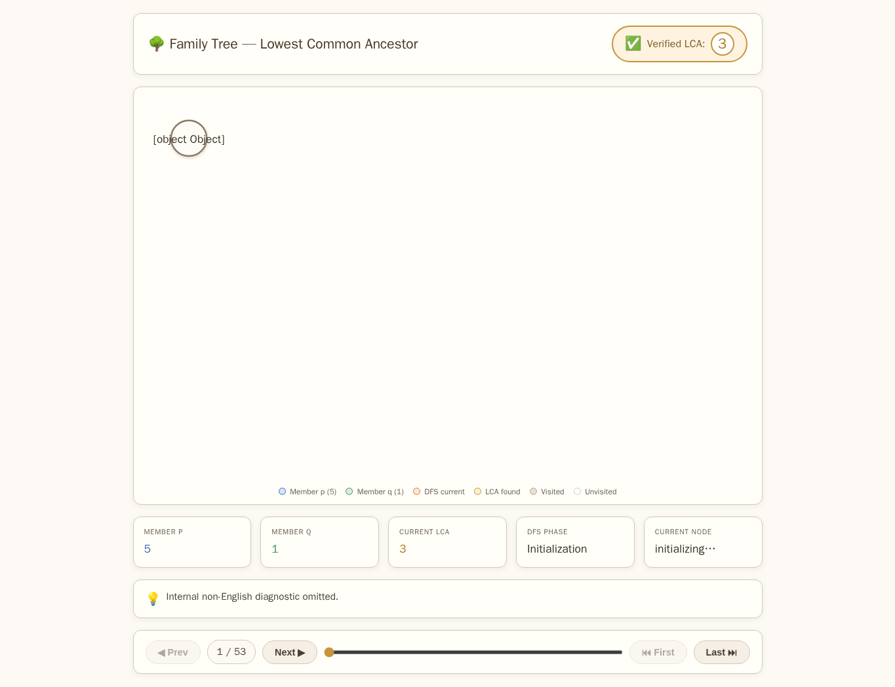
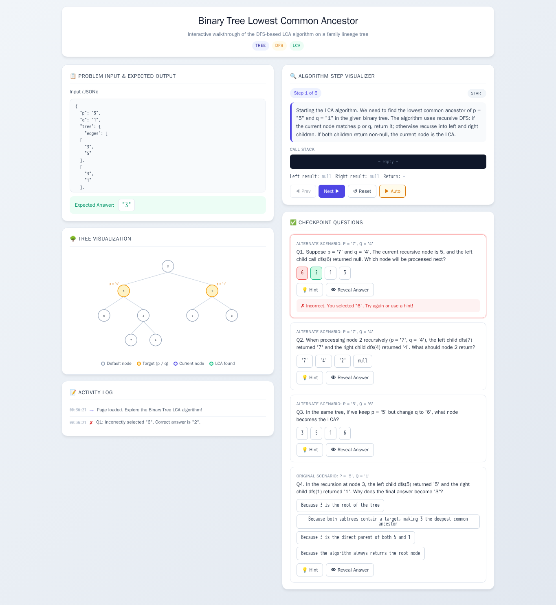
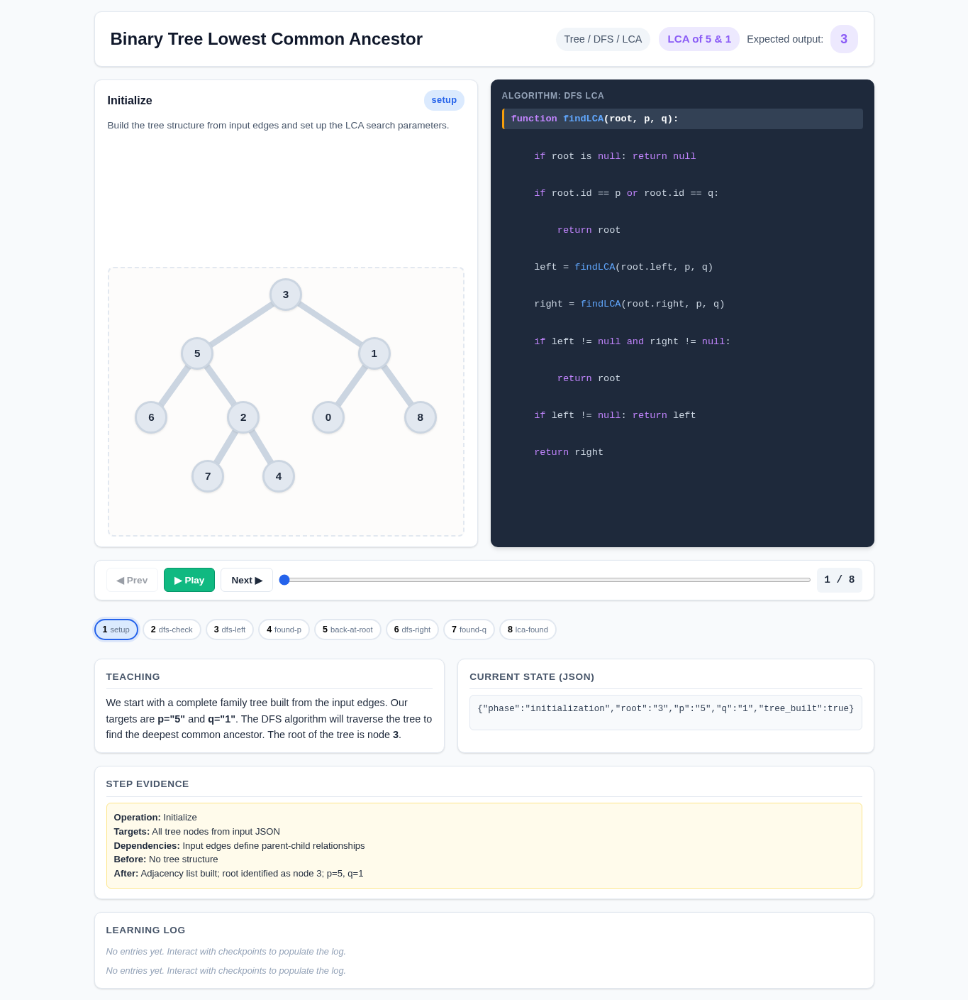
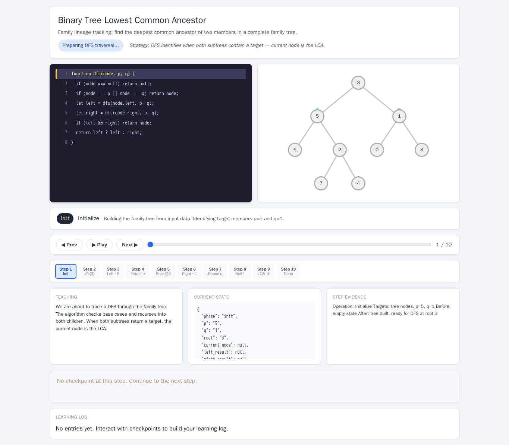

# Binary Tree Lowest Common Ancestor

- Case ID: `lca`
- Algorithm family: Tree / BST / LCA
- Difficulty: medium
- Time complexity: `O(n)`
- Space complexity: `O(h)`

In a family lineage tracking system, users often need to understand the kinship between two members. Your task: given the complete family tree tree (with node ids and parent-child edges), for any specified members p and q, compute the deepest common ancestor node of the two, and return its id as a string.

## Fixed input and expected answer

```json
{
  "expected": "3",
  "index": 0,
  "input_data": {
    "p": "5",
    "q": "1",
    "tree": {
      "edges": [
        [
          "3",
          "5"
        ],
        [
          "3",
          "1"
        ],
        [
          "5",
          "6"
        ],
        [
          "5",
          "2"
        ],
        [
          "1",
          "0"
        ],
        [
          "1",
          "8"
        ],
        [
          "2",
          "7"
        ],
        [
          "2",
          "4"
        ]
      ],
      "nodes": [
        {
          "id": "3"
        },
        {
          "id": "5"
        },
        {
          "id": "1"
        },
        {
          "id": "6"
        },
        {
          "id": "2"
        },
        {
          "id": "0"
        },
        {
          "id": "8"
        },
        {
          "id": "7"
        },
        {
          "id": "4"
        }
      ]
    }
  }
}
```

## Nine machine checks

Machine OK means that all nine browser checks pass for the same page.

| Method | Load | Answer | Interaction | Correct feedback | Wrong feedback | Hint | Show answer | Learning log | Mutation-free | Machine OK |
| --- | --- | --- | --- | --- | --- | --- | --- | --- | --- | --- |
| AlgoTutorGen / Stage2 | PASS | PASS | PASS | PASS | PASS | PASS | PASS | PASS | PASS | PASS |
| Direct HTML | PASS | PASS | FAIL | FAIL | FAIL | FAIL | FAIL | FAIL | FAIL | FAIL |
| WebGen-Agent | PASS | PASS | PASS | PASS | PASS | PASS | PASS | PASS | PASS | PASS |
| Direct + HTMLCure (strict) | PASS | PASS | FAIL | FAIL | FAIL | FAIL | FAIL | FAIL | FAIL | FAIL |
| Direct-BrowserRepair (1 call) | PASS | PASS | FAIL | FAIL | FAIL | FAIL | FAIL | FAIL | FAIL | FAIL |

## Generated artifacts

### AlgoTutorGen / Stage2

[Open AlgoTutorGen / Stage2 page](algotutorgen_stage2/page.html) · [Machine audit](algotutorgen_stage2/audit.json)



### Direct HTML

[Open Direct HTML page](direct_html/page.html) · [Machine audit](direct_html/audit.json)


### WebGen-Agent

[WebGen-Agent source entry](webgen_agent/source/index.html) · [Machine audit](webgen_agent/audit.json)



### Direct + HTMLCure (strict)

[Open Direct + HTMLCure (strict) page](htmlcure_strict/page.html) · [Machine audit](htmlcure_strict/audit.json)



### Direct-BrowserRepair (1 call)

[Open Direct-BrowserRepair (1 call) page](browser_repair_1call/page.html) · [Machine audit](browser_repair_1call/audit.json)


