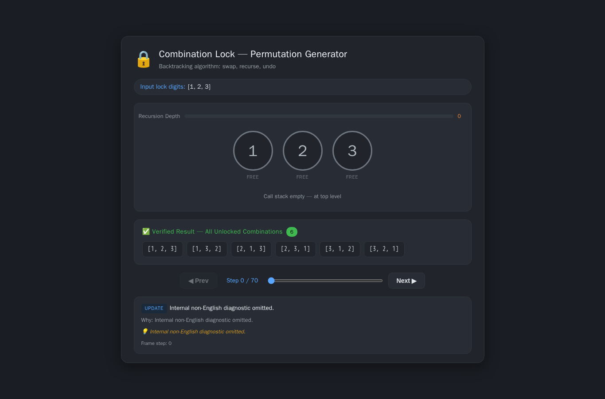
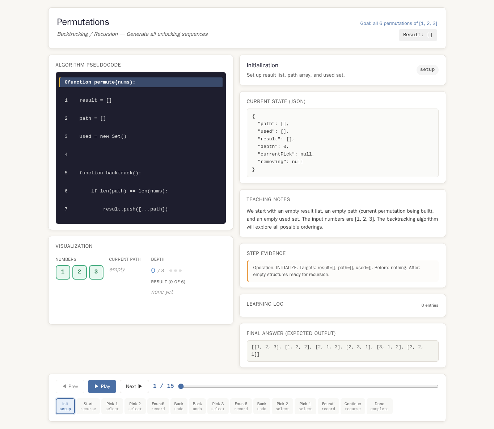
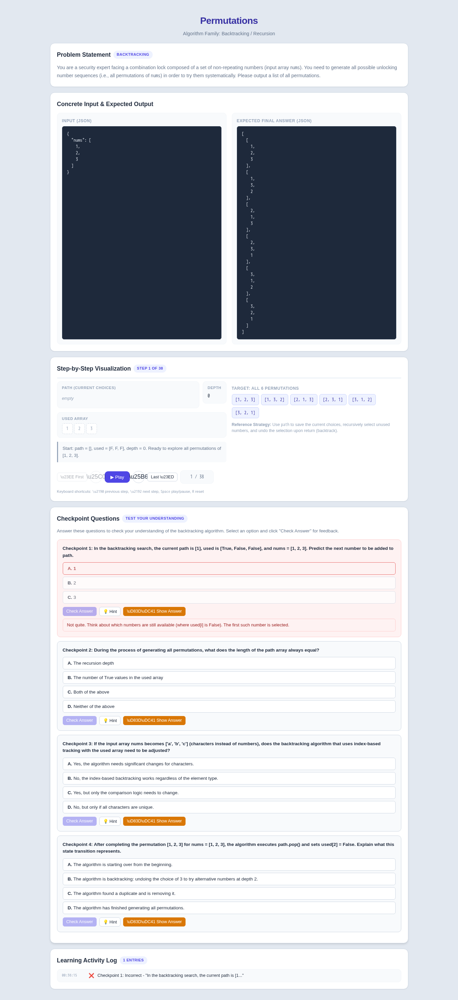
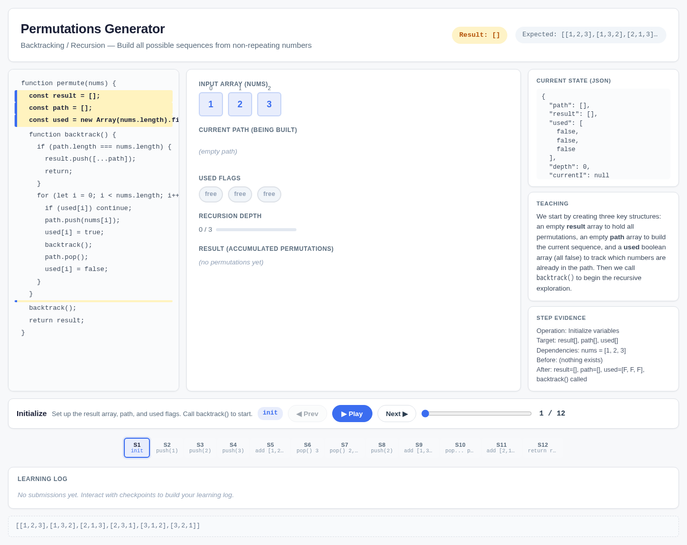

# Permutations

- Case ID: `permutations`
- Algorithm family: Backtracking / Recursion
- Difficulty: medium
- Time complexity: `O(n! n)`
- Space complexity: `O(n)`

You are a security expert facing a combination lock composed of a set of non-repeating numbers (input array nums). You need to generate all possible unlocking number sequences (i.e., all permutations of nums) in order to try them systematically. Please output a list of all permutations.

## Fixed input and expected answer

```json
{
  "expected": [
    [
      1,
      2,
      3
    ],
    [
      1,
      3,
      2
    ],
    [
      2,
      1,
      3
    ],
    [
      2,
      3,
      1
    ],
    [
      3,
      1,
      2
    ],
    [
      3,
      2,
      1
    ]
  ],
  "index": 0,
  "input_data": {
    "nums": [
      1,
      2,
      3
    ]
  }
}
```

## Nine machine checks

Machine OK means that all nine browser checks pass for the same page.

| Method | Load | Answer | Interaction | Correct feedback | Wrong feedback | Hint | Show answer | Learning log | Mutation-free | Machine OK |
| --- | --- | --- | --- | --- | --- | --- | --- | --- | --- | --- |
| AlgoTutorGen / Stage2 | PASS | PASS | PASS | PASS | PASS | PASS | PASS | PASS | PASS | PASS |
| Direct HTML | PASS | PASS | PASS | PASS | PASS | PASS | PASS | PASS | PASS | PASS |
| WebGen-Agent | PASS | PASS | PASS | PASS | PASS | PASS | PASS | FAIL | PASS | FAIL |
| Direct + HTMLCure (strict) | PASS | PASS | PASS | PASS | PASS | PASS | PASS | PASS | PASS | PASS |
| Direct-BrowserRepair (1 call) | PASS | PASS | PASS | PASS | FAIL | PASS | PASS | PASS | PASS | FAIL |

## Generated artifacts

### AlgoTutorGen / Stage2

[Open AlgoTutorGen / Stage2 page](algotutorgen_stage2/page.html) · [Machine audit](algotutorgen_stage2/audit.json)



### Direct HTML

[Open Direct HTML page](direct_html/page.html) · [Machine audit](direct_html/audit.json)



### WebGen-Agent

[WebGen-Agent source entry](webgen_agent/source/index.html) · [Machine audit](webgen_agent/audit.json)



### Direct + HTMLCure (strict)

[Open Direct + HTMLCure (strict) page](htmlcure_strict/page.html) · [Machine audit](htmlcure_strict/audit.json)


### Direct-BrowserRepair (1 call)

[Open Direct-BrowserRepair (1 call) page](browser_repair_1call/page.html) · [Machine audit](browser_repair_1call/audit.json)


