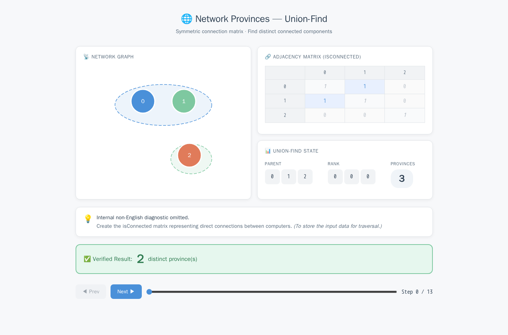
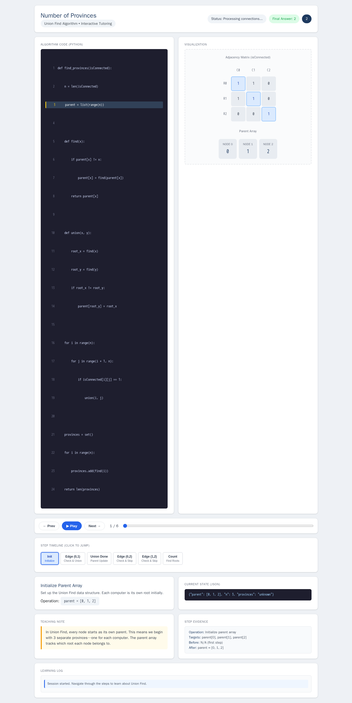
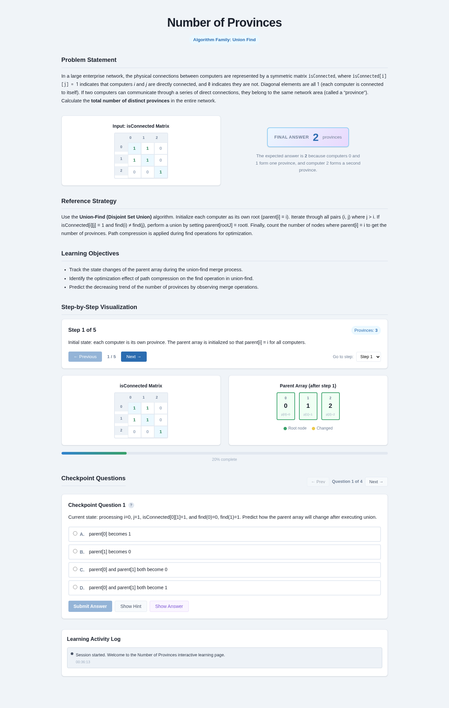
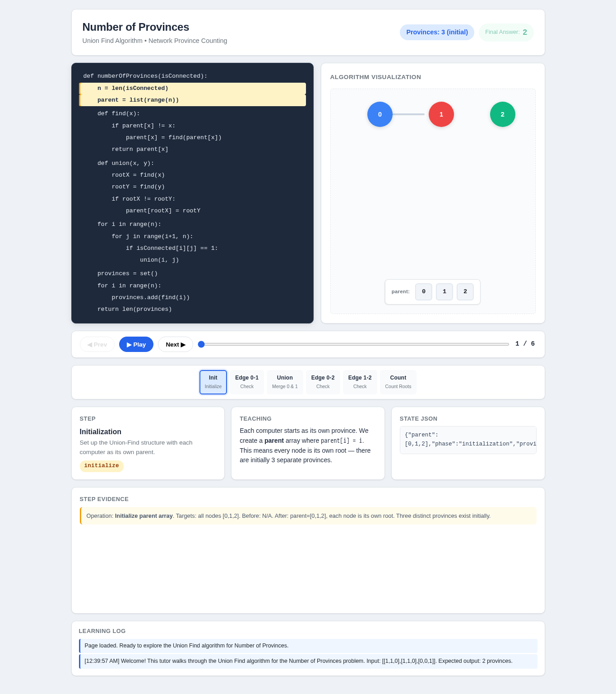

# Number of Provinces

- Case ID: `provinces`
- Algorithm family: Union Find
- Difficulty: medium
- Time complexity: `O(n^2 α(n))`
- Space complexity: `O(n)`

In a large enterprise network, the physical connections between computers are represented by a symmetric matrix isConnected, where isConnected[i][j] = 1 indicates that computers i and j are directly connected, and 0 indicates they are not; diagonal elements are all 1 (each computer is connected to itself). If two computers can communicate through a series of direct connections, they belong to the same network area (called a "province"). Please calculate the total number of distinct provinces in the entire network.

## Fixed input and expected answer

```json
{
  "expected": 2,
  "index": 0,
  "input_data": {
    "isConnected": [
      [
        1,
        1,
        0
      ],
      [
        1,
        1,
        0
      ],
      [
        0,
        0,
        1
      ]
    ]
  }
}
```

## Nine machine checks

Machine OK means that all nine browser checks pass for the same page.

| Method | Load | Answer | Interaction | Correct feedback | Wrong feedback | Hint | Show answer | Learning log | Mutation-free | Machine OK |
| --- | --- | --- | --- | --- | --- | --- | --- | --- | --- | --- |
| AlgoTutorGen / Stage2 | PASS | PASS | PASS | PASS | PASS | PASS | PASS | PASS | PASS | PASS |
| Direct HTML | PASS | PASS | PASS | PASS | PASS | PASS | PASS | PASS | PASS | PASS |
| WebGen-Agent | PASS | PASS | PASS | FAIL | FAIL | PASS | PASS | FAIL | PASS | FAIL |
| Direct + HTMLCure (strict) | PASS | PASS | PASS | PASS | PASS | PASS | PASS | PASS | PASS | PASS |
| Direct-BrowserRepair (1 call) | PASS | PASS | FAIL | FAIL | FAIL | FAIL | FAIL | FAIL | FAIL | FAIL |

## Generated artifacts

### AlgoTutorGen / Stage2

[Open AlgoTutorGen / Stage2 page](algotutorgen_stage2/page.html) · [Machine audit](algotutorgen_stage2/audit.json)



### Direct HTML

[Open Direct HTML page](direct_html/page.html) · [Machine audit](direct_html/audit.json)



### WebGen-Agent

[WebGen-Agent source entry](webgen_agent/source/index.html) · [Machine audit](webgen_agent/audit.json)



### Direct + HTMLCure (strict)

[Open Direct + HTMLCure (strict) page](htmlcure_strict/page.html) · [Machine audit](htmlcure_strict/audit.json)


### Direct-BrowserRepair (1 call)

[Open Direct-BrowserRepair (1 call) page](browser_repair_1call/page.html) · [Machine audit](browser_repair_1call/audit.json)


