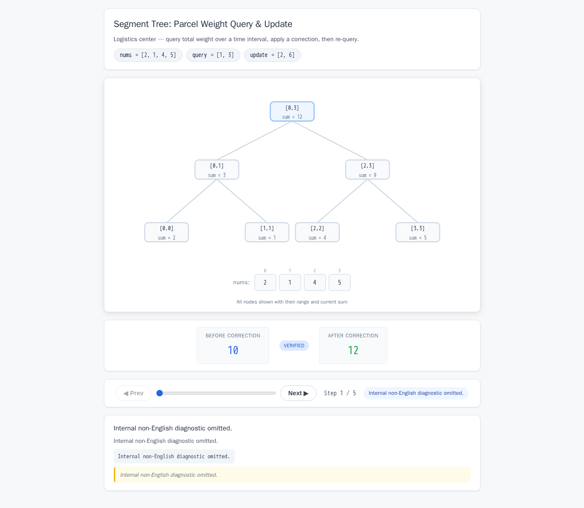
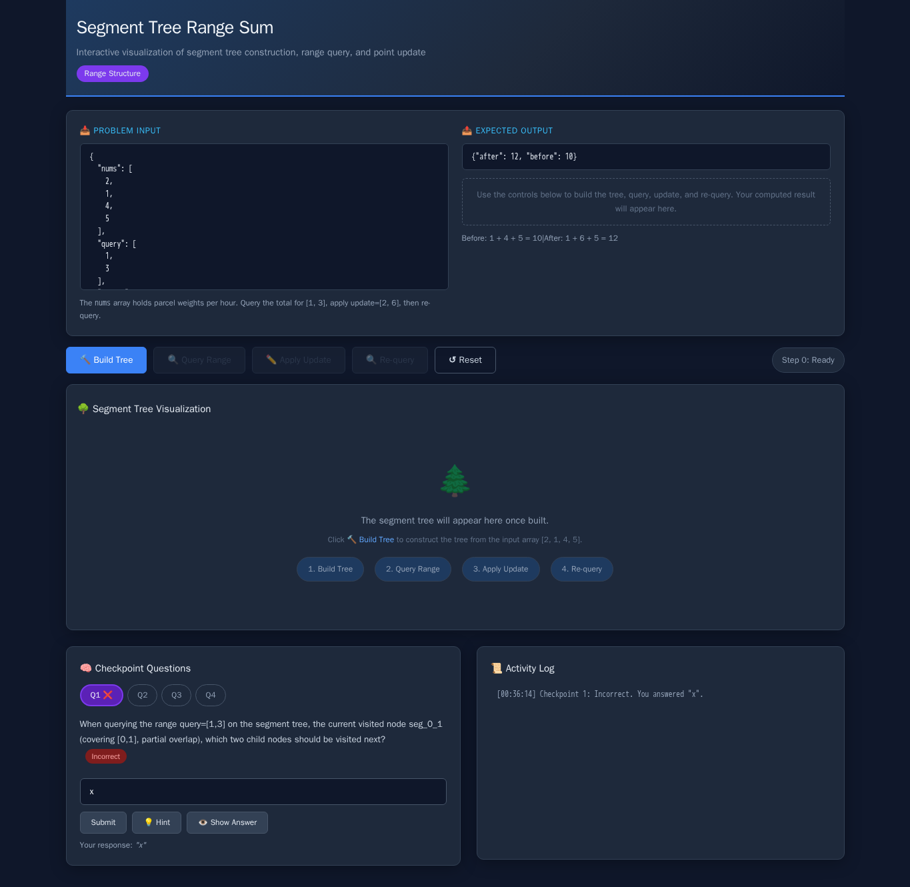
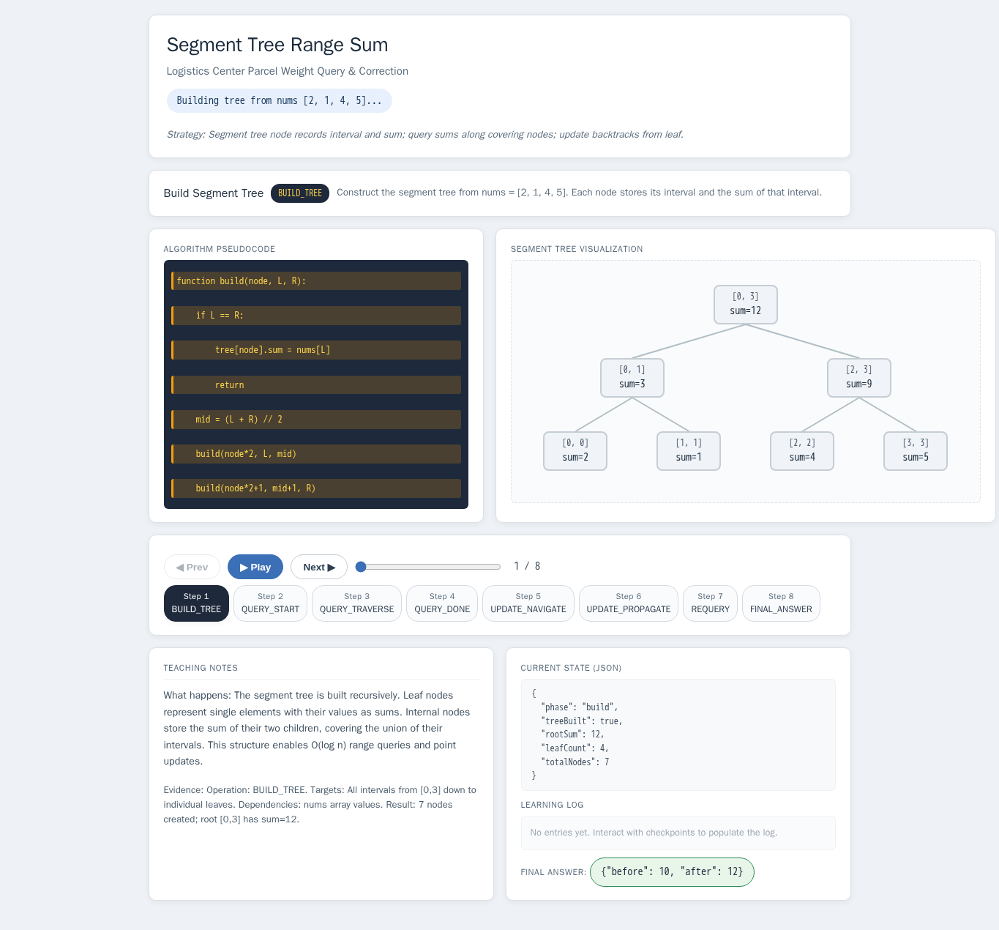
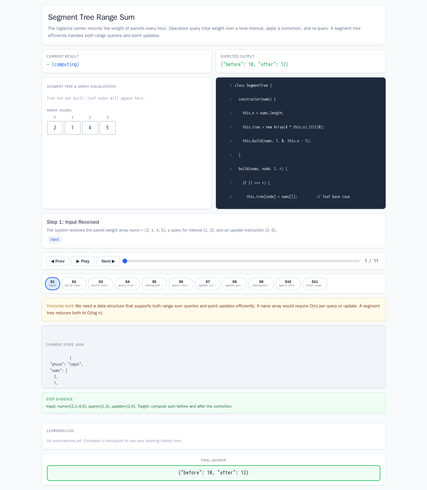

# Segment Tree Range Sum

- Case ID: `segment_tree_range_sum`
- Algorithm family: Range Structure
- Difficulty: medium
- Time complexity: `O(log n)`
- Space complexity: `O(n)`

The logistics center records the weight of parcels (in kilograms) every hour, stored in the array nums. Operators need to query the total weight of parcels from time point query[0] to query[1] (closed interval), then according to the received correction information update=[pos,value] change the weight at the pos-th hour to value, and then re-query the total weight of the same interval. Please use a segment tree to calculate and return the total weight before correction 'before' and after correction 'after'. The input includes the nums array, query interval, and update operation; the output is an object containing 'before' and 'after'.

## Fixed input and expected answer

```json
{
  "expected": {
    "after": 12,
    "before": 10
  },
  "index": 0,
  "input_data": {
    "nums": [
      2,
      1,
      4,
      5
    ],
    "query": [
      1,
      3
    ],
    "update": [
      2,
      6
    ]
  }
}
```

## Nine machine checks

Machine OK means that all nine browser checks pass for the same page.

| Method | Load | Answer | Interaction | Correct feedback | Wrong feedback | Hint | Show answer | Learning log | Mutation-free | Machine OK |
| --- | --- | --- | --- | --- | --- | --- | --- | --- | --- | --- |
| AlgoTutorGen / Stage2 | PASS | PASS | PASS | PASS | PASS | PASS | PASS | PASS | PASS | PASS |
| Direct HTML | PASS | PASS | PASS | PASS | PASS | PASS | PASS | PASS | PASS | PASS |
| WebGen-Agent | PASS | PASS | PASS | FAIL | PASS | PASS | PASS | FAIL | PASS | FAIL |
| Direct + HTMLCure (strict) | PASS | PASS | PASS | PASS | PASS | PASS | PASS | PASS | PASS | PASS |
| Direct-BrowserRepair (1 call) | PASS | PASS | PASS | FAIL | PASS | PASS | FAIL | PASS | PASS | FAIL |

## Generated artifacts

### AlgoTutorGen / Stage2

[Open AlgoTutorGen / Stage2 page](algotutorgen_stage2/page.html) · [Machine audit](algotutorgen_stage2/audit.json)



### Direct HTML

[Open Direct HTML page](direct_html/page.html) · [Machine audit](direct_html/audit.json)


### WebGen-Agent

[WebGen-Agent source entry](webgen_agent/source/index.html) · [Machine audit](webgen_agent/audit.json)



### Direct + HTMLCure (strict)

[Open Direct + HTMLCure (strict) page](htmlcure_strict/page.html) · [Machine audit](htmlcure_strict/audit.json)



### Direct-BrowserRepair (1 call)

[Open Direct-BrowserRepair (1 call) page](browser_repair_1call/page.html) · [Machine audit](browser_repair_1call/audit.json)


