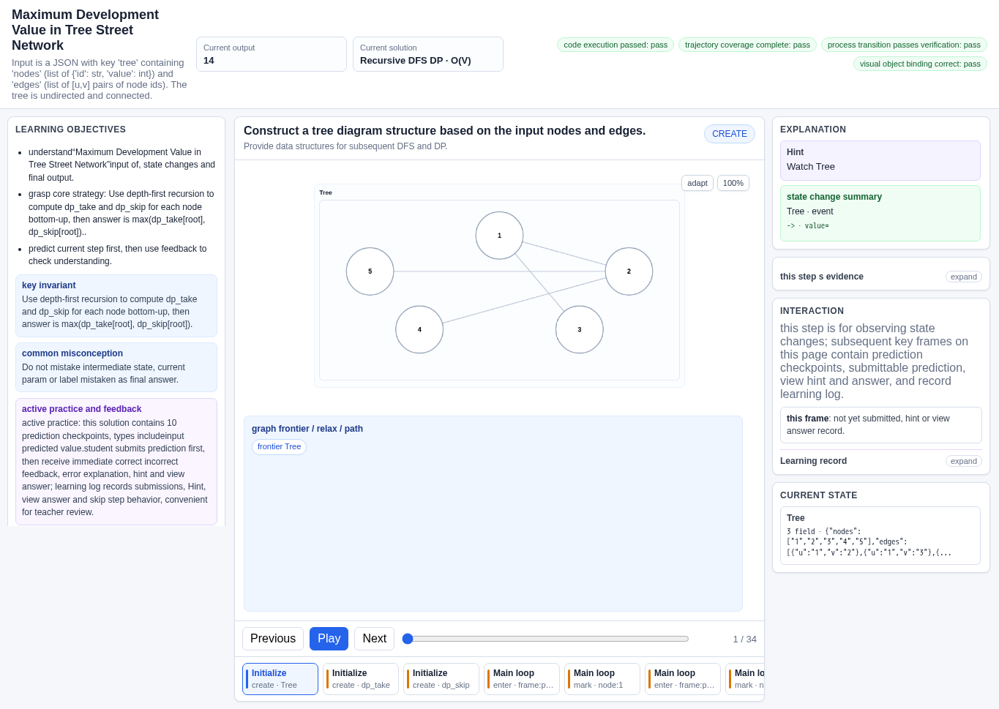
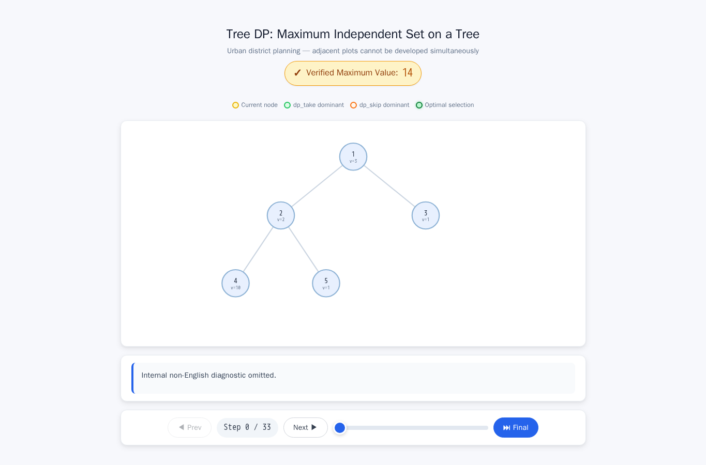
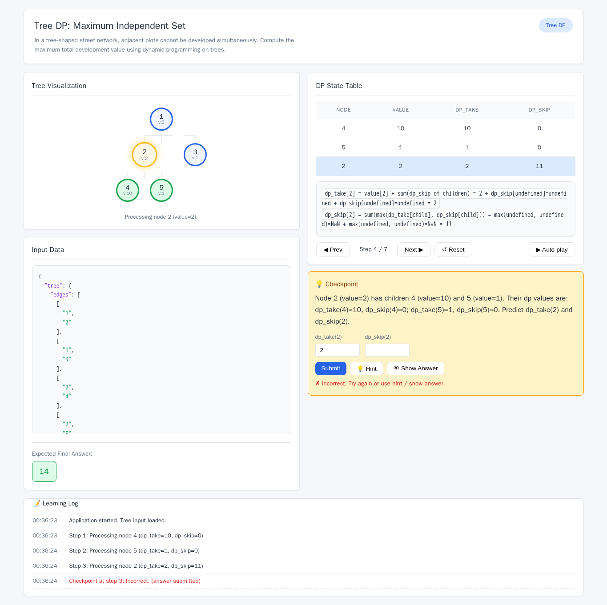
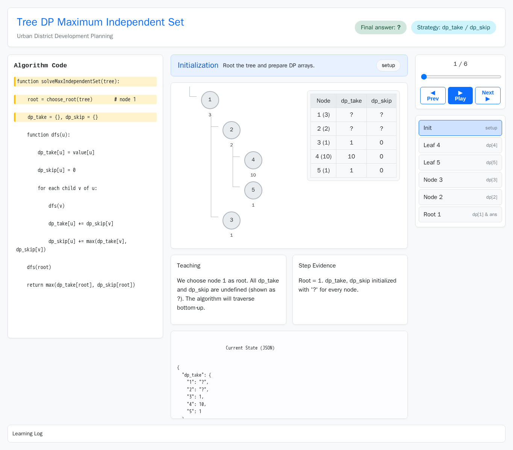
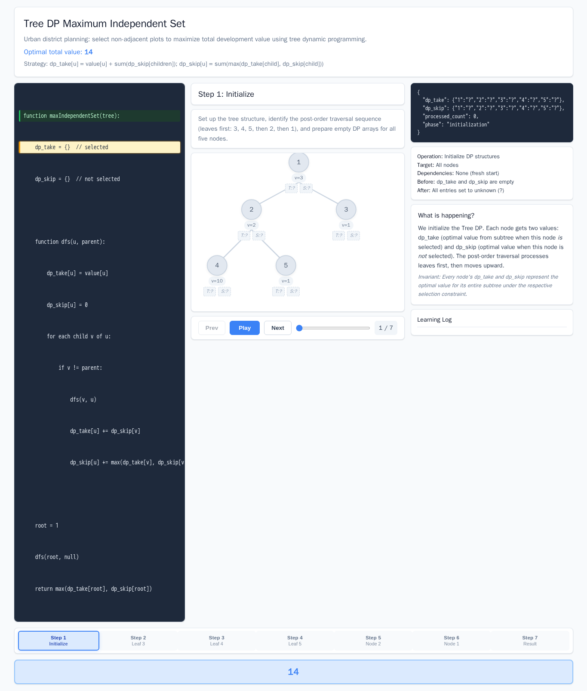

# Tree DP Maximum Independent Set

- Case ID: `tree_max_independent_set`
- Algorithm family: Tree DP
- Difficulty: medium
- Time complexity: `O(n)`
- Space complexity: `O(n)`

In the planning of a new urban district, there is a tree-shaped street network where each plot (node) has a development value. Adjacent plots cannot be developed simultaneously to avoid traffic congestion. Given a tree, where nodes represent plots, value represents development value, and edges represent adjacency. Compute the maximum total development value achievable, returning only the maximum number. The input tree object includes nodes (id, value) and edges (undirected edges).

## Fixed input and expected answer

```json
{
  "expected": 14,
  "index": 0,
  "input_data": {
    "tree": {
      "edges": [
        [
          "1",
          "2"
        ],
        [
          "1",
          "3"
        ],
        [
          "2",
          "4"
        ],
        [
          "2",
          "5"
        ]
      ],
      "nodes": [
        {
          "id": "1",
          "value": 3
        },
        {
          "id": "2",
          "value": 2
        },
        {
          "id": "3",
          "value": 1
        },
        {
          "id": "4",
          "value": 10
        },
        {
          "id": "5",
          "value": 1
        }
      ]
    }
  }
}
```

## Nine machine checks

Machine OK means that all nine browser checks pass for the evaluated interaction page.
The AlgoTutorGen / Stage2 row reuses the checks from its paired Stage1 interaction page; it is not a separate audit of the saved Stage2 visualization page.

| Method | Load | Answer | Interaction | Correct feedback | Wrong feedback | Hint | Show answer | Learning log | Mutation-free | Machine OK |
| --- | --- | --- | --- | --- | --- | --- | --- | --- | --- | --- |
| AlgoTutorGen / Stage1 | PASS | PASS | PASS | PASS | PASS | PASS | PASS | PASS | PASS | PASS |
| AlgoTutorGen / Stage2 | PASS | PASS | PASS | PASS | PASS | PASS | PASS | PASS | PASS | PASS |
| Direct HTML | PASS | PASS | PASS | FAIL | PASS | PASS | FAIL | FAIL | PASS | FAIL |
| WebGen-Agent | PASS | PASS | PASS | PASS | PASS | FAIL | PASS | PASS | PASS | FAIL |
| Direct + HTMLCure (strict) | PASS | PASS | PASS | FAIL | PASS | PASS | FAIL | FAIL | PASS | FAIL |
| Direct-BrowserRepair (1 call) | PASS | PASS | PASS | FAIL | FAIL | FAIL | FAIL | FAIL | PASS | FAIL |

## Generated artifacts

### AlgoTutorGen / Stage1

[Open AlgoTutorGen / Stage1 page](algotutorgen_stage1/page.html) · [Structured Stage1 JSON](algotutorgen_stage1/artifact.json) · [Machine audit](algotutorgen_stage1/audit.json)



### AlgoTutorGen / Stage2

[Open AlgoTutorGen / Stage2 page](algotutorgen_stage2/page.html) · [Machine audit](algotutorgen_stage2/audit.json)



### Direct HTML

[Open Direct HTML page](direct_html/page.html) · [Machine audit](direct_html/audit.json)


### WebGen-Agent

[WebGen-Agent source entry](webgen_agent/source/index.html) · [Machine audit](webgen_agent/audit.json)



### Direct + HTMLCure (strict)

[Open Direct + HTMLCure (strict) page](htmlcure_strict/page.html) · [Machine audit](htmlcure_strict/audit.json)



### Direct-BrowserRepair (1 call)

[Open Direct-BrowserRepair (1 call) page](browser_repair_1call/page.html) · [Machine audit](browser_repair_1call/audit.json)


